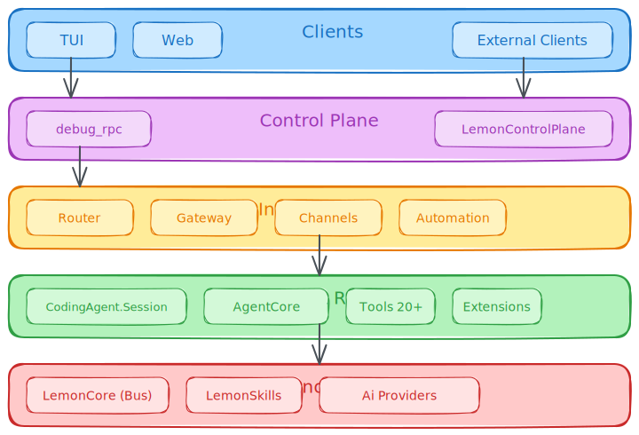

# lemon 🍋

Lemon is a local-first assistant and coding agent system (named after a very good cat) that you run on your own machine.

The easiest way to use Lemon day-to-day is through **Telegram**: you talk to a bot from your phone/desktop, while Lemon runs locally. Inbound/outbound messaging is handled by `lemon_channels` (Telegram adapter + outbox), runs are orchestrated by `lemon_router`, and execution is handled by `lemon_gateway` using one of the configured engines (native Lemon, Claude CLI, Codex CLI, OpenCode CLI, Pi CLI). Kimi, OpenCode, and Pi are also available as CodingAgent `task` subagent engines.

If you're here for the architecture deep-dive, jump to [What is Lemon?](#what-is-lemon).

## Quickstart (Telegram)

### 1. Prerequisites

- Elixir 1.19+ and Erlang/OTP 27+
- A model provider API key (Anthropic/OpenAI/etc.)
- Optional for web tools: Brave Search API key or Perplexity/OpenRouter API key
- Optional for WASM tools: Rust toolchain (`cargo`) when `auto_build = true`

Node.js is only required for the TUI/Web clients; the Telegram gateway is Elixir-only.

#### Installing Dependencies (If You Have Never Used Elixir)

**macOS (Homebrew):**

```bash
brew install elixir
elixir -v
```

Optional (only if you want the TUI/Web clients):

```bash
brew install node@20
node -v
```

**Linux:**

<details>
<summary>Show Linux install instructions (Arch, Ubuntu/Debian, Fedora, and asdf)</summary>

#### Option A (Recommended): asdf (consistent versions across distros)

Install `asdf` (see the asdf docs for your distro), then:

```bash
asdf plugin add erlang
asdf plugin add elixir

# Pick any Erlang/OTP 27.x + Elixir 1.19.x combo.
# Example (adjust versions as needed):
asdf install erlang 27.2
asdf install elixir 1.19.0-otp-27

asdf global erlang 27.2
asdf global elixir 1.19.0-otp-27

elixir -v
```

If your distro packages are too old to satisfy OTP 27 / Elixir 1.19, `asdf` is the simplest fix.

Build deps if `asdf install erlang ...` fails:

- Arch Linux:
```bash
sudo pacman -Syu
sudo pacman -S --needed base-devel git ncurses openssl wxwidgets-gtk3
```
- Ubuntu/Debian:
```bash
sudo apt-get update
sudo apt-get install -y build-essential git autoconf m4 libncurses5-dev libssl-dev libwxgtk3.2-dev libgl1-mesa-dev libglu1-mesa-dev libpng-dev libssh-dev unixodbc-dev
```
- Fedora:
```bash
sudo dnf install -y @development-tools git autoconf m4 ncurses-devel openssl-devel wxGTK-devel mesa-libGL-devel mesa-libGLU-devel libpng-devel libssh-devel unixODBC-devel
```

#### Option B: OS packages (fastest, version varies by distro)

- Arch Linux:
```bash
sudo pacman -Syu
sudo pacman -S elixir erlang
elixir -v
```
- Ubuntu/Debian:
```bash
sudo apt-get update
sudo apt-get install -y elixir erlang
elixir -v
```
- Fedora:
```bash
sudo dnf install -y elixir erlang
elixir -v
```

</details>

### 2. Create a Telegram bot token

1. In Telegram, message `@BotFather`
2. Run `/newbot`
3. Copy the bot token it gives you

If you plan to use Lemon in a group chat, also set bot privacy appropriately in BotFather (`/setprivacy`) so the bot receives messages.

### 3. Get your chat ID

Methods to find your chat ID:

**Using the Telegram Bot API (no third-party bots):**

Send any message to your new bot, then fetch updates via the Telegram Bot API:

```bash
export LEMON_TELEGRAM_BOT_TOKEN="123456:token"
curl -s "https://api.telegram.org/bot${LEMON_TELEGRAM_BOT_TOKEN}/getUpdates" | python3 -m json.tool
```

Look for `message.chat.id`. For groups/supergroups this is usually a negative number.

**Using a bot (fastest method):**

1. Search for `@RawDataBot` or `@userinfobot` in Telegram.
2. Start the chat and it will return your numerical ID.
3. For group IDs, add the bot to the group and it will display the chat ID (usually a negative number for groups/supergroups).

### 4. Configure Lemon

Create `~/.lemon/config.toml`:

```toml
# Provider keys (pick one)
[providers.anthropic]
api_key = "sk-ant-..."

# Defaults used by runtime + default profile
[defaults]
provider = "anthropic"
model = "anthropic:claude-sonnet-4-20250514"
engine = "lemon"

# Optional web tool config (`websearch` / `webfetch`)
[runtime.tools.web.search]
provider = "brave" # "brave" or "perplexity"
# api_key = "..." # Brave key when provider = "brave"

[runtime.tools.web.search.perplexity]
# model = "perplexity/sonar-pro"
# api_key = "..." # optional if PERPLEXITY_API_KEY/OPENROUTER_API_KEY is set
# base_url = "https://api.perplexity.ai"

[runtime.tools.web.fetch.firecrawl]
# Optional fallback extractor for hard pages
# enabled = true
# api_key = "fc-..."

# Telegram gateway (runs locally, you chat from Telegram)
[gateway]
enable_telegram = true
auto_resume = true
default_engine = "lemon"
# Optional fallback cwd for unbound chats/sessions (defaults to ~/).
default_cwd = "~/"

[gateway.telegram]
bot_token = "123456:token"
allowed_chat_ids = [123456789]
deny_unbound_chats = true
drop_pending_updates = true
allow_queue_override = true

# Assistant profile used for Telegram chats (when no binding overrides it)
[profiles.default]
name = "Lemon"
system_prompt = "You are my general assistant. Be concise, practical, and ask clarifying questions when needed."

[profiles.default.tool_policy]
allow = "all"
deny = []
require_approval = ["bash", "write", "edit"]

[[gateway.bindings]]
transport = "telegram"
chat_id = 123456789
agent_id = "default"
```

Legacy aliases are still accepted: `[agent]` for runtime/default settings and `[agents.<id>]` for profiles.

Notes:
- Restrict who can use the bot. Set `allowed_chat_ids` and consider enabling `deny_unbound_chats` (see `docs/config.md`).
- If you want Lemon to operate inside a specific repo, add a project and bind it (see `docs/config.md`).

### 5. Run the gateway

From this repo, start with the default command:

```bash
./bin/lemon-gateway
# defaults to a distributed BEAM node: lemon_gateway@<short-hostname>
```

The launcher prints the exact remote shell target on boot, so you can copy it when attaching from another terminal.

If you want explicit local defaults:

```bash
export LEMON_GATEWAY_NODE_NAME=lemon_gateway
export LEMON_GATEWAY_NODE_COOKIE="change-me"

./bin/lemon-gateway --sname "$LEMON_GATEWAY_NODE_NAME" --cookie "$LEMON_GATEWAY_NODE_COOKIE"
```

Other launch modes:

```bash
./bin/lemon-gateway --name lemon_gateway@my-host.example.com --cookie "change-me"
./bin/lemon-gateway --no-distribution
```

### 6. Use Lemon from Telegram

- Engine override (put at the start of a message): `/lemon`, `/claude`, `/codex`, `/opencode`, `/pi`
- Queue mode override: `/steer`, `/followup`, `/interrupt`
- Start a new session: `/new`
  - Optional: bind this chat to a repo for subsequent runs: `/new <project_id|path>`
  - The confirmation reply includes model, provider, cwd, and session context.
- Set or inspect working directory for this chat/topic: `/cwd [project_id|path|clear]`
- Resume previous sessions: `/resume` (list), then `/resume <number>` or `/resume <engine token>`
- Create a forum topic: `/topic <name>` (Telegram forum supergroups)
- Cancel a running run: reply to the bot's `Running...` message with `/cancel` (or send `/cancel` in a DM)
- Approvals: when a tool needs approval, Telegram will show inline buttons (Once / Session / Agent / Global / Deny).

## Table of Contents

- [Quickstart (Telegram)](#quickstart-telegram)
- [What is Lemon?](#what-is-lemon)
- [Why BEAM?](#why-beam)
- [Architecture Overview](#architecture-overview)
- [Project Structure](#project-structure)
- [Core Components](#core-components)
  - [AI Library](#ai-library)
  - [AgentCore](#agentcore)
  - [CodingAgent](#codingagent)
  - [CodingAgent UI](#codingagent-ui)
  - [LemonCore](#lemoncore)
  - [LemonGateway](#lemongateway)
  - [LemonRouter](#lemonrouter)
  - [LemonChannels](#lemonchannels)
  - [LemonAutomation](#lemonautomation)
  - [LemonControlPlane](#lemoncontrolplane)
  - [LemonSkills](#lemonskills)
  - [MarketIntel](#marketintel)
  - [Lemon TUI](#lemon-tui)
  - [Lemon Web](#lemon-web)
  - [Lemon Browser Node](#lemon-browser-node)
- [Orchestration Runtime](#orchestration-runtime)
  - [Lane-Aware Scheduling](#lane-aware-scheduling)
  - [Async Subagent Semantics](#async-subagent-semantics)
  - [Durable Background Processes](#durable-background-processes)
  - [Budget Enforcement](#budget-enforcement)
  - [Tool Policy](#tool-policy)
- [Installation](#installation)
  - [WASM Tool Support](#wasm-tool-support)
  - [Encrypted Secrets Store](#encrypted-secrets-store)
- [Usage](#usage)
- [Agent Inbox Messaging System](#agent-inbox-messaging-system)
- [Development](#development)
- [Documentation](#documentation)
- [License](#license)
- [Acknowledgments](#acknowledgments)

---

## What is Lemon?

Lemon is an AI coding assistant built as a distributed system of concurrent processes running on the BEAM. Unlike traditional coding agents that run as monolithic Python applications or stateless HTTP services, Lemon uses independent processes that communicate via message passing.

### Core Philosophy

1. **Agents as Processes**: Each AI agent runs as an independent GenServer process with its own state, mailbox, and lifecycle. This mirrors the actor model—agents are actors that communicate via message passing.

2. **Streaming as Events**: LLM streaming responses are modeled as event streams, enabling reactive UI updates, parallel processing, and backpressure handling.

3. **Fault Tolerance**: Using OTP supervision trees, agent failures are isolated and recoverable. A crashing tool execution doesn't bring down the entire session.

4. **Live Steering**: Users can inject messages mid-execution to steer the agent, enabled by the BEAM's ability to send messages to any process at any time.

5. **Multi-Provider Abstraction**: Unified interface for OpenAI, Anthropic, Google, Azure, AWS Bedrock, xAI, Mistral, Cerebras, DeepSeek, Qwen, MiniMax, Z.ai, and more with automatic model configuration and cost tracking.

6. **Multi-Engine Architecture**: Pluggable execution engines supporting native Lemon plus Codex/Claude/OpenCode/Pi CLI backends with unified event streaming.

### Key Features

**Agent Capabilities:**
- **Multi-turn conversations** with 34 built-in tools (`read`, `memory_topic`, `write`, `edit`, `patch`, `multiedit`, `hashline`, `bash`, `grep`, `find`, `ls`, `glob`, `browser`, `webfetch`, `websearch`, `webdownload`, `todo`, `task`, `agent`, `extensions_status`, `post_to_x`, `get_x_mentions`, `exec`, `process`, `restart`, `truncate`) plus extension tools
- **Real-time streaming** of LLM responses with fine-grained event notifications
- **Session persistence** via JSONL with tree-structured conversation history
- **Context compaction** and branch summarization for long conversations
- **Extension system** for custom tools and hooks
- **Skill system** for reusable knowledge modules with dependency verification

**Execution & Orchestration:**
- **Multi-engine support** with native Lemon, Codex CLI, Claude CLI, OpenCode CLI, and Pi CLI
- **Lane-aware scheduling** with per-lane concurrency caps (main: 4, subagent: 8, background: 2)
- **Async subagent semantics** with spawn/poll/join patterns
- **Durable background processes** with persistent state across restarts
- **Budget enforcement** with per-run token/cost tracking

**Control & Routing:**
- **Control plane server** with 98+ RPC methods over WebSocket
- **Hierarchical policy system** with approval gates for sensitive operations
- **Session routing** with canonical session keys and multi-channel support
- **Stream coalescing** with smart buffering for efficient delivery

**Infrastructure:**
- **Pluggable channel adapters** (Telegram, X/Twitter, with Discord/Email/Farcaster/SMS extensibility)
- **Cron scheduling** with timezone support, heartbeats, and on-demand wake
- **Event-driven architecture** with pub/sub messaging across all components
- **Comprehensive telemetry** for observability and monitoring

**Clients:**
- **Terminal UI** with themes, multi-session, real-time streaming
- **Web UI** with React frontend and WebSocket bridge
- **Browser automation node** with Playwright/CDP integration
- **Resume tokens** for session continuation across restarts

---

## Why BEAM?

The BEAM (Bogdan/Björn's Erlang Abstract Machine) provides capabilities that work well for building agentic AI systems:

### 1. Lightweight Concurrency

The BEAM can run millions of lightweight processes concurrently. In Lemon:

- Each **agent** is a GenServer process
- Each **LLM stream** runs in its own process
- Each **tool execution** can spawn worker processes
- **Event streams** are process-based with backpressure

This means an agent can be executing multiple tools concurrently, streaming responses to multiple UIs, and handling steering messages—all without blocking.

### 2. Message Passing Architecture

Agents communicate via asynchronous message passing:

```elixir
# Send a prompt to an agent (non-blocking)
:ok = AgentCore.prompt(agent, "Refactor this module")

# The agent process handles the LLM stream in the background
# Events are streamed back to subscribers
receive do
  {:agent_event, {:message_update, msg, delta}} ->
    IO.write(delta)  # Stream to UI in real-time

  {:agent_event, {:tool_execution_start, id, name, args}} ->
    IO.puts("Executing: #{name}")  # Show tool execution
end
```

This enables **live steering**: users can send messages to an agent while it's running, and the agent will incorporate them at the appropriate point in its execution loop.

### 3. Fault Isolation and Supervision

OTP supervision trees ensure that:

- A crashing tool doesn't kill the agent
- A network error during streaming is recoverable
- The UI remains responsive even during long-running operations
- Sessions can be restarted without losing state



The supervision tree shows all 13 OTP applications and their supervised processes. Key points:

- Each application has its own supervision subtree for fault isolation
- DynamicSupervisors manage runtime-spawned processes (sessions, runs, workers)
- Registries provide fast process lookup by ID
- GenServers maintain stateful components (stores, managers, queues)

### 4. Hot Code Upgrades

The BEAM supports hot code reloading, meaning:

- Tools can be updated without restarting sessions
- Extensions can be loaded dynamically
- The system can be patched without downtime

### 5. Distribution Ready

The BEAM was designed for distributed systems. Lemon is built to eventually support:

- Distributed agent clusters
- Remote tool execution
- Multi-node session persistence
- Load balancing across agent pools

### Comparison with Traditional Approaches

| Feature | Python/Node.js Agents | Lemon (BEAM) |
|---------|----------------------|--------------|
| Concurrency | Threads/asyncio | Millions of lightweight processes |
| State Management | External (Redis, DB) | In-process (ETS, GenServer state) |
| Streaming | Callbacks/generators | Event streams with backpressure |
| Fault Tolerance | Try/catch, restarts | OTP supervision trees |
| Live Steering | Complex state machines | Message passing to mailbox |
| Distribution | HTTP APIs, message queues | Native Erlang distribution |
| Hot Code Reload | Restart required | Hot code upgrades |
| Process Isolation | Shared memory risks | Complete process isolation |
| Scheduling | OS scheduler | Preemptive, fair BEAM scheduler |
| Background Tasks | Celery, Bull, etc. | Native process spawning |

### How BEAM is Currently Leveraged in Lemon

#### Process-per-Agent Architecture

Each agent session runs as an independent GenServer process (`AgentCore.Agent`), providing:

- **Isolated State**: Each agent maintains its own conversation context, tool registry, and configuration in process state, eliminating shared-state bugs
- **Mailbox Queue**: The GenServer message box naturally queues incoming prompts, steering messages, and follow-ups
- **Synchronous & Async Operations**: `GenServer.call/3` for operations needing confirmation, `GenServer.cast/2` for fire-and-forget

```elixir
# Each session is a separate process with isolated state
{:ok, pid1} = CodingAgent.start_session(session_id: "session-1")
{:ok, pid2} = CodingAgent.start_session(session_id: "session-2")

# Crash one session, the other continues unaffected
Process.exit(pid1, :kill)
# pid2 still operational
```

#### ETS for High-Performance State

Lemon uses ETS (Erlang Term Storage) tables for shared, read-heavy data:

- **Provider Registry** (`Ai.ProviderRegistry`): Stores provider configurations in `:persistent_term` for O(1) lookups
- **Abort Signals** (`AgentCore.AbortSignal`): Signal storage with `read_concurrency: true` for efficient concurrent checks
- **Todo Store** (`CodingAgent.Tools.TodoStore`): Per-session todo lists with fast lookups

```elixir
# Abort signals use ETS for O(1) concurrent reads
def aborted?(ref) do
  case :ets.lookup(@table, ref) do
    [{^ref, true}] -> true
    _ -> false
  end
end
```

#### Links and Monitors for Lifecycle Management

- **SessionRegistry**: Uses `Registry` (built on ETS) for process discovery
- **SubagentSupervisor**: `DynamicSupervisor` with `:temporary` restart for subagent processes
- **EventStream Owner Monitoring**: Streams auto-cancel when owner process dies

```elixir
# Stream monitors owner process and auto-cancels on death
{:ok, stream} = EventStream.start_link(owner: self())
# If calling process dies, stream automatically cleans up
```

#### Preemptive Scheduling for Responsive UI

The BEAM's preemptive scheduler ensures:

- **Non-blocking UI**: Long-running tool execution (bash commands) doesn't freeze the TUI
- **Concurrent Streaming**: Multiple LLM streams can run simultaneously without blocking each other
- **Responsive Steering**: User can send abort/steering messages even during heavy computation

```elixir
# Tool execution runs in separate Task process
Task.async(fn ->
  BashExecutor.execute(command, cwd, opts)
end)
# Main agent process remains responsive to messages
```

---

## Architecture Overview



The diagram above shows the complete Lemon system architecture:

- **Client Layer**: TUI (TypeScript), Web (React), Browser Node (Playwright), and external clients connect via JSON-RPC, WebSocket, or CDP
- **Control Plane**: LemonControlPlane provides HTTP/WebSocket server with 98+ RPC methods
- **Routing**: LemonRouter orchestrates runs with policy enforcement and approval gating
- **Infrastructure**: LemonChannels (adapters), LemonGateway (execution), LemonAutomation (scheduling)
- **Core Runtime**: CodingAgent.Session with built-in tools, extension tools, and compaction
- **Foundation**: LemonCore (Bus, Store, Telemetry), LemonSkills (knowledge), Ai Providers

### Data Flow



The diagram shows four main data paths through the system:

1. **Direct Path** (TUI/Web): JSON-RPC → debug_agent_rpc → coding_agent_ui → Session → AgentCore → Tools/Ai
2. **Control Plane Path**: WebSocket → ControlPlane → Router → Orchestrator → Gateway → Engine
3. **Channel Path**: Telegram → LemonChannels → Router → StreamCoalescer → Outbox (with chunking/rate-limiting)
4. **Automation Path**: CronManager tick → Due Jobs → Router → HeartbeatManager → Events on Bus

---

## Project Structure

```
lemon/
├── README.md                    # This file
├── mix.exs                      # Umbrella project configuration
├── mix.lock                     # Dependency lock file
├── .formatter.exs               # Elixir formatter configuration
├── .gitignore                   # Git ignore rules
│
├── config/
│   └── config.exs               # Application configuration
│
├── bin/                         # Executable scripts
│   ├── lemon                    # Unified runtime launcher (gateway + control plane + router + channels + web)
│   ├── lemon-dev                # Development launcher script (builds + launches the TUI)
│   ├── lemon-tui                # TUI launcher that attaches to ./bin/lemon runtime
│   ├── lemon-gateway            # Starts the Telegram runtime (router + gateway + channels)
│   ├── lemon-control-plane      # Starts the WebSocket/HTTP control server
│   ├── lemon-telegram-send-test # Telegram delivery smoke test helper
│   ├── lemon-telegram-webhook   # Telegram webhook helper
│   └── diag                     # Small diagnostic helper (Python)
│
├── apps/                        # Umbrella applications (13 apps)
│   │
│   │  # ─── Core Foundation ───────────────────────────────────
│   │
│   ├── ai/                      # LLM provider abstraction layer
│   │   └── lib/ai/
│   │       ├── providers/       # Anthropic, OpenAI, Google, Azure, Bedrock, xAI, Mistral, Cerebras, DeepSeek, Qwen, MiniMax, Z.ai
│   │       ├── event_stream.ex  # Streaming with backpressure
│   │       ├── models.ex        # Model registry and definitions (200+ models)
│   │       └── types.ex         # Context, Message, Model types
│   │
│   ├── agent_core/              # Core agent framework (provider-agnostic)
│   │   └── lib/agent_core/
│   │       ├── agent.ex         # GenServer-based stateful agents
│   │       ├── loop.ex          # Stateless agent execution loop
│   │       ├── context.ex       # Context management and truncation
│   │       ├── event_stream.ex  # Bounded event streams
│   │       └── cli_runners/     # CLI runner infrastructure
│   │           ├── codex_runner.ex, codex_schema.ex, codex_subagent.ex
│   │           ├── claude_runner.ex, claude_schema.ex, claude_subagent.ex
│   │           ├── kimi_runner.ex, kimi_schema.ex, kimi_subagent.ex
│   │           ├── opencode_runner.ex, opencode_schema.ex, opencode_subagent.ex
│   │           ├── pi_runner.ex, pi_schema.ex, pi_subagent.ex
│   │           └── jsonl_runner.ex   # Base JSONL subprocess runner
│   │
│   │  # ─── Agent Execution ───────────────────────────────────
│   │
│   ├── coding_agent/            # Complete coding agent implementation
│   │   └── lib/coding_agent/
│   │       ├── session.ex       # Session GenServer
│   │       ├── session_manager.ex    # JSONL persistence (v3 format)
│   │       ├── tool_registry.ex      # Dynamic tool management
│   │       ├── tool_policy.ex        # Per-agent tool allow/deny
│   │       ├── tool_executor.ex      # Approval gating
│   │       ├── extensions.ex         # Plugin system
│   │       ├── compaction.ex         # Context compaction
│   │       ├── lane_queue.ex         # Lane-aware scheduling
│   │       ├── coordinator.ex        # Subagent coordination
│   │       ├── process_manager.ex    # Background process supervision
│   │       ├── budget_tracker.ex     # Token/cost tracking
│   │       ├── cli_runners/          # Lemon CLI runner
│   │       ├── wasm/                 # WASM tool runtime
│   │       └── tools/                # Default built-ins + optional tool modules
│   │           ├── bash.ex, browser.ex, edit.ex, hashline.ex, memory_topic.ex, read.ex, write.ex
│   │           ├── grep.ex, find.ex, glob.ex, ls.ex, patch.ex, multiedit.ex
│   │           ├── task.ex, todo.ex, agent.ex, extensions_status.ex
│   │           ├── webfetch.ex, websearch.ex, webdownload.ex, web_cache.ex, web_guard.ex
│   │           ├── exec.ex, process.ex, restart.ex, truncate.ex
│   │           └── post_to_x.ex, get_x_mentions.ex
│   │
│   ├── coding_agent_ui/         # UI abstraction layer
│   │   └── lib/coding_agent/ui/
│   │       ├── rpc.ex           # JSON-RPC interface
│   │       ├── debug_rpc.ex     # JSONL debug protocol
│   │       └── headless.ex      # Headless mode
│   │
│   │  # ─── Infrastructure ────────────────────────────────────
│   │
│   ├── lemon_core/              # Shared primitives and utilities
│   │   └── lib/lemon_core/
│   │       ├── bus.ex           # Phoenix.PubSub wrapper for events
│   │       ├── event.ex         # Canonical event envelope
│   │       ├── store.ex         # Persistent key-value storage (ETS/JSONL/SQLite backends)
│   │       ├── secrets.ex       # Encrypted secrets store
│   │       ├── id.ex            # Prefixed UUID generation
│   │       ├── idempotency.ex   # At-most-once execution
│   │       ├── telemetry.ex     # Observability events
│   │       ├── clock.ex         # Time utilities
│   │       └── config/          # Modular config system
│   │
│   ├── lemon_gateway/           # Multi-engine execution gateway
│   │   └── lib/lemon_gateway/
│   │       ├── run.ex           # Run lifecycle GenServer
│   │       ├── scheduler.ex     # Global concurrency control
│   │       ├── thread_worker.ex # Per-thread job queues
│   │       ├── store.ex         # Pluggable storage via LemonCore.Store backends
│   │       ├── transports/      # Gateway-native transports (Email, Farcaster, Voice, Webhook, XMTP stub)
│   │       ├── engines/         # Execution engines
│   │       │   ├── lemon.ex     # Native CodingAgent engine
│   │       │   ├── claude.ex    # Claude CLI engine
│   │       │   ├── codex.ex     # Codex CLI engine
│   │       │   ├── opencode.ex  # OpenCode CLI engine
│   │       │   ├── pi.ex        # Pi CLI engine
│   │       │   ├── echo.ex      # Echo stub engine (testing)
│   │       │   └── cli_adapter.ex
│   │       └── telegram/        # Gateway Telegram utilities
│   │
│   ├── lemon_router/            # Run orchestration and routing
│   │   └── lib/lemon_router/
│   │       ├── router.ex        # Inbound message handling
│   │       ├── run_orchestrator.ex   # Run submission lifecycle
│   │       ├── run_process.ex        # Individual run management
│   │       ├── session_key.ex        # Session key generation
│   │       ├── policy.ex             # Hierarchical policy merging
│   │       ├── approvals_bridge.ex   # Approval request/resolution
│   │       ├── stream_coalescer.ex   # Output buffering
│   │       └── agent_profiles.ex     # Agent configuration
│   │
│   ├── lemon_channels/          # Pluggable channel adapters
│   │   └── lib/lemon_channels/
│   │       ├── plugin.ex        # Channel adapter behaviour
│   │       ├── registry.ex      # Adapter registration
│   │       ├── outbox.ex        # Message delivery queue
│   │       ├── outbox/
│   │       │   ├── chunker.ex   # Smart message splitting
│   │       │   ├── dedupe.ex    # Idempotency tracking
│   │       │   └── rate_limiter.ex   # Token bucket limiting
│   │       └── adapters/
│   │           ├── telegram/    # Telegram adapter (polling, voice, file transfer)
│   │           ├── discord/     # Discord adapter (Nostrum + slash commands)
│   │           ├── x_api/       # X/Twitter API adapter (OAuth 1.0a/2.0)
│   │           └── xmtp/        # XMTP adapter
│   │
│   ├── lemon_automation/        # Scheduling and automation
│   │   └── lib/lemon_automation/
│   │       ├── cron_manager.ex  # Cron job orchestration
│   │       ├── cron_schedule.ex # Cron expression parsing
│   │       ├── cron_job.ex      # Job data structure
│   │       ├── cron_run.ex      # Execution record
│   │       ├── cron_store.ex    # Persistent storage
│   │       ├── heartbeat_manager.ex  # Health monitoring
│   │       ├── wake.ex          # On-demand triggering
│   │       └── events.ex        # Event broadcasting
│   │
│   ├── lemon_control_plane/     # HTTP/WebSocket control server
│   │   └── lib/lemon_control_plane/
│   │       ├── http/router.ex   # HTTP routes (/healthz, /ws)
│   │       ├── ws/connection.ex # WebSocket protocol handler
│   │       ├── presence.ex      # Connection tracking
│   │       ├── event_bridge.ex  # Bus → WebSocket events
│   │       ├── auth/            # Token-based authentication
│   │       ├── protocol/        # Frame encoding, schemas
│   │       └── methods/         # 98+ RPC methods
│   │           ├── agent.ex, sessions.ex, chat.ex
│   │           ├── cron.ex, skills.ex, channels.ex
│   │           ├── node.ex, device.ex, exec.ex, secrets.ex
│   │           ├── browser.ex, tts.ex
│   │           └── ... (organized by domain)
│   │
│   ├── lemon_skills/            # Skill registry and management
│   │   └── lib/lemon_skills/
│   │       ├── registry.ex      # In-memory skill cache
│   │       ├── entry.ex         # Skill data structure
│   │       ├── manifest.ex      # YAML/TOML frontmatter parsing
│   │       ├── status.ex        # Dependency verification
│   │       ├── config.ex        # Enable/disable, paths
│   │       ├── installer.ex     # Install/update/uninstall
│   │       └── tools/
│   │           └── read_skill.ex # Agent tool for skill access
│   │
│   ├── lemon_web/               # Phoenix web interface
│   │   └── lib/lemon_web/
│   │       ├── endpoint.ex      # Phoenix endpoint
│   │       ├── router.ex        # Route definitions
│   │       ├── session_live.ex  # LiveView chat sessions
│   │       └── components/      # UI components
│   │
│   └── market_intel/            # Market intelligence and commentary
│       └── lib/market_intel/
│           ├── ingestion/       # Data ingestion (Polymarket, OnChain, DexScreener, Twitter)
│           ├── commentary/      # Commentary generation pipeline
│           ├── cache.ex         # Caching layer
│           └── repo.ex          # Ecto repository
│
├── clients/                     # Client applications
│   ├── lemon-tui/               # Terminal UI (TypeScript/Node.js)
│   │   ├── src/
│   │   │   ├── index.ts         # Main TUI application
│   │   │   ├── agent-connection.ts  # WebSocket/local RPC
│   │   │   ├── state.ts         # Multi-session state
│   │   │   ├── message-renderer.ts  # Markdown rendering
│   │   │   ├── overlay-manager.ts   # UI overlays
│   │   │   └── formatters/      # Tool output formatters
│   │   └── package.json
│   │
│   ├── lemon-web/               # Web UI (React + WebSocket)
│   │   ├── web/                 # Vite/React frontend
│   │   ├── server/              # Node WS bridge
│   │   └── shared/              # Shared types
│   │
│   └── lemon-browser-node/      # Browser automation (Playwright/CDP)
│       ├── src/
│       │   ├── index.ts         # WebSocket node mode
│       │   ├── local-driver.ts  # Local stdin/stdout driver
│       │   └── chrome.ts        # Chrome/CDP management
│       └── package.json
│
├── scripts/
│   ├── debug_agent_rpc.exs      # RPC debugging
│   ├── cron_lemon_loop.sh       # Scheduled execution
│   ├── setup_telegram_bot.py    # Telegram bot setup helper
│   └── x_api_*.exs              # X/Twitter API helpers
│
├── docs/                        # Documentation
│   ├── README.md                # Docs index
│   ├── beam_agents.md           # BEAM architecture
│   ├── extensions.md            # Extension system
│   ├── skills.md                # Skills system
│   ├── telemetry.md             # Observability
│   ├── benchmarks.md            # Performance
│   ├── context.md               # Context management
│   ├── config.md                # Configuration
│   └── tools/                   # Tool-specific docs
│
└── examples/
    ├── config.example.toml
    └── extensions/
```

---

## Core Components

### AI Library

The `Ai` library provides a unified interface for interacting with multiple LLM providers:

```elixir
# Create a context
context = Ai.new_context(system_prompt: "You are a helpful assistant")
context = Ai.Types.Context.add_user_message(context, "Hello!")

# Get a model
model = Ai.Models.get_model(:anthropic, "claude-sonnet-4-20250514")

# Stream a response
{:ok, stream} = Ai.stream(model, context)

for event <- Ai.EventStream.events(stream) do
  case event do
    {:text_delta, _idx, delta, _partial_message} -> IO.write(delta)
    {:done, _reason, message} -> IO.puts("\nDone!")
    _ -> :ok
  end
end
```

**Supported Providers (15 total, 200+ models):**

| Provider | Models | API Type | Notes |
|----------|--------|----------|-------|
| Anthropic | 26+ | Native | Claude 3/4 series with reasoning |
| OpenAI | 35+ | Native | GPT-4/5, o1, o3, o4, Codex |
| Google | 20+ | Native | Gemini 1.5/2.0/2.5/3 series |
| Amazon Bedrock | 50+ | Native | Nova, Titan, Claude, Llama, DeepSeek, Mistral |
| xAI | 14+ | OpenAI-compatible | Grok 2/3/4 series |
| Mistral | 8+ | OpenAI-compatible | Codestral, Devstral, Large |
| Cerebras | 3+ | OpenAI-compatible | Llama 3.1/3.3, Qwen 3 |
| DeepSeek | 3+ | OpenAI-compatible | V3, R1 with reasoning |
| Qwen | 5+ | OpenAI-compatible | Turbo, Plus, Max, Coder, VL |
| MiniMax | 3+ | OpenAI-compatible | M2/M2.1/M2.5 with reasoning |
| Z.ai | 5+ | OpenAI-compatible | GLM 4.5/4.7/5 series |
| Kimi | 1+ | Anthropic-compatible | Kimi for Coding |
| OpenCode | 4+ | OpenAI-compatible | Trinity, Kimi K2/K2.5 |
| OpenAI Codex | 35+ | OAuth | ChatGPT subscription integration |
| Google Antigravity | 2+ | Native | Internal Google CLI models |

**Key Features:**
- Provider-agnostic API
- Automatic cost calculation
- Token usage tracking
- Streaming with backpressure
- Circuit breaker pattern for resilience
- Rate limiting with token bucket algorithm
- Session caching support

### AgentCore

`AgentCore` builds on `Ai` to provide a complete agent framework:

```elixir
# Create tools
read_tool = AgentCore.new_tool(
  name: "read_file",
  description: "Read a file",
  parameters: %{
    "type" => "object",
    "properties" => %{
      "path" => %{"type" => "string"}
    },
    "required" => ["path"]
  },
  execute: fn _id, %{"path" => path}, _signal, _on_update ->
    case File.read(path) do
      {:ok, content} -> AgentCore.new_tool_result(content: [AgentCore.text_content(content)])
      {:error, reason} -> {:error, reason}
    end
  end
)

# Start an agent
{:ok, agent} = AgentCore.new_agent(
  model: model,
  system_prompt: "You are a coding assistant.",
  tools: [read_tool]
)

# Subscribe to events
AgentCore.subscribe(agent, self())

# Send a prompt
:ok = AgentCore.prompt(agent, "Read the README.md file")

# Receive events
receive do
  {:agent_event, event} -> handle_event(event)
end
```

**Key Features:**
- GenServer-based stateful agents
- Event-driven architecture
- Steering and follow-up message queues
- Abort signaling for cancellation
- Tool execution with streaming results

#### CLI Runner Infrastructure

AgentCore includes a comprehensive CLI runner infrastructure for integrating external AI tools as subagents:

```elixir
# Use Codex as a subagent
{:ok, session} = AgentCore.CliRunners.CodexSubagent.start(
  prompt: "Refactor this module",
  cwd: "/path/to/project"
)

# Stream events
for event <- AgentCore.CliRunners.CodexSubagent.events(session) do
  case event do
    {:started, resume_token} -> IO.puts("Session started: #{resume_token.value}")
    {:action, action, :started, _opts} -> IO.puts("Starting: #{action.title}")
    {:action, action, :completed, _opts} -> IO.puts("Completed: #{action.title}")
    {:completed, answer, _opts} -> IO.puts("Answer: #{answer}")
  end
end

# Resume a session later
{:ok, session} = AgentCore.CliRunners.CodexSubagent.resume(
  resume_token,
  prompt: "Continue with the next step"
)
```

**Runner vs Subagent terminology:**
- **Runner** (`*Runner` modules) are the low-level engine adapters. They own the execution (CLI subprocess or native session) and emit unified events (`StartedEvent`, `ActionEvent`, `CompletedEvent`) on an `AgentCore.EventStream`.
- **Subagent** (`*Subagent` modules) are the high-level caller API. They wrap a runner, track the resume token, and expose an ergonomic interface (`start/resume/continue/events/collect_answer`) with normalized tuple events.

**Supported integrations:**
- **CodexRunner / CodexSubagent**: Codex CLI (`codex exec`) with JSONL streaming
- **ClaudeRunner / ClaudeSubagent**: Claude Code CLI (`claude -p --output-format stream-json`)
- **KimiRunner / KimiSubagent**: Kimi CLI (`kimi --print --output-format stream-json`)
- **OpencodeRunner / OpencodeSubagent**: OpenCode CLI (`opencode run --format json`)
- **PiRunner / PiSubagent**: Pi CLI (`pi --print --mode json`)
- **LemonRunner / LemonSubagent**: Native `CodingAgent.Session` runner backend (no subprocess, implemented in `CodingAgent.CliRunners`)
- **JsonlRunner**: Base infrastructure for implementing new CLI runners

**Where they're used:**
- LemonGateway engines use the `*Runner` modules (via `LemonGateway.Engines.CliAdapter`) to stream engine events to clients.
- The CodingAgent `task` tool uses `CodexSubagent` / `ClaudeSubagent` / `KimiSubagent` / `OpencodeSubagent` / `PiSubagent` for CLI engines, and starts a new `CodingAgent.Session` for the internal engine.

#### Task Tool Integration

The **Task tool** in CodingAgent uses CLI runners to delegate subtasks to different AI engines. This allows your agent to spawn Codex, Claude, Kimi, OpenCode, or Pi as subagents for specialized work:

```elixir
# Synchronous task (default)
%{
  "description" => "Implement authentication",
  "prompt" => "Add JWT authentication to the User controller",
  "engine" => "codex"  # or "claude", "kimi", "opencode", "pi", or "internal" (default)
}

# Async task - returns immediately with task_id
%{
  "action" => "run",
  "async" => true,
  "prompt" => "Add tests for authentication",
  "engine" => "internal"
}

# Poll task status
%{"action" => "poll", "task_id" => "abc123"}

# Join multiple tasks
%{
  "action" => "join",
  "task_ids" => ["abc123", "def456"],
  "mode" => "wait_all",  # or "wait_any"
  "timeout_ms" => 30000
}
```

**How it works:**

1. **Internal engine** (default): Starts a new `CodingAgent.Session` (in-process GenServer)
2. **Codex engine**: Uses `CodexSubagent` to spawn the Codex CLI (`codex exec`)
3. **Claude engine**: Uses `ClaudeSubagent` to spawn Claude CLI (`claude -p`)
4. **Kimi engine**: Uses Kimi CLI (`kimi --print --output-format stream-json`)
5. **Opencode engine**: Uses `OpencodeSubagent` to spawn OpenCode CLI (`opencode run --format json`)
6. **Pi engine**: Uses `PiSubagent` to spawn Pi CLI (`pi --print --mode json`)

All engines support:
- **Streaming progress**: Events flow back to the parent agent
- **Resume tokens**: Sessions can be continued later
- **Role prompts**: Specialize the subagent (research, implement, review, test)
- **Abort signals**: Cancel long-running subtasks
- **Async spawn/poll/join**: Coordinate multiple subagents concurrently
- **Lane scheduling**: Subagents route through `:subagent` lane with concurrency caps
- **Budget tracking**: Token/cost usage tracked per subagent run

**Example flow:**

```
Parent Agent                    Task Tool                     Codex CLI
     │                              │                             │
     │  tool_call: task             │                             │
     │  engine: "codex"             │                             │
     │  prompt: "Add tests"         │                             │
     │─────────────────────────────►│                             │
     │                              │  CodexSubagent.start()      │
     │                              │────────────────────────────►│
     │                              │                             │
     │                              │  {:started, resume_token}   │
     │                              │◄────────────────────────────│
     │                              │                             │
     │  on_update: "Running..."     │  {:action, "edit file"...}  │
     │◄─────────────────────────────│◄────────────────────────────│
     │                              │                             │
     │                              │  {:completed, answer, ...}  │
     │                              │◄────────────────────────────│
     │  tool_result: answer         │                             │
     │◄─────────────────────────────│                             │
```

**Configuration:**

Configure CLI runner behavior in `~/.lemon/config.toml`:

```toml
[runtime.cli.codex]
extra_args = ["-c", "notify=[]"]
auto_approve = false

[runtime.cli.opencode]
# Optional model override passed to `opencode run --model`
model = "gpt-4.1"

[runtime.cli.pi]
extra_args = []
# Optional provider/model overrides passed to `pi --provider/--model`
provider = "openai"
model = "gpt-4.1"

[runtime.cli.claude]
dangerously_skip_permissions = true
```

### CodingAgent

`CodingAgent` is a complete coding assistant built on `AgentCore`:

```elixir
# Start a session
{:ok, session} = CodingAgent.start_session(
  cwd: "/path/to/project",
  model: Ai.Models.get_model(:anthropic, "claude-sonnet-4-20250514")
)

# Subscribe to events
unsubscribe = CodingAgent.Session.subscribe(session)

# Send a prompt
:ok = CodingAgent.Session.prompt(session, "Refactor the User module")

# Navigate session tree
:ok = CodingAgent.Session.navigate_tree(session, entry_id, direction: :parent)

# Compact context when it gets too long
:ok = CodingAgent.Session.compact(session)
```

**Key Features:**
- Session persistence (JSONL v3 format with tree structure)
- 34 built-in tools (file, search, shell, web, browser, task, todo, X/Twitter)
- Optional runtime tool modules for custom integrations
- Context compaction and branch summarization
- Extension system for custom tools
- Settings management (global + project-level)
- LemonRunner/LemonSubagent for using sessions as CLI runner backends
- Orchestration runtime with lane scheduling, async subagents, and durable background processes
- Budget tracking and enforcement for token/cost limits
- Tool policy profiles with per-engine restrictions
- **Hashline Edit Mode**: Line-addressable edits using xxHash32 content hashes (ported from Oh-My-Pi)

**Built-in Tools (34 total):**

| Category | Tools |
|----------|-------|
| File Operations | `read`, `write`, `edit`, `patch`, `multiedit`, `hashline`, `glob`, `ls` |
| Search | `grep`, `find` |
| Shell/Execution | `bash`, `exec`, `process`, `restart` |
| Web | `websearch`, `webfetch`, `webdownload`, `browser` |
| Task Management | `todo`, `task` |
| Agent Control | `agent` |
| Extensions | `extensions_status` |
| X/Twitter | `post_to_x`, `get_x_mentions` |
| Memory | `memory_topic`, `truncate` |

### CodingAgent UI

`coding_agent_ui` keeps the core agent UI-agnostic and exposes UI adapters that speak JSON-RPC or run headless:

- **RPC UI** (`CodingAgent.UI.RPC`): JSON-RPC over stdio for clients that want structured UI requests
- **Debug RPC** (`CodingAgent.UI.DebugRPC`): JSONL protocol used by `scripts/debug_agent_rpc.exs`
- **Headless UI** (`CodingAgent.UI.Headless`): No-op UI for automation and tests

This layer is what the TUI and Web UI bridge talk to, while the core agent runtime remains pure Elixir.

### LemonCore

`LemonCore` provides shared primitives and utilities that all Lemon applications depend on:

```elixir
# Event-driven publish/subscribe
LemonCore.Bus.subscribe("run:abc123")
LemonCore.Bus.broadcast("run:abc123", event)

# Canonical event envelope
event = LemonCore.Event.new(:delta, %{text: "Hello"}, %{run_id: "run_123"})

# Prefixed ID generation
run_id = LemonCore.Id.run_id()      # "run_<uuid>"
session_id = LemonCore.Id.session_id()  # "sess_<uuid>"

# Idempotent operations
LemonCore.Idempotency.execute("messages", "msg_123", fn ->
  send_message()  # Only executes once
end)
```

**Key Modules:**

| Module | Purpose |
|--------|---------|
| `LemonCore.Bus` | Phoenix.PubSub wrapper for cross-app event distribution |
| `LemonCore.Event` | Timestamped event envelope with type, payload, metadata |
| `LemonCore.Store` | Thin wrapper over persistent key-value storage |
| `LemonCore.Secrets` | Encrypted secrets store with keychain integration |
| `LemonCore.Id` | Prefixed UUID generation (run_, sess_, appr_, cron_, skill_) |
| `LemonCore.Idempotency` | At-most-once execution with 24-hour TTL |
| `LemonCore.Telemetry` | Standardized telemetry event emission |
| `LemonCore.Clock` | Consistent time handling (ms, sec, DateTime) |
| `LemonCore.Config` | Runtime configuration access |

**Standard Bus Topics:**
- `run:<run_id>` - Events for a specific run
- `session:<session_key>` - Events for a specific session
- `channels` - Channel-related events
- `cron` - Automation events
- `exec_approvals` - Execution approval events
- `nodes` - Node pairing/invoke events
- `system` - System-wide events



### LemonGateway

`LemonGateway` provides job orchestration and multi-engine execution:

```elixir
# Submit a job
job = %LemonGateway.Types.Job{
  run_id: "run_123",
  session_key: "agent:default:main",
  prompt: "Explain this code",
  engine_id: "claude",  # or "codex", "lemon", "opencode", "pi"
  queue_mode: :collect,
  lane: :main,
  meta: %{origin: :channel, agent_id: "default"}
}

LemonGateway.submit(job)

# Events flow through the system:
# Job → Scheduler → ThreadWorker → Run → Engine → Events (consumed by Router/Channels/ControlPlane)
```

**Key Features:**
- **Multi-Engine Support**: Lemon (default), Codex CLI, Claude CLI, OpenCode CLI, Pi CLI
- **Job Scheduling**: Configurable concurrency with slot-based allocation
- **Thread Workers**: Per-conversation job queues with sequential execution
- **Resume Tokens**: Persist and continue sessions across restarts
- **Event Streaming**: Unified event format across all engines
- **Config Loader**: Reads `~/.lemon/config.toml` (`[gateway]` section) with projects, bindings, and queue modes

**Supported Engines:**
| Engine | ID | Description |
|--------|-----|-------------|
| Lemon | `lemon` | Native CodingAgent.Session with full tool support and steering |
| Claude | `claude` | Claude CLI via subprocess |
| Codex | `codex` | Codex CLI via subprocess |
| OpenCode | `opencode` | OpenCode CLI via subprocess |
| Pi | `pi` | Pi CLI via subprocess |

**Transport Adapters:**
- Discord
- Email
- Farcaster
- Webhook
- XMTP
- SMS (Twilio)

### LemonRouter

`LemonRouter` provides run orchestration, session routing, and policy-driven execution gating:

```elixir
# Submit a run through the router
LemonRouter.submit(%{
  origin: :channel,
  session_key: "agent:my-agent:main",
  prompt: "Help me refactor this code",
  agent_id: "my-agent"
})

# Abort an active run
LemonRouter.abort("session:my-agent:main")
```

**Key Features:**

- **Session Management**: Canonical session keys (`agent:<id>:main` or full channel format)
- **Run Orchestration**: Agent config resolution, policy merging, engine selection
- **Hierarchical Policies**: Agent → Channel → Session → Runtime policy merging
- **Approval Workflow**: Four scopes (once, session, agent, global) with async blocking
- **Stream Coalescing**: Buffered output delivery with configurable thresholds

**Policy Structure:**
```elixir
%{
  approvals: %{"bash" => :always, "write" => :dangerous},
  blocked_tools: ["process_kill"],
  allowed_commands: ["git", "npm"],
  blocked_commands: ["rm -rf /"],
  max_file_size: 1_048_576,
  sandbox: true
}
```

**Key Modules:**

| Module | Purpose |
|--------|---------|
| `LemonRouter.Router` | Inbound message handling and normalization |
| `LemonRouter.RunOrchestrator` | Run submission with lifecycle management |
| `LemonRouter.RunProcess` | Individual run state and event forwarding |
| `LemonRouter.SessionKey` | Session key generation and parsing |
| `LemonRouter.Policy` | Hierarchical policy merging |
| `LemonRouter.ApprovalsBridge` | Approval request/resolution with timeouts |
| `LemonRouter.StreamCoalescer` | Output buffering (48 chars, 400ms idle, 1.2s max) |
| `LemonRouter.AgentDirectory` | Agent discovery and session listing |
| `LemonRouter.AgentInbox` | Inbox messaging system |
| `LemonRouter.AgentEndpoints` | Endpoint alias management |

### LemonChannels

`LemonChannels` provides pluggable channel adapters with intelligent message delivery:

```elixir
# Enqueue a message for delivery
LemonChannels.enqueue(%LemonChannels.OutboundPayload{
  channel_id: "telegram",
  account_id: "bot_123",
  peer: %{kind: :dm, id: "user_456"},
  kind: :text,
  content: "Hello from Lemon!"
})
```

**Key Features:**

- **Pluggable Adapters**: Standardized `Plugin` behaviour for any channel
- **Smart Chunking**: Automatic message splitting at word/sentence boundaries
- **Rate Limiting**: Token bucket algorithm (30 msgs/sec, 5 burst)
- **Deduplication**: Outbound idempotency keys use a 1-hour TTL; Telegram inbound update dedupe defaults to 10 minutes
- **Retry Logic**: Exponential backoff (3 attempts: 1s, 2s, 4s)

**Telegram Adapter:**
- Long-polling transport for inbound messages
- Normalized `InboundMessage` format
- Edit/delete support for message updates
- Peer kind detection (DM, group, supergroup, channel)
- `/cancel` works by replying to the bot's `Running…` message
- `/topic <name>` creates a Telegram forum topic in the current chat
- `/cwd [project_id|path|clear]` sets topic/chat working directory for subsequent `/new` sessions
- **Voice transcription** with OpenAI-compatible providers
- **File transfer** (`/file put`, `/file get`) with safety rails
- **Auto-send generated images** after runs complete

**X/Twitter Adapter:**
- OAuth 1.0a and OAuth 2.0 support
- Post tweets via `post_to_x` tool
- Fetch mentions via `get_x_mentions` tool

**Adding Custom Adapters:**

Implement the `LemonChannels.Plugin` behaviour:
```elixir
defmodule MyApp.Adapters.Discord do
  @behaviour LemonChannels.Plugin

  def id, do: "discord"
  def meta, do: %{capabilities: [...]}
  def deliver(payload), do: # send to Discord
  def normalize_inbound(raw), do: # convert to InboundMessage
end
```

### LemonAutomation

`LemonAutomation` provides cron-based scheduling and automation for agent tasks:

```elixir
# Create a scheduled job
{:ok, job} = LemonAutomation.add_job(%{
  name: "Daily Report",
  schedule: "0 9 * * *",  # 9 AM daily
  agent_id: "analyst_bot",
  session_key: "agent:analyst_bot:main",
  prompt: "Generate today's status report",
  timezone: "America/New_York"
})

# Trigger a job immediately
{:ok, run} = LemonAutomation.wake(job.id)

# List all jobs
jobs = LemonAutomation.list_jobs()
```

**Cron Expression Format:**
```
* * * * *
| | | | +-- Day of week (0-7, 0 and 7 = Sunday)
| | | +---- Month (1-12)
| | +------ Day of month (1-31)
| +-------- Hour (0-23)
+---------- Minute (0-59)
```

**Key Features:**

- **Cron Jobs**: Standard cron expressions with timezone support
- **Heartbeats**: Health checks with smart response suppression ("HEARTBEAT_OK")
- **Wake Triggers**: On-demand job execution
- **Jitter**: Random delay for load spreading
- **Run History**: Full execution tracking with status, duration, output

**Key Modules:**

| Module | Purpose |
|--------|---------|
| `CronManager` | Central job scheduling and execution |
| `CronSchedule` | Cron expression parsing and next-run calculation |
| `CronJob` | Job definition with metadata |
| `CronRun` | Execution record (pending → running → completed/failed) |
| `HeartbeatManager` | Health monitoring with suppression |
| `Wake` | Manual/pattern-based triggering |
| `Events` | Event broadcasting on `"cron"` topic |

### LemonControlPlane

`LemonControlPlane` is a WebSocket/HTTP server providing centralized control:

```elixir
# The control plane starts automatically and listens on port 4040
# Clients connect via WebSocket to /ws

# Example WebSocket request frame
%{
  "type" => "req",
  "id" => "abc123",
  "method" => "chat.send",
  "params" => %{
    "session_key" => "agent:my-agent:main",
    "prompt" => "Hello!"
  }
}
```

**Key Features:**

- **98+ RPC Methods**: Comprehensive API for all Lemon operations
- **Role-Based Access**: Three roles (operator, node, device) with scoped permissions
- **Real-Time Events**: Event bridge broadcasts system events to connected clients
- **Token Authentication**: Secure pairing with challenge-response flow
- **Health Endpoint**: `/healthz` for monitoring

**Method Categories:**

| Category | Methods | Description |
|----------|---------|-------------|
| Agent | `agent`, `agent.wait`, `agents.list`, `agent.inbox.send` | Agent invocation and management |
| Sessions | `sessions.list`, `sessions.patch`, `sessions.reset`, `sessions.compact` | Session lifecycle |
| Chat | `chat.send`, `chat.abort`, `chat.history` | Conversation operations |
| Cron | `cron.add`, `cron.list`, `cron.run` | Scheduled job management |
| Skills | `skills.status`, `skills.install`, `skills.update` | Skill management |
| Exec | `exec.approval.request`, `exec.approval.resolve` | Approval workflow |
| Secrets | `secrets.set`, `secrets.list`, `secrets.status` | Secrets management |
| Browser | `browser.request` | Browser automation |
| TTS | `tts.convert`, `tts.enable`, `tts.providers` | Text-to-speech |
| Nodes | `node.pair.*`, `node.invoke`, `node.list` | Node pairing and RPC |
| Channels | `channels.status`, `channels.logout` | Channel management |
| System | `health`, `status`, `system.presence` | System information |

**Event Mapping (Bus → WebSocket):**

| Bus Event | WebSocket Event |
|-----------|-----------------|
| `run_started/completed` | `agent` |
| `delta` | `chat` |
| `approval_requested/resolved` | `exec.approval.*` |
| `cron_run_started/completed` | `cron` |
| `node_pair_*` | `node.pair.*` |

### LemonSkills

`LemonSkills` provides a centralized skill registry for reusable knowledge modules:

```elixir
# List available skills
skills = LemonSkills.list()
skills = LemonSkills.list(cwd: "/path/to/project")

# Get a specific skill
{:ok, skill} = LemonSkills.get("git-workflow")

# Check skill readiness (dependency verification)
status = LemonSkills.status("kubectl-operations")
# => %{ready: false, missing_bins: ["kubectl"], missing_config: ["KUBECONFIG"]}

# Install a skill from Git
{:ok, entry} = LemonSkills.install("https://github.com/user/skill-repo")
```

**Skill File Format (SKILL.md):**
```markdown
---
name: git-workflow
description: Git best practices and commands
version: 1.0.0
requires:
  bins:
    - git
  config:
    - GITHUB_TOKEN
---

# Git Workflow

Instructions for the agent...
```

**Key Features:**

- **Dual Scope**: Global (`~/.lemon/agent/skill/`) and project (`.lemon/skill/`)
- **Bundled Skills**: Seeds built-ins on first run (`github`, `peekaboo`, `pinata`, `runtime-remsh`, `session-logs`, `skill-creator`, `summarize`, `tmux`)
- **Manifest Parsing**: YAML or TOML frontmatter with metadata
- **Dependency Verification**: Checks for required binaries and env vars
- **Approval Gating**: Requires approval for install/update/uninstall
- **Agent Integration**: `read_skill` tool for agents to access skill content
- **Online Discovery**: Search GitHub for installable skills

**Key Modules:**

| Module | Purpose |
|--------|---------|
| `Registry` | In-memory skill caching with lazy project loading |
| `Entry` | Skill data structure with metadata |
| `Manifest` | YAML/TOML frontmatter parsing |
| `Status` | Binary and config availability checking |
| `Installer` | Git clone or local copy with approval |
| `Discovery` | Online skill discovery from GitHub |
| `Tools.ReadSkill` | Agent tool for skill lookup |

### MarketIntel

`MarketIntel` provides market data ingestion and AI-generated commentary:

```elixir
# Fetch Polymarket data
MarketIntel.Ingestion.Polymarket.fetch_markets()

# Get on-chain data
MarketIntel.Ingestion.OnChain.fetch_data()

# Generate commentary
MarketIntel.Commentary.Pipeline.generate_commentary(data)
```

**Key Modules:**

| Module | Purpose |
|--------|---------|
| `Ingestion.Polymarket` | Prediction market data |
| `Ingestion.OnChain` | Blockchain/on-chain data |
| `Ingestion.DexScreener` | DEX market data |
| `Ingestion.TwitterMentions` | Social media mentions |
| `Commentary.Pipeline` | AI commentary generation |
| `Cache` | Data caching layer |
| `Repo` | Ecto repository |

### Lemon TUI

The Terminal UI client provides a full-featured interactive interface for interacting with the Lemon coding agent.

It supports two backend modes:
- **Local mode (default):** spawns `mix run scripts/debug_agent_rpc.exs -- ...` and communicates over JSONL (stdio)
- **Server mode:** connects to LemonControlPlane over WebSocket (`ws://localhost:4040/ws`)

#### CLI Usage

```bash
# Start the TUI with default settings (using lemon-dev script)
./bin/lemon-dev

# Specify working directory
./bin/lemon-dev /path/to/project

# Specify AI model (provider:model_id)
./bin/lemon-dev --model anthropic:claude-sonnet-4-20250514
./bin/lemon-dev --model openai:gpt-4-turbo

# Specify provider separately (overrides config/env)
./bin/lemon-dev --provider anthropic

# Set custom base URL (for local/alternative providers)
./bin/lemon-dev --base-url http://localhost:11434/v1

# Enable debug mode
./bin/lemon-dev --debug

# Force rebuild of TUI
./bin/lemon-dev --rebuild
```

#### Configuration

Lemon TUI reads settings from `~/.lemon/config.toml`, applies project overrides from
`<project>/.lemon/config.toml` (when `--cwd` is set), then applies environment variables,
then CLI args (highest priority).

At startup, Lemon also auto-loads `<cwd>/.env` (`--cwd`, or current directory) for the TUI/web bridge.
Existing shell environment variables still win; `.env` only fills missing values.

Example `~/.lemon/config.toml`:

```toml
[providers.anthropic]
api_key = "sk-ant-..."

[providers.openai]
api_key = "sk-..."

[providers.kimi]
api_key = "sk-kimi-..."
base_url = "https://api.kimi.com/coding/"

[providers.google]
api_key = "your-google-api-key"

[defaults]
provider = "anthropic"
model = "anthropic:claude-sonnet-4-20250514"

[tui]
theme = "lemon"
debug = false

# Optional: local runtime file logging (used by Lemon runtime in local mode)
[logging]
file = "~/.lemon/log/lemon.log"
level = "debug"

# Optional: connect to LemonControlPlane instead of spawning a local backend
[control_plane]
ws_url = "ws://localhost:4040/ws"
token = "..."
role = "operator"
scopes = ["read", "write"]
client_id = "lemon-tui"
```

Environment overrides (examples):
- `LEMON_DEFAULT_PROVIDER`, `LEMON_DEFAULT_MODEL`, `LEMON_THEME`, `LEMON_DEBUG`
- `LEMON_LOG_FILE`, `LEMON_LOG_LEVEL`
- `<PROVIDER>_API_KEY`, `<PROVIDER>_BASE_URL` (e.g., `ANTHROPIC_API_KEY`, `OPENAI_BASE_URL`, `KIMI_API_KEY`)
- Control plane (server mode): `LEMON_WS_URL`, `LEMON_WS_TOKEN`, `LEMON_WS_ROLE`, `LEMON_WS_SCOPES`, `LEMON_WS_CLIENT_ID`, `LEMON_SESSION_KEY`, `LEMON_AGENT_ID`

#### Slash Commands

All commands are prefixed with `/`. Type `/help` within the TUI to see this list:

**Session Management:**
- `/abort` — Stop the current operation
- `/reset` — Clear conversation history and reset the current session
- `/save` — Save the current session to a JSONL file
- `/sessions` — List all saved sessions
- `/resume [name]` — Resume a previously saved session by name
- `/stats` — Show current session statistics (tokens used, cost, message count)
- `/debug [on|off]` — Toggle debug mode

**Search and Settings:**
- `/search <term>` — Search conversation history for matching text
- `/settings` — Open the settings overlay

**Multi-Session Commands:**
- `/running` — List all currently running sessions with their status
- `/new-session [--cwd <path>] [--model <model>]` — Start a new session
- `/switch [session_id]` — Switch to a different session
- `/close-session [session_id]` — Close a session

**Application:**
- `/restart` — Restart the Lemon agent process (reload latest code)
- `/quit` or `/exit` or `/q` — Exit the application
- `/help` — Display help message with all commands and shortcuts

#### Keyboard Shortcuts

**Message Input:**
- **Enter** — Send message to the agent
- **Shift+Enter** — Insert newline in editor

**Session Management:**
- **Ctrl+N** — Create new session
- **Ctrl+Tab** — Cycle through open sessions

**Tool Output:**
- **Ctrl+O** — Toggle tool output panel visibility

**Application Control:**
- **Ctrl+C** (once, empty editor) — Show quit hint
- **Ctrl+C** (twice) — Exit the application
- **Esc** (once, during agent execution) — Show abort hint
- **Esc** (twice) — Abort current agent operation
- **Escape** — Cancel/close overlay dialogs

#### Key Features

- **Real-time Streaming**: Watch LLM responses appear character-by-character
- **Tool Execution Visualization**: Dedicated panel showing tool execution with outputs and results
- **Multi-Session Management**: Run multiple independent agent sessions, switch between them
- **Markdown Rendering**: Responses rendered with syntax highlighting and formatting
- **Overlay Dialogs**: Interactive select, confirm, input, and editor overlays
- **Session Persistence**: Save and resume sessions with full conversation tree structure
- **Search**: Search across entire conversation history
- **Settings Management**: Configurable themes (6 themes: lemon, lime, midnight, rose, ocean, charcoal), debug mode, persisted to config file
- **Git Integration**: Displays git branch and status in the status bar
- **Token Tracking**: Real-time display of input/output tokens and running cost estimate
- **Auto-Completion**: Smart completion for commands and paths
- **Debug Mode**: Toggle debug output to see internal events and diagnostics
- **Prompt Caching Metrics**: Track cache read/write tokens for efficient API usage

### Lemon Web

The Web UI is a React client with a small Node.js WebSocket bridge that spawns `scripts/debug_agent_rpc.exs`.

#### Development

```bash
cd clients/lemon-web
npm install
npm run dev
```

By default this starts:
- Web server (Vite) for the React UI
- Node bridge that spawns `mix run scripts/debug_agent_rpc.exs --`

If the server cannot find the Lemon repo root automatically, set `LEMON_PATH` or pass `--lemon-path` to the server.

#### Bridge Server Options

The server accepts these flags (see `clients/lemon-web/server/src/index.ts`):
- `--cwd <path>`: Working directory for the agent session
- `--model <provider:model>`: Override model
- `--base-url <url>`: Override provider base URL
- `--system-prompt <text>`: Set a system prompt
- `--session-file <path>`: Resume a saved session
- `--debug`: Enable RPC stderr forwarding
- `--no-ui`: Disable UI signals
- `--lemon-path <path>`: Set Lemon repo root
- `--port <port>`: Server port (default `3939`)
- `--static-dir <path>`: Serve prebuilt UI from a custom directory

Example:

```bash
node clients/lemon-web/server/dist/index.js \
  --cwd /path/to/project \
  --model anthropic:claude-sonnet-4-20250514 \
  --port 3939
```

### Lemon Browser Node

The Browser Node provides browser automation capabilities via Playwright and Chrome DevTools Protocol (CDP).

#### Operating Modes

1. **WebSocket Node Mode**: Connects to LemonControlPlane as a "node" and receives `node.invoke.request` events
2. **Local Driver Mode**: Reads JSON commands from stdin and writes responses to stdout

#### Browser Methods Supported

- `browser.navigate` - Navigate to URL
- `browser.screenshot` - Capture screenshots (PNG/JPEG, fullPage/window)
- `browser.click` - Click elements by selector
- `browser.type` - Type text into inputs
- `browser.evaluate` - Execute JavaScript in page context
- `browser.waitForSelector` - Wait for element to appear
- `browser.getContent` - Get HTML/text content (with truncation)
- `browser.snapshot` - Get accessibility snapshot (interactive elements, roles, visibility)
- `browser.getCookies` / `browser.setCookies` - Cookie management

#### CLI Features

```bash
cd clients/lemon-browser-node
npm install

# Pair with control plane
npm start -- --pair --token <challenge_token>

# Start with existing token
npm start -- --token <node_token>

# Options
--cdp-port <port>       # CDP port (default 18800)
--headless              # Run Chrome headless
--no-sandbox            # Disable Chrome sandbox
--attach-only           # Attach to existing Chrome
--user-data-dir <path>  # Custom Chrome profile
```

---

## Orchestration Runtime

Lemon includes a comprehensive orchestration runtime that coordinates subagents, background processes, and async work with unified scheduling, budget controls, and durability.



### Lane-Aware Scheduling

Within the CodingAgent runtime, work routes through a unified **LaneQueue** with per-lane concurrency caps (subagents and background exec). LemonGateway separately enforces global run concurrency via `gateway.max_concurrent_runs` plus per-thread serialization.

```elixir
# Default lane configuration
%{
  main: 4,           # Main agent runs
  subagent: 8,       # Task tool subagent spawns
  background_exec: 2 # Background OS processes
}
```

**Key Components:**

- **LaneQueue** (`CodingAgent.LaneQueue`): FIFO queue with O(1) task lookups and configurable per-lane caps
- **RunGraph** (`CodingAgent.RunGraph`): Tracks parent/child relationships between runs with DETS persistence
- **LemonGateway.Scheduler**: Single authority for gateway run admission, cancellation, and per-session serialization.

```elixir
# Submit work to a specific lane
CodingAgent.LaneQueue.run(CodingAgent.LaneQueue, :subagent, fn -> do_work() end, %{task_id: id})

# All subagent spawns automatically route through :subagent lane
# All background processes route through :background_exec lane
```

### Async Subagent Semantics

The **Task tool** supports async spawn/poll/join patterns for coordinating multiple subagents:

```elixir
# Async spawn - returns immediately with task_id
%{
  "action" => "run",
  "async" => true,
  "prompt" => "Implement feature X",
  "engine" => "internal"
}
# Returns: %{task_id: "abc123", run_id: "def456", status: "queued"}

# Poll task status
%{
  "action" => "poll",
  "task_id" => "abc123"
}
# Returns: %{status: :running, events: [...], result: nil}

# Join multiple tasks with patterns
%{
  "action" => "join",
  "task_ids" => ["abc123", "def456"],
  "mode" => "wait_all",      # or "wait_any"
  "timeout_ms" => 30000
}
# Returns: %{task_id => %{status, result, error}, ...}
```

**Join Patterns:**

- **`wait_all`**: Wait for ALL tasks to complete (default)
- **`wait_any`**: Return as soon as ANY task completes

**Supported Engines:**

- `internal`: Native CodingAgent.Session
- `codex`: Codex CLI via subprocess
- `claude`: Claude CLI via subprocess
- `kimi`: Kimi CLI via subprocess
- `opencode`: OpenCode CLI via subprocess
- `pi`: Pi CLI via subprocess

### Durable Background Processes

Lemon persists all background process state to DETS:

Note: `exec`/`process` tool modules currently exist for custom integrations and tests, but they are not enabled in the default `CodingAgent.ToolRegistry` tool set.

**Exec Tool** - Start background processes:

```elixir
%{
  "command" => "npm test",
  "timeout_sec" => 300,      # Auto-kill after timeout
  "yield_ms" => 1000,        # Auto-background after 1 second
  "background" => true       # Force background mode
}
# Returns: %{process_id: "hex123", status: :running}
```

**Process Tool** - Manage background processes:

```elixir
# List all processes
%{"action" => "list", "status" => "running"}

# Poll status and logs
%{"action" => "poll", "process_id" => "hex123", "lines" => 50}

# Write to stdin
%{"action" => "write", "process_id" => "hex123", "data" => "y\n"}

# Kill a process
%{"action" => "kill", "process_id" => "hex123", "signal" => "sigterm"}

# Clear completed process
%{"action" => "clear", "process_id" => "hex123"}
```

**Durability Features:**

- Process metadata persists across restarts (command, cwd, env, timestamps)
- Rolling log buffer (default 1000 lines) preserved in DETS
- Exit codes and completion status tracked
- Processes marked as `:lost` on restart (OS PIDs can't be reattached)
- TTL-based cleanup prevents unbounded growth (default 24 hours)

### Budget Enforcement

Per-run budget tracking with enforcement at spawn time:

```elixir
# BudgetTracker tracks per-run usage
CodingAgent.BudgetTracker.record_usage(run_id, %{
  tokens_in: 1000,
  tokens_out: 500,
  cost_usd: 0.05
})

# BudgetEnforcer validates before spawning
case CodingAgent.BudgetEnforcer.check_subagent_spawn(parent_run_id, opts) do
  :ok -> spawn_subagent()
  {:error, :budget_exceeded} -> return_error()
  {:error, :max_children_reached} -> return_error()
end
```

**Budget Limits:**

- Token limits (input + output)
- Cost limits (USD)
- Per-parent child concurrency caps
- Budget inheritance from parent to child

### Tool Policy



Per-agent tool policies with allow/deny lists:

```elixir
# Predefined profiles
:full_access        # All tools allowed
:minimal_core       # Lean core set (read/memory_topic/write/edit/patch/bash/grep/find/ls/browser/webfetch/websearch/todo/task/extensions_status)
:read_only          # Only read operations
:safe_mode          # No write/edit/patch/bash/exec/process
:subagent_restricted # Limited tools for subagents
:no_external        # No browser/web fetch/search

# Per-engine defaults
%{
  "codex" => :subagent_restricted,
  "claude" => :subagent_restricted,
  "kimi" => :subagent_restricted,
  "opencode" => :subagent_restricted,
  "pi" => :subagent_restricted,
  "internal" => :full_access
}
```

**Policy Features:**

- Allow/deny lists with precedence rules
- Per-engine tool restrictions
- Approval gates for dangerous operations
- NO_REPLY silent turn support
- Policy serialization for persistence

### Compaction Hooks

Pre-compaction flush hooks preserve state before context compaction:

```elixir
# Register a hook
CodingAgent.CompactionHooks.register(:my_hook, fn ->
  # Flush state before compaction
  flush_important_state()
end, priority: :high)

# Hooks execute in priority order: :high -> :normal -> :low
# Failed hooks don't block compaction
```

---

## Installation

### Prerequisites

- Elixir 1.19+ and Erlang/OTP 27+
- Node.js 20+ (for TUI/Web)
- Python 3.10+ (for debug CLI, optional)
- Rust/Cargo (optional, for WASM runtime auto-build)

### Clone and Build

```bash
# Clone the repository
git clone https://github.com/z80dev/lemon.git
cd lemon

# Install Elixir dependencies
mix deps.get

# Build the project
mix compile

# Install TUI dependencies
cd clients/lemon-tui
npm install
npm run build
cd ../..
```

### Quick Start with lemon-dev

The easiest way to run Lemon is using the development launcher:

```bash
# Make executable (first time only)
chmod +x bin/lemon-dev

# Run with defaults
./bin/lemon-dev

# Run in a specific directory
./bin/lemon-dev /path/to/your/project

# Use a specific model
./bin/lemon-dev --model anthropic:claude-sonnet-4-20250514
```

The `lemon-dev` script automatically:
1. Installs Elixir dependencies if needed
2. Compiles the Elixir project
3. Installs and builds the TUI if needed
4. Launches the TUI with your specified options

### Unified Runtime (`bin/lemon`) + Attached TUI (`bin/lemon-tui`)

Use these scripts when you want one long-running BEAM runtime that all clients attach to:

```bash
# Start unified runtime (gateway + router + channels + control plane + automation + web)
./bin/lemon

# Or start in background
./bin/lemon --daemon

# Launch TUI attached to the running runtime on ws://localhost:4040/ws
./bin/lemon-tui
```

`./bin/lemon-tui` checks whether the control plane is already healthy on `:4040`.
If not, it starts `./bin/lemon --daemon`, waits for readiness, then launches the TUI.

### Configuration

Create a config file at `~/.lemon/config.toml`:

```toml
[defaults]
provider = "anthropic"
model = "anthropic:claude-sonnet-4-20250514"

[providers.anthropic]
api_key = "sk-ant-..."

[providers.openai]
api_key = "sk-..."

[providers.google]
api_key = "your-google-api-key"

[providers.azure-openai-responses]
api_key = "your-azure-key"
```

Alternatively, use environment variables:

```bash
# Anthropic
export ANTHROPIC_API_KEY="sk-ant-..."

# OpenAI
export OPENAI_API_KEY="sk-..."

# OpenAI Codex (chatgpt.com backend)
export OPENAI_CODEX_API_KEY="..."
# or
export CHATGPT_TOKEN="..."

# Kimi
export KIMI_API_KEY="sk-kimi-..."
export KIMI_BASE_URL="https://api.kimi.com/coding/"

# Google Generative AI
export GOOGLE_GENERATIVE_AI_API_KEY="your-api-key"
# or
export GOOGLE_API_KEY="your-api-key"
export GEMINI_API_KEY="your-api-key"

# AWS Bedrock
export AWS_ACCESS_KEY_ID="..."
export AWS_SECRET_ACCESS_KEY="..."
export AWS_REGION="us-east-1"

# Azure OpenAI
export AZURE_OPENAI_API_KEY="your-api-key"
export AZURE_OPENAI_BASE_URL="https://myresource.openai.azure.com/openai/v1"
export AZURE_OPENAI_RESOURCE_NAME="myresource"
export AZURE_OPENAI_API_VERSION="2024-12-01-preview"
```

### WASM Tool Support

Lemon supports Ironclaw-compatible WASM tools through a per-session Rust sidecar runtime.
WASM tools are opt-in and disabled by default.

```toml
[runtime.tools.wasm]
enabled = true
auto_build = true
runtime_path = ""
tool_paths = []
```

Tool discovery order:
1. `<cwd>/.lemon/wasm-tools`
2. `~/.lemon/agent/wasm-tools`
3. Paths in `runtime.tools.wasm.tool_paths`

Each tool is discovered as `<name>.wasm` with an optional `<name>.capabilities.json`.

If `runtime_path` is empty and `auto_build = true`, Lemon attempts to build the runtime via Cargo automatically.
For full config and troubleshooting, see [`docs/tools/wasm.md`](docs/tools/wasm.md) and [`docs/config.md`](docs/config.md).

### Encrypted Secrets Store

Lemon includes an encrypted local secrets store for:

- LLM provider keys (`api_key_secret` in provider config)
- WASM host-side credential injection (`<tool>.capabilities.json`)

Secret values are encrypted at rest (AES-256-GCM), and plaintext is never returned by list/status APIs.

#### 1) Initialize the master key

Preferred (macOS Keychain):

```bash
mix lemon.secrets.init
```

Fallback (no keychain): set `LEMON_SECRETS_MASTER_KEY`.

```bash
# Example: generate a 32-byte base64 key
export LEMON_SECRETS_MASTER_KEY="$(openssl rand -base64 32)"
```

Master key resolution order is:
1. Keychain
2. `LEMON_SECRETS_MASTER_KEY`

For detailed read/write path mapping and tested error/fallback semantics, see [`docs/security/secrets-keychain-audit-matrix.md`](docs/security/secrets-keychain-audit-matrix.md).

#### 2) Store and manage secrets

```bash
# Set
mix lemon.secrets.set llm_openai_api_key "sk-..."

# List metadata only (never plaintext)
mix lemon.secrets.list

# Check status (key source + count)
mix lemon.secrets.status

# Delete
mix lemon.secrets.delete llm_openai_api_key
```

Optional metadata on set:

```bash
mix lemon.secrets.set github_api_token "ghp_..." --provider github --expires-at 1735689600000
```

#### 3) Provider OAuth onboarding (recommended)

Use onboarding tasks to run provider OAuth, store credentials in encrypted secrets, and write `api_key_secret` in config:

```bash
mix lemon.onboard.anthropic
mix lemon.onboard.antigravity
mix lemon.onboard.codex
mix lemon.onboard.copilot
```

For Antigravity OAuth, store client credentials in Lemon secrets:
- `google_antigravity_oauth_client_id`
- `google_antigravity_oauth_client_secret`

Environment fallback is also supported:
- `GOOGLE_ANTIGRAVITY_OAUTH_CLIENT_ID`
- `GOOGLE_ANTIGRAVITY_OAUTH_CLIENT_SECRET`

For OpenAI Codex specifically, `mix lemon.onboard.codex` is the primary path. It resolves/stores Codex OAuth credentials in Lemon's secret store and wires `providers.openai-codex.api_key_secret` automatically.

#### 4) Use secrets for LLM providers

Use `api_key_secret` in `~/.lemon/config.toml`:

```toml
[providers.openai]
api_key_secret = "llm_openai_api_key"
```

Runtime key resolution order is:
1. Provider env vars (for example `OPENAI_API_KEY`)
2. Plain `api_key` in config
3. `api_key_secret` from encrypted store
4. Default secret name fallback: `llm_<provider>_api_key`

Example fallback names:
- OpenAI: `llm_openai_api_key`
- Anthropic: `llm_anthropic_api_key`
- OpenAI Codex: `llm_openai_codex_api_key`

#### 5) Use secrets for WASM HTTP credentials

WASM tools are discovered from `.lemon/wasm-tools`. For `github_fetch.wasm`, create:

- `.lemon/wasm-tools/github_fetch.wasm`
- `.lemon/wasm-tools/github_fetch.capabilities.json`

Example capabilities file:

```json
{
  "secrets": {
    "allowed_names": ["github_api_token"]
  },
  "http": {
    "allowlist": [
      {
        "host": "api.github.com",
        "path_prefix": "/",
        "methods": ["GET"]
      }
    ],
    "credentials": {
      "github_auth": {
        "secret_name": "github_api_token",
        "host_patterns": ["api.github.com"],
        "location": {
          "type": "header",
          "name": "Authorization",
          "prefix": "Bearer "
        }
      }
    }
  }
}
```

Then store the secret:

```bash
mix lemon.secrets.set github_api_token "ghp_..."
```

At runtime, the host injects credentials during `http-request` based on capabilities.
The secret value is resolved at the host boundary and is not exposed in WASM `execute` params/context.
If the store lookup fails, Lemon keeps env fallback behavior.

#### 6) Control-plane management methods

Lemon control plane exposes:
- `secrets.status` (read)
- `secrets.list` (read)
- `secrets.exists` (read)
- `secrets.set` (admin)
- `secrets.delete` (admin)

`secrets.list`/`secrets.status` return metadata only; plaintext values are never returned.

#### 7) Prompt-boundary hardening for untrusted tool output

Lemon wraps all untrusted tool result text blocks at the pre-LLM boundary.
This is automatic and idempotent (already wrapped content is not double-wrapped).

### CLI Runner Configuration (Codex/Claude/Kimi/OpenCode/Pi)

CLI runner behavior is configured in the preferred TOML config under `[runtime.cli.*]`
(legacy `[agent.cli.*]` also works)
(see `docs/config.md`):

```toml
[runtime.cli.codex]
extra_args = ["-c", "notify=[]"]
auto_approve = false

[runtime.cli.kimi]
extra_args = []

[runtime.cli.opencode]
model = "gpt-4.1"

[runtime.cli.pi]
extra_args = []
provider = "openai"
model = "gpt-4.1"

[runtime.cli.claude]
dangerously_skip_permissions = true
# yolo = true  # Can also be toggled via env (see docs/config.md)
```

---

## Usage

### Running the TUI

```bash
# Using lemon-dev (recommended)
./bin/lemon-dev /path/to/your/project

# With specific model
./bin/lemon-dev /path/to/project --model anthropic:claude-sonnet-4-20250514

# With custom base URL (for local models)
./bin/lemon-dev /path/to/project --model openai:llama3.1:8b --base-url http://localhost:11434/v1
```

### Running the Web UI

```bash
cd clients/lemon-web
npm install
npm run dev
```

If the server can't locate the repo root, set `LEMON_PATH` or pass `--lemon-path` when starting the server.

### Running Tests

```bash
# Run all tests
mix test

# Run tests for specific app
mix test apps/ai
mix test apps/agent_core
mix test apps/coding_agent
mix test apps/coding_agent_ui
mix test apps/lemon_core
mix test apps/lemon_gateway
mix test apps/lemon_router
mix test apps/lemon_channels
mix test apps/lemon_automation
mix test apps/lemon_control_plane
mix test apps/lemon_skills
mix test apps/market_intel

# Run integration tests (require CLI tools)
mix test --include integration
```

For Codex/Claude integration tests specifically, set the gate env vars and ensure binaries are on `PATH`:

```bash
LEMON_CODEX_INTEGRATION=1 LEMON_CLAUDE_INTEGRATION=1 mix test --include integration
```

### Running the Control Plane

LemonControlPlane provides a WebSocket/HTTP server for external clients:

```bash
# Start everything in IEx (umbrella starts all OTP apps, including the control plane)
iex -S mix

# Or start only the pieces you need (recommended when you don't want to boot everything)
mix run --no-start --no-halt -e 'Application.ensure_all_started(:lemon_control_plane); Application.ensure_all_started(:lemon_router); Application.ensure_all_started(:lemon_gateway)'

# The control plane listens on port 4040 by default
# Health check: curl http://localhost:4040/healthz
# WebSocket: ws://localhost:4040/ws
```

Configure the port in `config/config.exs`:

```elixir
config :lemon_control_plane, :port, 4040
```

### Running LemonGateway

LemonGateway powers transport-based workflows (Telegram, etc.). Telegram polling and message delivery live in `lemon_channels` (Telegram adapter + outbox), but the simplest way to run the full Telegram runtime from source is `./bin/lemon-gateway` which starts `:lemon_gateway`, `:lemon_router`, and `:lemon_channels` without booting every umbrella app (for example the control plane on `:4040`).

#### Quickest local workflow (copy/paste)

Terminal 1 (start gateway):

```bash
./bin/lemon-gateway
```

Terminal 2 (attach remote shell):

```bash
iex --sname lemon_attach --cookie lemon_gateway_dev_cookie --remsh "lemon_gateway@$(hostname -s)"
```

Inside attached shell (run code in the live gateway runtime):

```elixir
node()
Application.started_applications() |> Enum.map(&elem(&1, 0))
LemonGateway.Config.get()
```

Detach without stopping gateway:

```text
Ctrl+G
q
```

#### Launch/attach options

Notes:
- `--sname` is best for local/same-LAN use and requires matching short host naming.
- `--name` is best when you want explicit FQDN-style hostnames.
- `--no-distribution` disables remote attach entirely.
- `LEMON_GATEWAY_NODE_NAME` and `LEMON_GATEWAY_NODE_COOKIE` set defaults for `./bin/lemon-gateway`.

Attach to the running gateway node from another terminal:

```bash
# default short-name mode
iex --sname lemon_attach --cookie lemon_gateway_dev_cookie --remsh "lemon_gateway@$(hostname -s)"

# long-name mode (if you started gateway with --name)
iex --name lemon_attach@my-host.example.com --cookie "change-me" --remsh lemon_gateway@my-host.example.com
```

Start examples with explicit node settings:

```bash
# short-name node
./bin/lemon-gateway --sname lemon_gateway --cookie "change-me"

# long-name node
./bin/lemon-gateway --name lemon_gateway@my-host.example.com --cookie "change-me"

# disable distribution (no remsh/rpc attach)
./bin/lemon-gateway --no-distribution
```

Once attached, run Elixir code in the live runtime, for example:

```elixir
node()
Application.started_applications() |> Enum.map(&elem(&1, 0))
LemonGateway.Config.get()
```

Run one-off code remotely without opening an interactive shell:

```bash
elixir --sname lemon_probe --cookie lemon_gateway_dev_cookie --rpc-eval "lemon_gateway@$(hostname -s)" "IO.puts(node()); IO.inspect(LemonGateway.Config.get(:default_engine))"
```

Long-name one-off eval:

```bash
elixir --name lemon_probe@my-host.example.com --cookie "change-me" --rpc-eval "lemon_gateway@my-host.example.com" "IO.inspect(LemonGateway.Config.get(:default_engine))"
```

---

## Agent Inbox Messaging System

Lemon has a BEAM-local inbox API and control-plane methods so you can message an agent from anywhere connected to the running node (remote shell, RPC eval, control plane client), while keeping output routing tied to channel context (for example Telegram chat/topic).

### Core Concepts

- **Agent identity**: every message targets an `agent_id` (for example `"default"`).
- **Session selectors**:
  - `:latest` picks the latest session for that agent/route.
  - `:new` creates a new sub-session that preserves route context.
  - explicit session key targets exactly one session.
- **Routing target**:
  - shorthand target string (for example `tg:-100123456/77`)
  - endpoint alias (friendly name you define, like `"ops-room"`)
  - route map (`%{channel_id: ..., peer_id: ..., thread_id: ...}`)
- **Fanout**: `deliver_to` duplicates final output to extra routes.
- **Queue semantics**: inbox messages default to `:followup` (same behavior class as async delegated completion pings), and can be overridden with `queue_mode: :collect | :steer | :interrupt`.

### Discoverability and Phonebook

List known Telegram rooms/topics (learned from inbound traffic) so aliases are easy to create:

```elixir
LemonRouter.list_agent_targets(channel_id: "telegram")
# => [%{target: "tg:-100123456/77", label: "Release Room / Shipit", ...}]
```

List agent directory entries/sessions:

```elixir
LemonRouter.list_agent_directory(agent_id: "default", include_sessions: true, limit: 20)
LemonRouter.list_agent_sessions(agent_id: "default", limit: 20)
```

Define friendly endpoint aliases:

```elixir
{:ok, endpoint} =
  LemonRouter.set_agent_endpoint("default", "ops room", "tg:-100123456/77",
    description: "Ops notifications"
  )

LemonRouter.list_agent_endpoints(agent_id: "default")
LemonRouter.delete_agent_endpoint("default", "ops-room")
```

### Sending Inbox Messages (Elixir API)

Send to latest Telegram conversation for the route:

```elixir
{:ok, result} =
  LemonRouter.send_to_agent("default", "Status update: deploy done",
    session: :latest,
    to: "tg:-100123456/77",
    source: :ops_console
  )
```

Start a fresh sub-session on the same route:

```elixir
LemonRouter.send_to_agent("default", "Handle this as a new thread",
  session: :new,
  to: "tg:-100123456/77"
)
```

Use alias + fanout:

```elixir
LemonRouter.send_to_agent("default", "Post-mortem summary is ready",
  session: :latest,
  to: "ops-room",
  deliver_to: ["tg:123456789", "tg:-100987654/12"]
)
```

Force immediate collect-mode behavior instead of follow-up:

```elixir
LemonRouter.send_to_agent("default", "Process immediately", queue_mode: :collect)
```

### Sending from Another Terminal

Terminal 1:

```bash
./bin/lemon-gateway
```

Terminal 2 (interactive remote shell):

```bash
iex --sname lemon_attach --cookie lemon_gateway_dev_cookie --remsh "lemon_gateway@$(hostname -s)"
```

Then in the attached shell:

```elixir
LemonRouter.list_agent_targets(channel_id: "telegram")

LemonRouter.send_to_agent("default", "Ping from remsh",
  session: :latest,
  to: "tg:-100123456/77",
  source: :remsh
)
```

One-off non-interactive send from terminal 2:

```bash
elixir --sname lemon_probe --cookie lemon_gateway_dev_cookie \
  --rpc-eval "lemon_gateway@$(hostname -s)" \
  'LemonRouter.send_to_agent("default", "Ping via rpc-eval", session: :latest, to: "tg:-100123456/77") |> IO.inspect()'
```

### Control Plane Methods

These methods are available over LemonControlPlane RPC:

- `agent.inbox.send`
- `agent.targets.list`
- `agent.directory.list`
- `agent.endpoints.list`
- `agent.endpoints.set`
- `agent.endpoints.delete`

`agent.inbox.send` example payload:

```json
{
  "method": "agent.inbox.send",
  "params": {
    "agentId": "default",
    "prompt": "Ping from control plane",
    "sessionTag": "latest",
    "to": "tg:-100123456/77",
    "deliverTo": ["tg:123456789"]
  }
}
```

### Message Metadata (for Integrations)

Inbox-submitted runs include metadata markers for downstream logic:

- `meta.agent_inbox_message = true`
- `meta.agent_inbox_followup = true|false`
- `meta.agent_inbox.queue_mode`
- `meta.agent_inbox.selector` (`latest`, `new`, or explicit)
- `meta.agent_inbox.target`, `meta.agent_inbox.fanout_targets`

This lets adapters/UIs identify externally injected inbox traffic and handle it similarly to async completion follow-ups.

#### Remote attach troubleshooting

- `nodedown` or timeout while attaching:
  - Check the exact target printed by gateway on startup: `[lemon-gateway] Remote shell target: ...`
  - Ensure both terminals use either short names (`--sname`) or long names (`--name`) consistently.
- `Invalid challenge reply`:
  - Cookie mismatch. Use the same cookie value for launcher and `iex --remsh`/`elixir --rpc-eval`.
- `Can't set long name name`:
  - Your host name is not suitable for long names. Use `--sname` or pass a valid FQDN with `--name`.
- Node exists but app calls fail:
  - Gateway may have exited after startup (for example port conflict). Check terminal 1 logs.
- Verify node registration:
  - `epmd -names` should list your gateway node name.

Minimal `~/.lemon/config.toml` for Telegram:

```toml
[gateway]
enable_telegram = true
auto_resume = true
default_engine = "lemon"
# Optional fallback cwd for unbound chats/sessions (defaults to ~/).
default_cwd = "~/"

[gateway.telegram]
bot_token = "your-telegram-bot-token"
allowed_chat_ids = [123456789]
deny_unbound_chats = true
allow_queue_override = true
# Optional: don't reply to messages that were sent while Lemon was offline.
drop_pending_updates = true

[[gateway.bindings]]
transport = "telegram"
chat_id = 123456789
agent_id = "default"
```

Optional: bind a chat to a specific working directory (project):

```toml
[gateway.projects.myrepo]
root = "/path/to/myrepo"
default_engine = "lemon"

[[gateway.bindings]]
transport = "telegram"
chat_id = 123456789
project = "myrepo"
agent_id = "default"
```

From Telegram:
- Engine override: `/lemon`, `/claude`, `/codex`, `/opencode`, `/pi` (at the start of a message)
- Queue mode override: `/steer`, `/followup`, `/interrupt`
- Start a new session: `/new` (optional: `/new <project_id|path>` to bind the chat to a repo)
  - The confirmation reply includes model, provider, cwd, and session context.
- Set or inspect working directory for this chat/topic: `/cwd [project_id|path|clear]`
- Resume previous sessions: `/resume` (list), then `/resume <number>` or `/resume <engine token>`
- Create a forum topic: `/topic <name>` (Telegram forum supergroups)
- Cancel a running run: reply to the bot's `Running...` message with `/cancel` (or send `/cancel` in a DM)
- Approvals: when a tool needs approval, you'll get inline approval buttons

Start from IEx (advanced):

```elixir
Application.ensure_all_started(:lemon_gateway)
Application.ensure_all_started(:lemon_router)
Application.ensure_all_started(:lemon_channels)
```

### Running Cron Jobs (LemonAutomation)

LemonAutomation provides scheduled task execution:

```elixir
# In IEx, create a cron job
{:ok, job} = LemonAutomation.add_job(%{
  name: "Daily Cleanup",
  schedule: "0 3 * * *",  # 3 AM daily
  agent_id: "maintenance_bot",
  session_key: "agent:maintenance_bot:main",
  prompt: "Run daily cleanup tasks",
  timezone: "UTC"
})

# Trigger immediately (for testing)
{:ok, run} = LemonAutomation.wake(job.id)

# List all jobs
LemonAutomation.list_jobs()

# Get run history
LemonAutomation.runs(job.id, limit: 10)
```

**Cron expression examples:**
- `0 9 * * *` - Daily at 9 AM
- `*/15 * * * *` - Every 15 minutes
- `0 0 1 * *` - First of each month
- `30 8 * * 1-5` - Weekdays at 8:30 AM

### Interactive Development

```bash
# Start an IEx session with the project loaded
iex -S mix

# In IEx, start a session with required model parameter:
{:ok, session} = CodingAgent.start_session(
  cwd: File.cwd!(),
  model: Ai.Models.get_model(:anthropic, "claude-sonnet-4-20250514")
)

# Subscribe to session events
unsubscribe = CodingAgent.Session.subscribe(session)

# Send a prompt to the session
:ok = CodingAgent.Session.prompt(session, "Read the mix.exs file")

# Receive and handle events
receive do
  {:session_event, session_id, event} ->
    IO.inspect(event)
end
```

### Settings Configuration

Configuration is stored as TOML:
- Global: `~/.lemon/config.toml`
- Project: `<project>/.lemon/config.toml` (overrides global)

Example:

```toml
[defaults]
provider = "anthropic"
model = "anthropic:claude-sonnet-4-20250514"

[providers.anthropic]
api_key = "sk-ant-..."
```

At runtime, Lemon merges global + project TOML and then applies environment/CLI overrides.

---

## Development

### Architecture Decisions

#### Why an Umbrella Project?

The umbrella structure separates concerns while maintaining tight integration:

**Core Foundation:**
- **`ai`**: Pure LLM API abstraction, no agent logic
- **`agent_core`**: Generic agent framework with CLI runner infrastructure

**Agent Execution:**
- **`coding_agent`**: Complete coding agent with tools, persistence, orchestration
- **`coding_agent_ui`**: UI abstractions, separate from core logic

**Infrastructure:**
- **`lemon_core`**: Shared primitives (Bus, Event, Store, Telemetry, Id, Secrets)
- **`lemon_gateway`**: Multi-engine execution with scheduling
- **`lemon_router`**: Run orchestration, session routing, policy enforcement
- **`lemon_channels`**: Pluggable channel adapters with smart delivery
- **`lemon_automation`**: Cron scheduling, heartbeats, wake triggers
- **`lemon_control_plane`**: HTTP/WebSocket server with 98+ RPC methods
- **`lemon_skills`**: Skill registry and lifecycle management
- **`lemon_web`**: Phoenix web interface
- **`market_intel`**: Market intelligence and commentary

This allows:
- Independent testing and versioning
- Potential extraction to separate libraries
- Clear dependency boundaries
- Selective deployment (not all apps required)

#### Why GenServers for Agents?

GenServers provide:
- **State isolation**: Each agent has its own state
- **Message mailbox**: Natural queue for steering messages
- **Process monitoring**: Automatic cleanup on crashes
- **Synchronous calls**: For operations that need confirmation
- **Asynchronous casts**: For fire-and-forget operations

#### Why Event Streams?

Event streams (implemented as GenServer-based producers) provide:
- **Backpressure**: Consumers control consumption rate
- **Cancellation**: Streams can be aborted mid-flight
- **Composition**: Streams can be mapped, filtered, combined
- **Resource cleanup**: Automatic cleanup when done

### Adding a New Tool

```elixir
# In apps/coding_agent/lib/coding_agent/tools/my_tool.ex
defmodule CodingAgent.Tools.MyTool do
  alias AgentCore.Types.AgentTool

  def tool(cwd, _opts) do
    %AgentTool{
      name: "my_tool",
      description: "Does something useful",
      parameters: %{
        "type" => "object",
        "properties" => %{
          "arg" => %{"type" => "string"}
        },
        "required" => ["arg"]
      },
      execute: fn id, %{"arg" => arg}, signal, on_update ->
        # Do work here
        result = do_something(arg)

        AgentCore.new_tool_result(
          content: [AgentCore.text_content(result)],
          details: %{processed: true}
        )
      end
    }
  end
end
```

Then register it in the default built-in tool set (`CodingAgent.ToolRegistry`):

```elixir
@builtin_tools [
  # ... existing tools
  {:my_tool, Tools.MyTool}
]
```

### Adding a New LLM Provider

1. Create a provider module in `apps/ai/lib/ai/providers/my_provider.ex`
2. Implement the `Ai.Provider` behavior
3. Register in `Ai.ProviderRegistry`

See existing providers for examples.

### Adding a New Execution Engine

1. Create an engine module in `apps/lemon_gateway/lib/lemon_gateway/engines/my_engine.ex`
2. Implement the `LemonGateway.Engine` behavior:
   ```elixir
   @callback id() :: String.t()
   @callback start_run(job, opts, sink_pid) :: {:ok, run_ref, cancel_ctx} | {:error, term()}
   @callback cancel(cancel_ctx) :: :ok
   @callback format_resume(ResumeToken.t()) :: String.t()
   @callback extract_resume(String.t()) :: ResumeToken.t() | nil
   @callback is_resume_line(String.t()) :: boolean()
   @callback supports_steer?() :: boolean()
   @callback steer(cancel_ctx, text) :: :ok | {:error, term()}
   ```
3. Register it in the engine list (either `config :lemon_gateway, :engines, [...]` or the defaults in `LemonGateway.EngineRegistry`)

### Adding a New Channel Adapter

1. Create an adapter module in `apps/lemon_channels/lib/lemon_channels/adapters/my_channel.ex`
2. Implement the `LemonChannels.Plugin` behavior:
   ```elixir
   defmodule LemonChannels.Adapters.MyChannel do
     @behaviour LemonChannels.Plugin

     def id, do: "my_channel"

     def meta do
       %{
         capabilities: %{
           edit_support: true,
           chunk_limit: 4096,
           voice_support: false
         }
       }
     end

     def child_spec(opts), do: # OTP child spec
     def normalize_inbound(raw), do: # convert to InboundMessage
     def deliver(payload), do: # Send OutboundPayload
     def gateway_methods, do: []  # Control plane methods
   end
   ```
3. Register in `LemonChannels.Application.register_and_start_adapters/0`

### Adding a New Skill

Create a skill directory with a `SKILL.md` file:

```bash
# Global skill
mkdir -p ~/.lemon/agent/skill/my-skill

# Project skill
mkdir -p .lemon/skill/my-skill
```

Create `SKILL.md`:
```markdown
---
name: my-skill
description: My custom skill for agents
version: 1.0.0
requires:
  bins:
    - some-binary
  config:
    - SOME_API_KEY
---

# My Skill

Instructions for the agent when this skill is loaded...
```

Or install from Git:
```elixir
LemonSkills.install("https://github.com/user/my-skill-repo")
```

---

## Documentation

Detailed documentation is available in the `docs/` directory:

| Document | Description |
|----------|-------------|
| [docs/README.md](docs/README.md) | Canonical docs index and navigation map |
| [architecture_boundaries.md](docs/architecture_boundaries.md) | Allowed umbrella dependency boundaries and enforcement |
| [quality_harness.md](docs/quality_harness.md) | Quality checks, eval harness, and cleanup workflow |
| [beam_agents.md](docs/beam_agents.md) | BEAM/OTP architecture patterns, supervision trees, event flow |
| [extensions.md](docs/extensions.md) | Extension system: behaviors, hooks, tool conflicts, capabilities |
| [skills.md](docs/skills.md) | Skill system: SKILL.md format, APIs, project vs global |
| [telemetry.md](docs/telemetry.md) | Telemetry events reference for monitoring and observability |
| [benchmarks.md](docs/benchmarks.md) | Performance benchmarks and baselines |
| [context.md](docs/context.md) | Context management, truncation strategies, token counting |
| [config.md](docs/config.md) | Canonical TOML configuration (global + project overrides) |
| [model-selection-decoupling.md](docs/model-selection-decoupling.md) | Design doc for model/engine decoupling |
| [tools/web.md](docs/tools/web.md) | Websearch/webfetch setup and troubleshooting |
| [tools/firecrawl.md](docs/tools/firecrawl.md) | Firecrawl fallback for webfetch |
| [tools/wasm.md](docs/tools/wasm.md) | WASM runtime behavior, discovery, security model |

---

## License

MIT License - see LICENSE file for details.

---

## Acknowledgments

### Special Thanks to [Mario Zechner](https://github.com/badlogic) and the [Pi](https://github.com/badlogic/pi-mono) Project

This codebase is **heavily inspired by [pi](https://github.com/badlogic/pi-mono)**—Mario Zechner's agent framework. The pi project demonstrated the power of building agentic systems with:

- **Event-driven streaming** for real-time UI updates
- **Composable tool abstractions** with streaming results
- **Session tree structures** for conversation history
- **Context compaction** strategies for long conversations
- **Steering mechanisms** for user intervention

Many of the core concepts, type definitions, and architectural patterns in Lemon were adapted from pi's TypeScript implementation and reimagined for the BEAM. The pi project proved that agents should be built as reactive, event-driven systems—and Lemon brings that philosophy to Elixir/OTP.

Thank you, Mario, for open-sourcing pi and advancing the state of agent frameworks!

### Thanks to [can1357](https://github.com/can1357) and [Oh-My-Pi](https://github.com/can1357/oh-my-pi)

Lemon incorporates ideas from **Oh-My-Pi**, a powerful fork of the Pi project:

- **Hashline Edit Mode**: Line-addressable edits using xxHash32 content hashes for robust file modification without position-based fragility (`LINE#HASH:CONTENT` format)

The Hashline implementation in Lemon (ported via commit `0522d892`) demonstrates how community forks can introduce valuable innovations that benefit the broader agent ecosystem.

Thank you to can1357 for extending Pi's capabilities and sharing Oh-My-Pi with the community!

### Thanks to [banteg](https://github.com/banteg) and [Takopi](https://github.com/banteg/takopi)

Lemon was influenced by ideas from **takopi**, especially around:
- **CLI runner infrastructure**: Reliable subprocess management patterns and event models
- **Responsiveness and practical defaults**: Interface design decisions
- **Telegram integration**: File transfer capabilities and transport patterns

Takopi's approach to building practical, responsive agent tools informed several design decisions in Lemon's CLI runner modules and Telegram adapter.

Thank you to **banteg** for sharing that work publicly. It has been a helpful reference while building Lemon.

### Thanks to the OpenClaw and Ironclaw Projects

Lemon draws significant architectural inspiration from **OpenClaw** and **Ironclaw**:

**From OpenClaw:**
- System prompt structure and assistant bootstrap contracts
- Browser automation patterns and Chrome DevTools Protocol integration
- WebSocket protocol designs for control plane communication
- Node pairing and authentication flows

**From Ironclaw:**
- **WASM tool system**: Ironclaw-compatible WASM runtime with per-session Rust sidecar
- **Configuration architecture**: Modular config system with helpers, agents, tools, gateway, logging, TUI, and providers modules
- **Testing patterns**: Test harness builder pattern and utilities
- **Extension/skill registry**: Online skill discovery and registry patterns

These projects demonstrated how to build robust, extensible agent platforms with clean architectural boundaries—and their influence is visible throughout Lemon's codebase.

### Additional Thanks

- Built with [Elixir](https://elixir-lang.org/) and the [BEAM](https://www.erlang.org/)
- TUI powered by [@mariozechner/pi-tui](https://www.npmjs.com/package/@mariozechner/pi-tui)
- Inspired by [Claude Code](https://claude.ai/code), [Aider](https://aider.chat/), and [Cursor](https://cursor.sh/)
