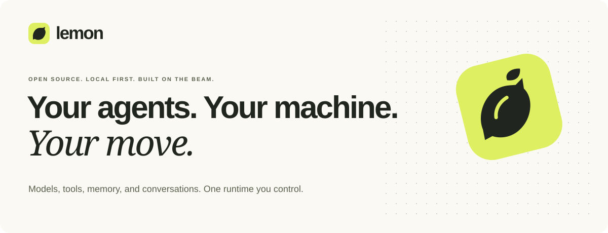

<div align="center">



# Lemon

### Your agents. Your machine. Your move.

A self-hosted AI assistant that codes, remembers, and gets work done.<br>
Use it from your terminal, browser, or chat. Powered by Elixir and the BEAM.

[**Get started**](#get-started) · [**Documentation**](https://z80dev.github.io/lemon/) · [**Try a demo**](docs/demo.md) · [**Releases**](https://github.com/z80dev/lemon/releases)

[](https://github.com/z80dev/lemon/actions/workflows/quality.yml)
[](https://github.com/z80dev/lemon/actions/workflows/sim-bench.yml)
[](LICENSE)

</div>

## An assistant you can make your own

Bring your preferred models. Give each specialist its own workspace. Keep conversations and memory on your machine, and reach your agents wherever you work. Lemon brings the tools, interfaces, and runtime together in one open-source system.

| Make it useful | Make it yours |
| --- | --- |
| **Work across interfaces.** Chat in the terminal or browser, then connect Telegram or Discord. [Choose an interface →](docs/user-guide/setup.md) | **Choose your models.** Use Anthropic, OpenAI, Google, or other supported providers through one runtime. [Configure providers →](docs/config.md) |
| **Put agents to work.** Edit code, use browser and LSP tools, connect MCP servers, and delegate to native subagents. [Explore the tools →](apps/coding_agent/README.md) | **Build a team of specialists.** Give profiles stable chats, separate workspaces, skills, and optional model or execution-node assignments. [Meet profiles →](docs/user-guide/profiles.md) |
| **Pick up where you left off.** Resume durable sessions, search local memory, and turn repeatable work into skills and automation. [Explore skills →](docs/user-guide/skills.md) | **Stay in control.** Manage local configuration and encrypted secrets, inspect runtime health, and create verified backups. [Operate Lemon →](docs/user-guide/backups.md) |

Lemon is **pre-1.0 and actively evolving**. Start with the [supported platforms](docs/install.md) and [current capabilities](docs/compare.md) to see what is available today.

## Get started

### 1. Install

Run this in an interactive terminal on a [supported macOS or Linux system](docs/install.md):

```bash
curl -fsSL https://raw.githubusercontent.com/z80dev/lemon/main/install.sh | sh
```

The installer verifies the release checksum and opens setup to choose your provider, authentication, and default model. No Elixir installation is needed for prebuilt releases.

### 2. Check your setup

```bash
export PATH="$HOME/.lemon/bin:$PATH"
lemon doctor
```

If you skipped the setup wizard, run `lemon setup` first. For help with installation or provider configuration, follow the [quickstart](docs/getting-started/quickstart.md) or [troubleshooting guide](docs/support.md).

### 3. Start a conversation

```bash
lemon
```

Send your first message. Use `/help` to explore commands and `/sessions` to return to previous conversations.

Prefer a browser? The full release includes a local Web UI:

```bash
lemon web
```

**Next:** [Connect Telegram or Discord](docs/user-guide/setup.md) · [Create a specialist profile](docs/user-guide/profiles.md) · [Explore the CLI](docs/user-guide/cli.md)

## Built for more than one conversation

Lemon runs agents as supervised Elixir/OTP processes. Conversations can execute concurrently, workers have a supervision boundary, and durable sessions preserve history across individual requests. Native subagents share the same execution stack; named execution nodes let you place work on another machine.

That architecture also powers **LemonSim**: event-sourced arenas for studying how models plan, cooperate, compete, and recover. Try a deterministic offline game without provider API keys:

```bash
# From a source checkout with dependencies installed
mix lemon.sim.tic_tac_toe --offline-strategy random --seed 42 --no-persist --max-turns 10
```

[Why the BEAM?](docs/why-beam-for-agents.md) · [Architecture overview](docs/architecture/overview.md) · [LemonSim guide](apps/lemon_sim/README.md) · [Run benchmarks](docs/benchmarks/quickstart.md)

## Find your next step

| I want to… | Start here |
| --- | --- |
| Get from installation to a working chat | [Quickstart](docs/getting-started/quickstart.md) |
| Build an agent with the platform | [Build your first agent](docs/getting-started/build-your-first-agent.md) |
| Configure providers, models, or secrets | [Configuration reference](docs/config.md) |
| Use sessions, profiles, and command-line tools | [CLI reference](docs/user-guide/cli.md) · [TUI reference](clients/tui/README.md) |
| Connect independent agents | [Persistent A2A conversations](docs/user-guide/a2a-peers.md) |
| Send channel notifications from scripts | [Script notifications](apps/lemon_channels/README.md#script-notifications) |
| Update or move an installation | [Safe updates](docs/user-guide/updates.md) · [Backup and restore](docs/user-guide/backups.md) |
| Diagnose a problem | [Support](docs/support.md) · [Report an issue](https://github.com/z80dev/lemon/issues) |
| Explore everything | [Documentation index](docs/README.md) · [Machine-readable docs](https://z80dev.github.io/lemon/llms.txt) |

## Build with us

Lemon is an Elixir umbrella with reusable AI, agent, memory, and routing libraries; a personal assistant runtime; and simulation products. See the [architecture guide](docs/architecture/overview.md) for the package map and [architecture boundaries](docs/architecture_boundaries.md) for dependency rules.

For source development, use Erlang/OTP 28.5+, Elixir 1.19.5+, and Bun 1.3.14+ for the TUI. Web client development also uses Node.js 24 LTS+.

```bash
git clone https://github.com/z80dev/lemon.git
cd lemon
mix local.hex --force
mix deps.get
mix compile
./bin/lemon setup
./bin/lemon doctor
./bin/lemon-tui
```

Run checks from the repository root:

```bash
scripts/test fast       # Compile with warnings as errors; run the fast suite
scripts/test quality    # Check code quality, documentation, and architecture
```

[Contributing](CONTRIBUTING.md) · [Agent guide](AGENTS.md) · [Testing](docs/testing.md) · [Security policy](SECURITY.md) · [Changelog](CHANGELOG.md)

## Acknowledgments

Inspired by [pi](https://github.com/badlogic/pi-mono), with architectural ideas from [Oh-My-Pi](https://github.com/can1357/oh-my-pi), [takopi](https://github.com/banteg/takopi), OpenClaw, and Ironclaw. The skill library was bootstrapped from [Hermes Agent](https://github.com/NousResearch/hermes-agent). Built with [Elixir](https://elixir-lang.org/) on the Erlang BEAM; the TUI uses [@oh-my-pi/pi-tui](https://www.npmjs.com/package/@oh-my-pi/pi-tui).

[MIT licensed](LICENSE). Named after a very good cat.
