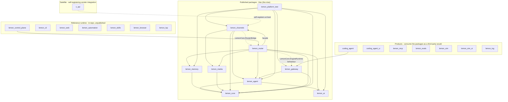

# Lemon

[](https://github.com/z80dev/lemon/actions/workflows/quality.yml)
[](https://github.com/z80dev/lemon/actions/workflows/dialyzer.yml)
[](https://github.com/z80dev/lemon/actions/workflows/sim-bench.yml)
[](https://github.com/z80dev/lemon/actions/workflows/osv-scanner.yml)

**Lemon is a resilient, BEAM-native personal AI assistant and agent platform.** Built on Elixir/OTP, it provides supervised per-run agent processes, multi-channel messaging, a configured execution runtime, persistent memory, and deterministic simulation arenas.

---

## Why Lemon?

- **Multi-channel and always on** — Chat with your agent across **Telegram**, **Discord**, **WhatsApp**, **XMTP**, the terminal **TUI**, or the **Web UI**.
- **Model-agnostic** — Connect to 27 configured LLM providers, including Anthropic, OpenAI, Google Gemini, Bedrock, Azure, and OpenAI-compatible services. Lemon provides unified streaming, automatic retries, rate limiting, and cost accounting (`lemon_ai`); compatible local endpoints can be configured separately.
- **Coding agent and MCP** — Native tool execution, MCP (Model Context Protocol) client/server bridge, native in-process subagent orchestration, browser automation, and LSP integration.
- **Durable memory** — SQLite-backed full-text recall, document ingestion, and a provider interface for optional semantic backends, including Honcho long-term memory integration (`lemon_memory`).
- **User-managed profiles** — Create durable specialist agents with stable chats,
  separate bootstrap/memory/skill workspaces, optional model/node assignment,
  node-aware roster status, safe clone/export, and guarded deletion.
- **Durable session operations** — Search and inspect bounded redacted history,
  title/pin/archive sessions, create redacted exports, and preview-confirm
  verified pruning from the packaged or source CLI.
- **LemonSim and benchmark arenas** — Event-sourced simulation worlds (Werewolf, Space Station, Stock Market, Survivor, Poker) and reproducible offline benchmark scoring without provider API keys.
- **Supervised on the BEAM** — Each agent run is an isolated OTP process. Separate conversations execute concurrently, crashed workers are supervised, and durable session state survives individual requests.

> **Design:** [Agents Are a Concurrency Problem](docs/why-beam-for-agents.md) and [BEAM Agent Architecture](docs/beam_agents.md).

---

## Quickstart

### 1. Install Lemon

Install the prebuilt binary runtime directly into `~/.lemon/bin`:

```bash
curl -fsSL https://raw.githubusercontent.com/z80dev/lemon/main/install.sh | sh
```

*(Add `~/.lemon/bin` or `$HOME/.lemon/bin` to your `PATH` if prompted.)*

### 2. Configure Providers & Models

Run the interactive setup wizard to configure your preferred LLM provider and API keys:

```bash
lemon setup
```

Verify your setup with the diagnostic doctor:

```bash
lemon doctor
```

Create a verified private backup of durable `~/.lemon` state before changing
machines or performing maintenance:

```bash
lemon backup create
```

See [Back up and restore Lemon user state](docs/user-guide/backups.md) for the
versioned data contract, credential exclusions, and guarded overwrite flow.

### 3. Start Chatting

Launch the interactive Terminal UI (TUI):

```bash
lemon
```

Or launch the local browser interface (the full release profile starts the
daemon automatically and waits for the page):

```bash
lemon web
```

See [Use Lemon in a Browser](docs/user-guide/web.md) for setup recovery,
access-control, and headless launch details.

Create a specialist profile and send work to its canonical chat:

```bash
lemon profile create research --name "Research" --model openai:gpt-5
lemon profile chat research "Summarize the open questions"
lemon profile roster
```

Inside the TUI, `/profiles` opens the same live roster and switches to the
selected canonical chat. `/profile create|clone|rename|export|delete` uses the
authenticated control plane for lifecycle actions, while normal prompts from
an opened profile retain its derived workspace and named-node routing.

See [User-managed profiles](docs/user-guide/profiles.md) for lifecycle,
filesystem isolation, named-node routing, and export safeguards.

Inspect or safely manage durable sessions, and install completion generated
from the same registry as CLI help and dispatch:

```bash
lemon sessions list --limit 20
lemon sessions search "deployment follow-up"
lemon sessions export agent:research:main --format markdown
lemon completion zsh > "$HOME/.zfunc/_lemon"
```

See the [Lemon command-line reference](docs/user-guide/cli.md) for the complete
session lifecycle, guarded prune, exit-code, JSON, and shell setup contracts.

---

## Connect Messaging Channels

Connect Lemon to your favorite chat platforms:

### Telegram
```bash
lemon gateway setup telegram
```

### Discord
```bash
lemon gateway setup discord
```

### Script & CI Notifications
Send messages or upload build artifacts directly to your channels from shell scripts or CI pipelines:

```bash
# Installed runtime
lemon send --to telegram:<chat_id> "Deployment complete"
lemon send --to discord:#ops --attach release-notes.md --attach build.log "Build finished"

# Source checkout
./bin/lemon send --to telegram:<chat_id> "Deployment complete"
```
*(See [Script Notifications Reference](apps/lemon_channels/README.md#script-notifications) for delivery options and default target configuration.)*

---

## Source Development

For development or contributing to Lemon, clone the repository and build from source:

### Prerequisites
- **Erlang/OTP** 28.5+ & **Elixir** 1.19.5+
- **Bun** 1.3.14+ (for TUI development)
- **Node.js** 24 LTS+ (for Web UI development)

### Build & Run

```bash
# Clone the repository
git clone https://github.com/z80dev/lemon.git
cd lemon

# Fetch dependencies & compile
mix local.hex --force
mix deps.get
mix compile

# Run initial setup & doctor
./bin/lemon setup
./bin/lemon doctor

# Launch the dev TUI client
./bin/lemon-tui

# Or start/open the local Web UI
./bin/lemon web
```

---

## LemonSim and Simulation Arenas

Lemon includes **LemonSim**, an event-sourced simulation engine and arena system for benchmarking model behavior deterministically.

You can run deterministic simulations locally without any API keys:

```bash
# Run offline Tic-Tac-Toe
mix lemon.sim.tic_tac_toe --offline-strategy random --seed 42 --no-persist --max-turns 10

# Run VendingBench benchmark preset
mix lemon.sim.vending_bench --preset ci --offline-strategy baseline --sim-id vb_ci

# Verify and score the game artifact
mix lemon.sim.verify apps/lemon_sim/priv/game_logs/vending_bench/vb_ci
mix lemon.sim.score  apps/lemon_sim/priv/game_logs/vending_bench/vb_ci
```

Learn more in the [LemonSim Guide](apps/lemon_sim/README.md) and [Benchmark Guides](docs/benchmarks/quickstart.md).

---

## Architecture

Lemon is organized as an Elixir umbrella split into 9 modular core packages, a reference runtime, and product applications.

### Core Packages

| Package | Role & Contents |
| --- | --- |
| [`lemon_ai`](apps/lemon_ai/README.md) | Provider-agnostic LLM client (27 configured providers), streaming API, rate limiting, circuit breaker, cost tracking |
| [`lemon_core`](apps/lemon_core/README.md) | Shared bus, `Event` envelopes, `Store` (ETS/JSONL/SQLite), encrypted secrets, config management |
| [`lemon_agent`](apps/lemon_agent/README.md) | Core agentic loop, tool registry, subagents, and model runtime |
| [`lemon_memory`](apps/lemon_memory/README.md) | SQLite full-text search, memory provider registry, document ingestion pipeline, session search |
| [`lemon_media`](apps/lemon_media/README.md) | Redacted-by-construction media job records, hashing, and audio/image processing |
| [`lemon_router`](apps/lemon_router/README.md) | Message routing, run lifecycle (single-flight execution, queue/steer/coalesce), session orchestration |
| [`lemon_gateway`](apps/lemon_gateway/README.md) | Run execution runtime, scheduler, locks, and ingress transports |
| [`lemon_channels`](apps/lemon_channels/README.md) | Channel core, `Plugin` behaviour, Telegram/Discord/WhatsApp/XMTP adapters, outbox & presentation |
| [`lemon_platform_test`](apps/lemon_platform_test/README.md) | Contract-test kit (`BackendCase`, `PluginCase`, `ProviderCase`) for platform extensions |

### Reference Runtime & Products

- **Reference Runtime** (in-repo): [`lemon_control_plane`](apps/lemon_control_plane/README.md) (JSON-RPC API), [`lemon_cli`](apps/lemon_cli/README.md), [`lemon_web`](apps/lemon_web/README.md), [`lemon_automation`](apps/lemon_automation/README.md), [`lemon_skills`](apps/lemon_skills/README.md), [`lemon_browser`](apps/lemon_browser/README.md), [`lemon_lsp`](apps/lemon_lsp/README.md).
- **Products**: [`coding_agent`](apps/coding_agent/README.md), [`coding_agent_ui`](apps/coding_agent_ui/README.md), [`lemon_mcp`](apps/lemon_mcp/README.md), [`lemon_sim`](apps/lemon_sim/README.md), [`lemon_sim_ui`](apps/lemon_sim_ui/README.md), [`lemon_tcg`](apps/lemon_tcg/README.md), [`lemon_evals`](apps/lemon_evals/README.md).
- **Satellites**: [`x_api`](apps/x_api/README.md) (self-registering X / Twitter integration).

### Dependency Graph

Dependencies flow strictly downward. Core platform packages never depend on products or reference runtimes. The published-package edges below are complete; consumption edges from the reference runtime, products, and satellites are representative:


```mermaid
%% Source of truth: apps/*/mix.exs in_umbrella deps (see docs/architecture_boundaries.md).
%% Solid = compile-time dependency. Dashed = runtime-only seam (no compile edge).
graph TD
    subgraph published["Published packages · Hex (the nine)"]
        core["lemon_core"]
        ai["lemon_ai"]
        agent["lemon_agent"]
        mem["lemon_memory"]
        media["lemon_media"]
        chan["lemon_channels"]
        router["lemon_router"]
        gw["lemon_gateway"]
        kit["lemon_platform_test"]
    end

    subgraph reference["Reference runtime · in-repo, unpublished"]
        cp["lemon_control_plane"]
        cli["lemon_cli"]
        web["lemon_web"]
        auto["lemon_automation"]
        skills["lemon_skills"]
        browser["lemon_browser"]
        lsp["lemon_lsp"]
    end

    subgraph products["Products · consume the packages as a third party would"]
        ca["coding_agent"]
        caui["coding_agent_ui"]
        mcp["lemon_mcp"]
        evals["lemon_evals"]
        sim["lemon_sim"]
        simui["lemon_sim_ui"]
        tcg["lemon_tcg"]
    end

    subgraph satellite["Satellite · self-registering vendor integration"]
        xapi["x_api"]
    end

    %% Published-tier compile edges
    agent --> ai
    agent --> core
    mem --> core
    media --> core
    chan --> core
    chan --> agent
    chan --> media
    router --> core
    router --> ai
    router --> agent
    router --> mem
    router --> media
    gw --> core
    gw --> agent
    kit --> core
    kit --> agent
    kit --> ai
    kit --> chan
    kit --> gw
    kit --> mem

    %% The one allowed router->channels compile edge
    router -->|"facade"| chan

    %% Runtime-only seams
    chan -.->|"LemonCore.RouterBridge"| router
    router -.->|"LemonCore.EngineRuntime behaviour"| gw

    %% Representative one-way consumption into the platform
    cp --> router
    ca --> gw
    xapi -.->|"self-registers at boot"| chan
```

---

## Engineering Guarantees

- **Compiler-Enforced Boundaries** — AST-level architecture verification ([`architecture_rules_check.ex`](apps/lemon_core/lib/lemon_core/quality/architecture_rules_check.ex)) ensures no layer violations or circular dependencies exist.
- **Contract Testing for Extensions** — [`lemon_platform_test`](apps/lemon_platform_test/README.md) ships compliance case templates so third-party channel adapters, memory backends, and delegated runners can verify their implementations safely.
- **Typed, Reader-Owned Configuration** — Over 260 environment variable declarations are defined directly by their consumer modules ([`config/config.exs`](config/config.exs)).
- **Deterministic Test Suites** — Fast, isolated ExUnit test execution with network scrubbing and temp dir sandboxing (`scripts/test`).
- **Continuous Security Audits** — OSV-Scanner checks the listed Elixir and JavaScript lockfiles when dependency manifests change and on a weekly schedule ([`osv-scanner.yml`](.github/workflows/osv-scanner.yml)).

---

## Documentation

| Guide | Description |
| --- | --- |
| [Documentation Index](docs/README.md) | Complete documentation catalog |
| [Installation Guide](docs/install.md) | Prebuilt releases, platform support, and headless setup |
| [Configuration Reference](docs/config.md) | Runtime configuration and environment variables |
| [Command-line Reference](docs/user-guide/cli.md) | Runtime commands, durable sessions, exit codes, and shell completion |
| [Backup and Restore](docs/user-guide/backups.md) | `~/.lemon` data contract, verification, guarded restore, and rollback |
| [Testing Guide](docs/testing.md) | Test suites, quality gates, and CI parity |
| [Mix Tasks Reference](docs/mix-tasks.md) | Grouped reference for all `mix lemon.*` commands |
| [Skills Documentation](docs/skills.md) | Skill registry, discovery, and custom assistant tools |
| [Platform Split Plan](docs/platform-split.md) | Architecture evolution and package decoupling roadmap |
| [Benchmark Guides](docs/benchmarks/quickstart.md) | Running model benchmarks in LemonSim |

---

## Development and Quality Commands

```bash
# Fast test suite (compilation warnings as errors + ExUnit)
scripts/test fast

# Full quality suite (Credo, doc freshness, architecture boundaries)
scripts/test quality

# Test specific path
scripts/test path apps/lemon_core/test
```

---

## Contributing

We welcome contributions! Please see:
- [`CONTRIBUTING.md`](CONTRIBUTING.md) — Guidelines for human contributors.
- [`AGENTS.md`](AGENTS.md) — Working agreements for agent and automated contributors.
- [`SECURITY.md`](SECURITY.md) — Security policy and vulnerability disclosure.

---

## License

Lemon is open source software licensed under the [MIT License](LICENSE).

---

## Acknowledgments

Heavily inspired by [pi](https://github.com/badlogic/pi-mono) (Mario Zechner), with architectural ideas from [Oh-My-Pi](https://github.com/can1357/oh-my-pi), [takopi](https://github.com/banteg/takopi), OpenClaw, and Ironclaw. The skill library was bootstrapped from [Hermes Agent](https://github.com/NousResearch/hermes-agent). Built with [Elixir](https://elixir-lang.org/) on the Erlang BEAM; the TUI is powered by [@oh-my-pi/pi-tui](https://www.npmjs.com/package/@oh-my-pi/pi-tui).

*Named after a very good cat.*
