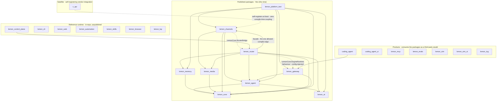

# Lemon

[](https://github.com/z80dev/lemon/actions/workflows/quality.yml)
[](https://github.com/z80dev/lemon/actions/workflows/dialyzer.yml)
[](https://github.com/z80dev/lemon/actions/workflows/sim-bench.yml)
[](https://github.com/z80dev/lemon/actions/workflows/osv-scanner.yml)

Lemon is a platform for building agents on the BEAM: supervised per-run agent
processes, multi-channel ingress, pluggable execution engines, durable memory,
and a benchmark arena for scoring model behaviour. It is an Elixir umbrella
today and is mid-way through a split into a small set of semver'd Hex packages
plus a batteries-included reference runtime that wires them together.

Concretely, the tree contains:

- **Agent runtime** — agent loop, tool registry, subagents, model runtime,
  and workspace stores (`apps/lemon_agent`).
- **Channels** — Telegram, Discord, WhatsApp and XMTP adapters behind one
  `LemonChannels.Plugin` behaviour, plus outbox/dispatcher/presentation
  ([`plugin.ex`](apps/lemon_channels/lib/lemon_channels/plugin.ex)). Email is
  mid-port from the legacy gateway transport; see
  [`docs/platform/transport-unification.md`](docs/platform/transport-unification.md).
- **Engines** — one `LemonGateway.Engine` behaviour with an in-process
  implementation plus five CLI coding agents (Claude Code, Codex, Kimi,
  OpenCode, Pi) in [`apps/lemon_gateway/lib/lemon_gateway/engines`](apps/lemon_gateway/lib/lemon_gateway/engines).
- **Run lifecycle** — single-flight, queue/steer/coalesce, policy, watchdog,
  delivery routing (`apps/lemon_router`).
- **Providers** — a provider-agnostic LLM client with rate limiting, circuit
  breaking, compaction and token accounting, with zero umbrella dependencies
  (`apps/lemon_ai`).
- **Memory** — document schema, SQLite-backed store, a `Provider` behaviour
  with a fan-out registry, ingest pipeline and session search
  (`apps/lemon_memory`).
- **Arenas** — an event-sourced simulation kernel, 16 scored scenarios, and
  always-on model leagues (`apps/lemon_sim`, `apps/lemon_sim_ui`).

The premise: an LLM product is already a distributed system — conversations run
concurrently, tool calls block, providers fail, users interrupt, sessions
outlive requests — so it belongs on a runtime that supervises processes rather
than on queue glue wrapped around one. The full argument, costs included, is
[Agents Are a Concurrency Problem](docs/why-beam-for-agents.md); the invariants
that fall out of it are written down in [`docs/beam_agents.md`](docs/beam_agents.md).

## Architecture

The target shape is nine published packages, a reference runtime that stays
in this repo, and products that consume the packages exactly as a third party
would.

| Package | Contents |
| --- | --- |
| `lemon_ai` | Providers, registry, rate limiting, circuit breaker, compaction, tokens/text |
| `lemon_core` | Bus, `Event` envelope, `Store` + backends, secrets, config, boundary contracts, primitives |
| `lemon_agent` | Agent loop, tool registry, subagents, model runtime, CLI runners, workspace stores |
| `lemon_memory` | Document schema, store, `Provider` behaviour + registry, ingest, search |
| `lemon_media` | Redacted-by-construction media-job records: prompt/error hashing, label redaction |
| `lemon_router` | Run lifecycle and session orchestration |
| `lemon_gateway` | Engine execution runtime: `Engine` behaviour, registry, scheduler, locks |
| `lemon_channels` | Channel core, `Plugin` behaviour, built-in adapters |
| `lemon_platform_test` | Contract-test kit for `Plugin`/`Engine`/`Store.Backend`/`Memory.Provider` authors |

**Reference runtime** (in-repo, unpublished): control plane, CLI, web UI,
automation, skills, browser, LSP. **Products** (leaving for their own
repos): the coding agent, the sim arenas, the showcase site, and the web/TUI
clients.
**Satellites** are the model for vendor integrations — `apps/x_api` carries the
X client, its channel adapter and its three tools, and self-registers at boot,
so the platform holds zero compile-time knowledge of X.

Dependencies flow one way, and the direction is enforced rather than
documented. Solid arrows are compile-time `in_umbrella` dependencies drawn from
`apps/*/mix.exs` (the same graph behind
[`docs/architecture_boundaries.md`](docs/architecture_boundaries.md)); dashed
arrows are runtime-only seams where two packages talk through a behaviour or
bridge with **no** compile-time edge between them.


```mermaid
%% Source of truth: apps/*/mix.exs in_umbrella deps (see docs/architecture_boundaries.md).
%% Solid = compile-time dependency. Dashed = runtime-only seam (no compile edge).
graph TD
    subgraph published["Published packages · Hex (the nine)"]
        core["lemon_core"]
        ai["lemon_ai"]
        agent["lemon_agent"]
        mem["lemon_memory"]
        media["lemon_media"]
        chan["lemon_channels"]
        router["lemon_router"]
        gw["lemon_gateway"]
        kit["lemon_platform_test"]
    end

    subgraph reference["Reference runtime · in-repo, unpublished"]
        cp["lemon_control_plane"]
        cli["lemon_cli"]
        web["lemon_web"]
        auto["lemon_automation"]
        skills["lemon_skills"]
        browser["lemon_browser"]
        lsp["lemon_lsp"]
    end

    subgraph products["Products · consume the packages as a third party would"]
        ca["coding_agent"]
        caui["coding_agent_ui"]
        mcp["lemon_mcp"]
        evals["lemon_evals"]
        sim["lemon_sim"]
        simui["lemon_sim_ui"]
        tcg["lemon_tcg"]
    end

    subgraph satellite["Satellite · self-registering vendor integration"]
        xapi["x_api"]
    end

    %% Published-tier compile edges (full fidelity from mix.exs)
    agent --> ai
    agent --> core
    mem --> core
    media --> core
    chan --> core
    chan --> agent
    chan --> media
    router --> core
    router --> ai
    router --> agent
    router --> mem
    router --> media
    gw --> core
    gw --> agent
    kit --> core
    kit --> agent
    kit --> ai
    kit --> chan
    kit --> gw
    kit --> mem

    %% The one allowed router->channels compile edge
    router -->|"facade · the one allowed compile edge"| chan

    %% Runtime-only seams: no compile edge exists in either direction
    chan -.->|"LemonCore.RouterBridge"| router
    router -.->|"LemonCore.EngineRuntime behaviour · config-injected"| gw

    %% One-way consumption into the platform (representative real edges)
    cp --> router
    ca --> gw
    xapi -.->|"self-registers at boot · zero compile-time coupling"| chan
```

Reference-runtime, product, and satellite apps each depend on the platform
packages; the platform depends on **none** of them. Only one representative
consume-edge per tier is drawn above — the invariant is that no arrow ever runs
back from `published` into the other three tiers.

The same rules, stated precisely:

```
lemon_ai ← lemon_agent ← {router, gateway, channels, skills, products}
lemon_core ← everything
lemon_memory ← {router (ingest hook), skills, products}
router ⇄ gateway: ONLY via LemonCore.EngineRuntime behaviour (config-injected)
channels → router: ONLY via LemonCore.RouterBridge
router → channels: Dispatcher/Outbox facade only (the one allowed compile-time edge)
products/satellites → platform: hex deps; platform NEVER depends on a product
```

**State of the split.** Phases 1–3 are complete: `lemon_core` is
product-free, the wrong-direction dependencies are inverted (the enforced
allowlist is empty), the email channel port has landed, and the contracts,
docs and test kit are in place. Phase 4 (packaging) is done — all nine
packages build clean and are metadata-ready — with the first Hex release
pending. The plan of record is
[`docs/platform-split.md`](docs/platform-split.md) — a living document with the
evidence behind each decision, a numbered decision log, and work items checked
off in place. Per-package pages are in [`docs/platform/`](docs/platform).

## Engineering

Claims here are links, not adjectives.

**Boundaries are compiler-checked, and the allowlist is empty.**
[`architecture_rules_check.ex`](apps/lemon_core/lib/lemon_core/quality/architecture_rules_check.ex)
resolves the dependency rules above from each file's AST, so aliases, calls and
dynamic `:"Elixir.Foo"` atoms all count while mentions in comments do not. It
started with a 29-entry shrink-only `@grandfathered` list grouped by the work
item that would retire each group; that list is now `[]`. A separate
[direct-dependency policy](docs/architecture_boundaries.md) is generated from
the actual `mix.exs` graph. Both run in `mix lemon.quality` on every push.

**Third parties can test their own implementations.**
[`apps/lemon_platform_test`](apps/lemon_platform_test/README.md) ships four
`ExUnit.CaseTemplate`s — `BackendCase`, `PluginCase`, `EngineCase`,
`ProviderCase` — used as `use LemonPlatformTest.PluginCase, adapter:
MyAdapter`. They are safe by default: nothing delivers a message, starts a run
or opens a socket without an explicit probe, because a compliance suite that
posts to a live bot is worse than none. Registration round-trips are included,
since "works standalone, invisible to the platform" is the common integration
failure. The kit was validated by running a deliberately-broken backend through
`BackendCase` to confirm it fails rather than passing vacuously, and by running
`XApi.ChannelAdapter` and `CodingAgent.GatewayEngine` through it *from their own
apps* — the dependency direction a third party has.

**Configuration is typed and owned by its reader.** 260 environment-variable
declarations live in 16 per-app registry modules aggregated through
`config :lemon_core, :env_registries`
([`config/config.exs`](config/config.exs)); registries missing from a given
build are skipped, so the aggregate always describes what the build can
actually read. Ownership is by reader, not by name prefix.

**Tests are deterministic and numerous.** 887 test files, ~318k lines under
`apps/*/test`. The runner (`scripts/test`) scrubs ambient provider credentials
and provisions per-invocation temp dirs so a lane cannot silently reach the
network or a developer's real store; CI re-runs the historically flaky suites
twice per build. Library-ification is proved by tests, not asserted:
[`store_instance_test.exs`](apps/lemon_core/test/lemon_core/store_instance_test.exs)
runs two independently-named stores with isolated caches in one node.

**Dependencies are scanned; work is not parked in comments.** OSV-Scanner runs
over the Elixir, Node and Python manifests on every lockfile change and again
weekly ([`osv-scanner.yml`](.github/workflows/osv-scanner.yml)). Grep `apps/`
for `TODO` and you get two hits, both string literals inside a truncation
heuristic rather than deferred work, and there are no `FIXME` markers at all
across ~425k lines of Elixir.

**The plan gets corrected by the code.** Two entries in the decision log are
reversals of my own earlier decisions after reading the source: **D2** —
"move all five gateway transports to the channel `Plugin` behaviour" was
abandoned because `Plugin.deliver/1` is fire-and-forget and cannot return a
synchronous HTTP response into the originating request; only email actually
fits, and the rest stay as non-channel ingress. **D11** — `chat_state` was
slated to move to the router as its sole owner, but `lemon_channels` turned out
to read *and* write it, and channels may not depend on the router, so moving it
would have encoded an accident as architecture. Both are written up with
evidence in [§8 of the plan](docs/platform-split.md).

## Quickstart

### Install Lemon and start chatting

From an interactive terminal, install the prebuilt runtime:

```bash
curl -fsSL https://raw.githubusercontent.com/z80dev/lemon/main/install.sh | sh
```

The installer downloads and verifies the release, then hands off to the
interactive `lemon setup` wizard for the `full` and `min` profiles. The wizard
creates first-time configuration only when it is absent, initializes encrypted
secrets when needed, and guides provider authentication and default-model
selection. It verifies provider configuration; it does not configure messaging
channels or run general diagnostics automatically.

After setup, open the interactive TUI and send your first message:

```bash
$HOME/.lemon/bin/lemon
```

The installer prints the PATH entry; after adding `~/.lemon/bin`, use `lemon`.
The first interactive launch checks provider readiness and opens `lemon setup`
before starting an unconfigured daemon. If it has no terminal, run `lemon
setup` later from an interactive terminal instead.

To defer setup, including for automation, pass `--skip-setup` to the installer:

```bash
curl -fsSL https://raw.githubusercontent.com/z80dev/lemon/main/install.sh | sh -s -- --skip-setup
```

Without a TTY, the installer does not block; it prints the absolute setup
command to run later. The `sim` profile has no provider setup wizard. For
provider, model, diagnostics, and optional channels after installation, use:

```bash
lemon setup
lemon model --provider anthropic
lemon doctor
lemon gateway setup       # optional: choose Telegram or Discord
lemon channels
```

`lemon setup provider` performs live provider verification when supported;
append `--skip-verify` to defer that network check when offline. See the
[Install guide](docs/install.md) for the non-interactive flow, platform
requirements, and release lifecycle.

### Source development

Use a source checkout for development, unsupported platforms, or building
release artifacts. This path—not the prebuilt installer—requires Elixir
1.19.5+, Erlang/OTP 28.5+, Bun 1.3.14+ for TUI development, and Node.js 24
LTS+ for web development:

```bash
git clone https://github.com/z80dev/lemon.git
cd lemon
mix local.hex --force
mix deps.get
mix compile
./bin/lemon setup
./bin/lemon doctor
./bin/lemon-tui
```

Use the source wrapper for the corresponding commands:

```bash
./bin/lemon model --provider anthropic
./bin/lemon gateway setup telegram
./bin/lemon gateway setup discord
./bin/lemon config validate
./bin/lemon secrets status
./bin/lemon channels
```

## Arenas

The most visible thing the platform does is run models against each other. An
arena keeps a league game running continuously for one simulation domain,
samples a randomized model lineup per game, and records every finished game
into persistent standings, resuming games that die mid-flight and reconciling
unrecorded results on restart. Five domains are wired: werewolf, space station,
stock market, survivor, poker — served at `/arena/:domain`,
`/arena/:domain/leaderboard`, and a cross-domain `/leaderboards`, all in
`apps/lemon_sim_ui`. Enable one with `LEMON_ARENA_<DOMAIN>_ENABLED` and
`LEMON_ARENA_<DOMAIN>_MODELS`.

Results are meant to be checkable: every run writes a hash-manifested artifact
bundle, each scenario's scorecard is a pure function of final world state that
the verifier recomputes and diffs, and per-actor token and cost usage is
recorded alongside. On top of single runs sit benchmark suites (competitors ×
seeds matrices) and order-independent Bradley-Terry model ratings fit over
pairwise seed-level comparisons.

No API keys needed for a deterministic run:

```bash
mix lemon.sim.tic_tac_toe --offline-strategy random --seed 42 --no-persist --max-turns 10
mix lemon.sim.vending_bench --preset ci --offline-strategy baseline --sim-id vb_ci
mix lemon.sim.verify apps/lemon_sim/priv/game_logs/vending_bench/vb_ci
mix lemon.sim.score  apps/lemon_sim/priv/game_logs/vending_bench/vb_ci
```

The arena guide is [`apps/lemon_sim/README.md`](apps/lemon_sim/README.md).

## Repository map

Every app has its own README; these are the ones worth reading first.

| Layer | Apps |
| --- | --- |
| Platform | [`ai`](apps/lemon_ai/README.md), [`lemon_core`](apps/lemon_core/README.md), [`agent_core`](apps/lemon_agent/README.md), `lemon_memory`, [`lemon_router`](apps/lemon_router/README.md), [`lemon_gateway`](apps/lemon_gateway/README.md), [`lemon_channels`](apps/lemon_channels/README.md), [`lemon_platform_test`](apps/lemon_platform_test/README.md) |
| Reference runtime | [`lemon_control_plane`](apps/lemon_control_plane/README.md), [`lemon_cli`](apps/lemon_cli/README.md), [`lemon_web`](apps/lemon_web/README.md), [`lemon_automation`](apps/lemon_automation/README.md), [`lemon_skills`](apps/lemon_skills/README.md), [`lemon_browser`](apps/lemon_browser/README.md), [`lemon_lsp`](apps/lemon_lsp/README.md) |
| Products | [`coding_agent`](apps/coding_agent/README.md), [`coding_agent_ui`](apps/coding_agent_ui/README.md), [`lemon_mcp`](apps/lemon_mcp/README.md), [`lemon_evals`](apps/lemon_evals/README.md), [`lemon_sim`](apps/lemon_sim/README.md), [`lemon_sim_ui`](apps/lemon_sim_ui/README.md), [`lemon_tcg`](apps/lemon_tcg/README.md) |
| Satellite | [`x_api`](apps/x_api/README.md) |

Docs index: [`docs/README.md`](docs/README.md) · architecture overview:
[`docs/architecture/overview.md`](docs/architecture/overview.md) · config
reference: [`docs/config.md`](docs/config.md).

## Development

```bash
scripts/test fast      # compile --warnings-as-errors + ExUnit, excluding integration
scripts/test quality   # credo, doc freshness, architecture boundaries, duplicate tests
scripts/test path apps/lemon_core/test
```

[`docs/testing.md`](docs/testing.md) maps every local lane to its CI job, and
[`docs/mix-tasks.md`](docs/mix-tasks.md) groups the ~85 `mix lemon.*` tasks by
what they do — `mix lemon.help` prints the same index from the CLI.
Release profiles `lemon_runtime_min`, `lemon_runtime_full` and
`sim_broadcast_platform` are defined in [`mix.exs`](mix.exs):

```bash
MIX_ENV=prod mix release lemon_runtime_full
```

## Contributing

Start with [`CONTRIBUTING.md`](CONTRIBUTING.md); [`AGENTS.md`](AGENTS.md) is the
working agreement for both human and agent contributors. A new channel adapter
is the ideal first contribution — implement
[`LemonChannels.Plugin`](apps/lemon_channels/lib/lemon_channels/plugin.ex) and
run it against `LemonPlatformTest.PluginCase`. Vulnerability reports:
[`SECURITY.md`](SECURITY.md).

## License

MIT — see [`LICENSE`](LICENSE).

## Acknowledgments

Heavily inspired by [pi](https://github.com/badlogic/pi-mono) (Mario Zechner),
with architectural ideas from [Oh-My-Pi](https://github.com/can1357/oh-my-pi),
[takopi](https://github.com/banteg/takopi), OpenClaw and Ironclaw. The skill
library was bootstrapped from
[Hermes Agent](https://github.com/NousResearch/hermes-agent). Built with
[Elixir](https://elixir-lang.org/); the TUI is powered by
[@oh-my-pi/pi-tui](https://www.npmjs.com/package/@oh-my-pi/pi-tui).

Named after a very good cat.
