# Architecture Overview

Lemon is a BEAM-native stack for LLM interactions: a layered set of Elixir/OTP
libraries (`ai` → `agent_core` → product apps) with two products on top — a
multi-channel personal assistant and **LemonSim**, a deterministic
model-vs-model simulation arena. This document covers the system architecture,
key design decisions, and component responsibilities.

For system diagrams see `docs/diagrams/`. For per-app details see each `apps/*/README.md`.

---

## Core Philosophy

1. **Agents as Processes** — each AI agent is a GenServer with isolated state, a
   mailbox, and an independent lifecycle. Multiple sessions never share state.

2. **Streaming as Events** — LLM responses are modeled as event streams, enabling
   reactive UIs, parallel processing, and backpressure handling.

3. **Fault Tolerance** — OTP supervision trees isolate failures. A crashing tool
   does not kill the agent session; a network error during streaming is recoverable.

4. **Live Steering** — users can inject messages mid-execution because the BEAM
   can send a message to any process at any time.

5. **Multi-Provider Abstraction** — unified interface for 26 LLM providers with
   automatic model configuration and cost tracking.

6. **Multi-Engine Architecture** — pluggable execution engines: native Lemon plus
   Codex CLI, Claude CLI, OpenCode CLI, and Pi CLI backends.

---

## System Architecture

```
┌─────────────────────────────────────────────────────────────┐
│ Clients                                                      │
│  TUI (TypeScript)  ·  Web (React)  ·  Browser (Playwright)  │
└───────────────────────┬─────────────────────────────────────┘
                        │ JSON-RPC / WebSocket
┌───────────────────────▼────────────────────┐
│ LemonControlPlane  (112+ RPC methods)       │
└───────────────────────┬────────────────────┘
                        │
┌───────────────────────▼────────────────────┐
│ LemonRouter            RunOrchestrator      │
│  · model selection     · policy enforcement │
│  · routing feedback    · approval gating    │
└────────┬──────────────────────┬────────────┘
         │                      │
┌────────▼───────┐   ┌──────────▼──────────┐
│ LemonGateway   │   │ LemonChannels        │
│  (engines)     │   │  Telegram, Discord,  │
└────────┬───────┘   │  X/Twitter           │
         │           └─────────────────────-┘
┌────────▼───────────────────────────────────┐
│ CodingAgent.Session                         │
│  · 23 built-in tools                        │
│  · context compaction                       │
│  · extension system                         │
└────────┬───────────────────────────────────┘
         │
┌────────▼──────────────┬──────────────────┐
│ LemonCore             │ LemonSkills       │
│  · EventBus           │  · skill catalog  │
│  · MemoryStore        │  · audit engine   │
│  · TaskFingerprint    │  · synthesis      │
│  · Config/Secrets     │  · installer      │
└───────────────────────┴──────────────────┘
         │
┌────────▼──────────────────────────────────┐
│ LemonAi  (provider abstraction layer)           │
│  26 providers: Anthropic, OpenAI, Google,  │
│  Azure, AWS Bedrock, xAI, Mistral, …       │
└───────────────────────────────────────────┘
```

See `docs/diagrams/architecture.svg` for the full visual diagram.

---

## Application Map

The project is an Elixir umbrella with 24 applications:

**Stack (bottom-up):**

| App | Role |
|---|---|
| `ai` | Provider abstraction, streaming, cost tracking (standalone; no umbrella deps) |
| `lemon_core` | EventBus, TaskFingerprint, config, secrets (standalone; no umbrella deps) |
| `lemon_memory` | Durable memory for agents: document schema, SQLite-backed full-text store, provider behaviour with isolated fan-out search, run ingest (published; extracted from `lemon_core`) |
| `agent_core` | Core agent loop, tool execution, model runtime credential glue, abort/subagent semantics |
| `lemon_platform_test` | Contract-test kit for the platform's extension behaviours: ExUnit case templates that validate Plugin, Engine, Store backend, and memory-provider implementations (published) |

**Assistant product:**

| App | Role |
|---|---|
| `coding_agent` | Session management, compaction, JSONL persistence, tools |
| `coding_agent_ui` | Debug RPC interface, TUI/Web bridge |
| `lemon_router` | RunOrchestrator, ModelSelection, RoutingFeedbackStore, lane queues, policy engine |
| `lemon_gateway` | Engine dispatch (native + CLI backends), execution lifecycle |
| `lemon_channels` | Transport adapters (Telegram, Discord, X/Twitter, WhatsApp), model policy |
| `lemon_automation` | CronManager, HeartbeatManager, scheduled jobs |
| `lemon_control_plane` | HTTP/WebSocket server, 112+ RPC methods |
| `lemon_skills` | Skill catalog, manifest v2 parser, installer, audit, synthesis |
| `lemon_mcp` | MCP protocol server |
| `lemon_cli` | Onboarding/setup/migration mix tasks and CLI glue |
| `lemon_web` | React web frontend bridge |
| `x_api` | X/Twitter HTTP client (leaf) |
| `lemon_evals` | Eval harness for assistant behavior |

**Capability apps (extracted from lemon_core):**

| App | Role |
|---|---|
| `lemon_browser` | Local browser automation server, artifacts, route policy |
| `lemon_media` | Media jobs, worker, supervisor |
| `lemon_lsp` | LSP server manager |

**Arena product:**

| App | Role |
|---|---|
| `lemon_sim` | Deterministic model-vs-model simulation arena: event-sourced kernel, scenarios, verified benchmark artifacts |
| `lemon_sim_ui` | Phoenix LiveView spectator/admin UI for the arena |

**Other products:**

| App | Role |
|---|---|
| `lemon_tcg` | Live market data and paper execution for an agent-operated on-chain TCG shop — the real-world counterpart of `LemonSim.Examples.TcgShop` |

### Package dependency graph

The graph below is the compile-time dependency structure of the platform tier,
drawn from the `in_umbrella` deps in `apps/*/mix.exs` (the same source behind
[`architecture_boundaries.md`](../architecture_boundaries.md)). Solid arrows are
compile-time dependencies; dashed arrows are runtime-only seams where two
packages talk through a behaviour or bridge with **no** compile-time edge —
which is exactly what keeps `router`, `gateway` and `channels` independently
replaceable.

```mermaid
%% Source of truth: apps/*/mix.exs in_umbrella deps (see docs/architecture_boundaries.md).
%% Solid = compile-time dependency. Dashed = runtime-only seam (no compile edge).
graph TD
    subgraph published["Published packages · Hex (the nine)"]
        core["lemon_core"]
        ai["lemon_ai"]
        agent["lemon_agent"]
        mem["lemon_memory"]
        media["lemon_media"]
        chan["lemon_channels"]
        router["lemon_router"]
        gw["lemon_gateway"]
        kit["lemon_platform_test"]
    end

    subgraph reference["Reference runtime · in-repo, unpublished"]
        cp["lemon_control_plane"]
        cli["lemon_cli"]
        web["lemon_web"]
        auto["lemon_automation"]
        skills["lemon_skills"]
        browser["lemon_browser"]
        lsp["lemon_lsp"]
    end

    subgraph products["Products · consume the packages as a third party would"]
        ca["coding_agent"]
        caui["coding_agent_ui"]
        mcp["lemon_mcp"]
        evals["lemon_evals"]
        sim["lemon_sim"]
        simui["lemon_sim_ui"]
        tcg["lemon_tcg"]
    end

    subgraph satellite["Satellite · self-registering vendor integration"]
        xapi["x_api"]
    end

    %% Published-tier compile edges (full fidelity from mix.exs)
    agent --> ai
    agent --> core
    mem --> core
    media --> core
    chan --> core
    chan --> agent
    chan --> media
    router --> core
    router --> ai
    router --> agent
    router --> mem
    router --> media
    gw --> core
    gw --> agent
    kit --> core
    kit --> agent
    kit --> ai
    kit --> chan
    kit --> gw
    kit --> mem

    %% The one allowed router->channels compile edge
    router -->|"facade · the one allowed compile edge"| chan

    %% Runtime-only seams: no compile edge exists in either direction
    chan -.->|"LemonCore.RouterBridge"| router
    router -.->|"LemonCore.EngineRuntime behaviour · config-injected"| gw

    %% One-way consumption into the platform (representative real edges)
    cp --> router
    ca --> gw
    xapi -.->|"self-registers at boot · zero compile-time coupling"| chan
```



Consumption is one-directional: reference-runtime, product, and satellite apps
depend on the platform packages, and no platform package depends back on any of
them. Only one representative consume-edge per tier is drawn; the invariant is
that no arrow ever runs from `published` into the outer three tiers.

---

## Data Flow

Four main paths through the system:

1. **Direct (TUI/Web)**: JSON-RPC → `debug_agent_rpc` → `coding_agent_ui` → Session → LemonAgent → Tools/LemonAi

2. **Control Plane**: WebSocket → ControlPlane → Router → Orchestrator → Gateway → Engine

3. **Channel (Telegram etc.)**: Message → LemonChannels → Router → StreamCoalescer → Outbox

4. **Automation**: CronManager tick → Due jobs → Router → HeartbeatManager → EventBus

See `docs/diagrams/data-flow.svg` for the full diagram.

---

## Run Lifecycle

```
User message
  → Session routing (canonical session key)
    → RunOrchestrator.start_run/1
      → ModelSelection.resolve/1  (explicit → meta → session → profile → history → default)
      → Lane selection (main/subagent/background)
      → Engine dispatch
        → Tool execution (isolated Task processes)
        → LLM streaming (event stream per response)
      → Outcome recording (RunOutcome → MemoryDocument)
      → Routing feedback entry
```

### Lane scheduling

| Lane | Default cap | Purpose |
|---|---|---|
| `main` | 4 | User-initiated runs |
| `subagent` | 8 | Agent-spawned subagents |
| `background` | 2 | Cron jobs, automations |

### Model selection precedence

```
explicit_model        # per-message /model override
  → meta_model        # metadata field in request
    → session_model   # /model set for this session
      → profile_model # config [profiles.X] model field
        → history_model  # best model for this task fingerprint (routing_feedback)
          → default_model  # config [defaults] model
```

---

## Key Abstractions

### TaskFingerprint

Classifies every run into a canonical key used for routing feedback and skill synthesis:

```
<task_family>|<toolset>|<workspace>|<provider>|<model>
```

Task families: `:code`, `:query`, `:file_ops`, `:chat`, `:unknown`

Context key (for history lookup): `<task_family>|<toolset>|<workspace>`

### MemoryDocument

Durable record of a completed run:

```
doc_id, run_id, session_key, agent_id, workspace_key, scope,
started_at_ms, ingested_at_ms,
prompt_summary, answer_summary, tools_used,
provider, model, outcome, meta
```

### Feature Flags

All non-trivial features are gated behind flags in `[features]` TOML section.
Code reads flags via `LemonCore.Config.Features.enabled?(features, :flag_name)`.

Current flags: `session_search` (default `"default-on"`; disable with
`LEMON_FEATURE_SESSION_SEARCH=off`), `routing_feedback`, and
`skill_synthesis_drafts` (both default `"default-on"`; disable with
`LEMON_FEATURE_ROUTING_FEEDBACK=off` / `LEMON_FEATURE_SKILL_SYNTHESIS_DRAFTS=off`).

---

## Why BEAM?

| Concern | BEAM advantage |
|---|---|
| Millions of concurrent agents | Lightweight processes (microseconds to start, ~2KB memory) |
| Live steering mid-run | Message to any process at any time |
| Tool crash isolation | OTP supervision; supervisor restarts failed child |
| Streaming responses | Process-per-stream with backpressure |
| Session persistence across restarts | Durable state in ETS + SQLite |
| Hot code reload | BEAM code upgrade without restart |
| Multi-node future | Native Erlang distribution built in |

---

## Further Reading

| Document | Topic |
|---|---|
| [`docs/architecture_boundaries.md`](../architecture_boundaries.md) | Dependency policy between apps |
| [`docs/beam_agents.md`](../beam_agents.md) | BEAM agent architecture deep-dive |
| [`docs/context.md`](../context.md) | Context management and compaction |
| [`docs/model-selection-decoupling.md`](../model-selection-decoupling.md) | Model selection design |
| [`docs/assistant_bootstrap_contract.md`](../assistant_bootstrap_contract.md) | Session bootstrap sequence |
| `apps/*/README.md` | Per-application documentation |

*Last reviewed: 2026-08-10*
