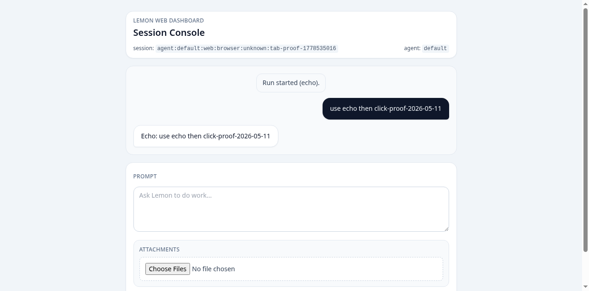
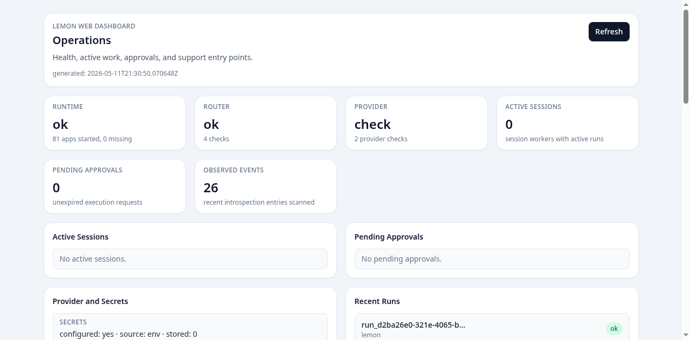

# Demo Lemon

Last reviewed: 2026-05-11

This page gives deterministic demo paths for evaluating Lemon without relying on
marketing claims or unreleased hosted infrastructure. The goal is to prove the
local runtime can install, diagnose itself, boot, expose operations surfaces, and
run a simple agent path.

## Prerequisites

Use the source install path from [Install Lemon](install.md). Before running a
demo, confirm:

```bash
mix deps.get
mix compile
mix lemon.doctor
```

If doctor reports missing provider credentials, either configure a provider with
the [Setup Guide](user-guide/setup.md) or use only the runtime and support-bundle
checks below.

## Demo 1: Runtime Health

Start the unified runtime:

```bash
./bin/lemon
```

In another terminal, check the Web health endpoint:

```bash
curl -fsS http://127.0.0.1:4080/healthz
```

Expected result:

- HTTP request succeeds
- response indicates the Web runtime is healthy
- the runtime process remains supervised

## Demo 2: Operations UI

With `./bin/lemon` running, open:

- `http://127.0.0.1:4080/`
- `http://127.0.0.1:4080/ops`

Current launch proof screenshots:





The operations page should show:

- runtime and router health
- provider and secrets status
- active sessions
- recent runs
- pending approvals when any exist
- observed cron, skills, channel, memory, and log activity from introspection
- cron schedules and recent cron failures
- skill store health
- channel transport enablement and configured bindings
- support bundle download and equivalent source/release commands

For a specific run, use:

```text
Use the TUI, control-plane run APIs, or logs to inspect run details.
```

The run page should show timeline events, tool events, failures, the nested run
graph, event counts, pending approvals for that run, and support-bundle download
or commands.

## Demo 3: TUI From a Project

Start Lemon attached to a repository:

```bash
./bin/lemon-dev /path/to/your/project
```

Use a small prompt that does not require edits:

```text
Inspect this repository and tell me the canonical test command.
```

Expected result:

- Lemon starts inside the selected project context
- the session streams progress in the interface
- tool activity is visible instead of hidden
- cancellation and follow-up prompts remain available

## Demo 4: Support Bundle

From a source checkout:

```bash
mix lemon.doctor --bundle
```

Expected result:

- a redacted support bundle zip is written
- provider keys, tokens, passwords, private prompts, memory contents, and tool
  outputs are excluded
- the bundle includes enough runtime shape to support setup and release triage

Release-runtime support bundles are generated with:

```bash
bin/lemon_runtime_full eval 'LemonCore.Doctor.CLI.bundle!()'
```

The exact release artifact proof is tracked in
[Release Artifact Proof](plans/lemon-1.0-release-artifact-proof-2026-05-11.md).

## Demo 5: Docs and Quality

The public docs site should build cleanly:

```bash
cd docs
npm install --no-package-lock
npm audit --audit-level=high
npm run build
find . -name "*.md" ! -path "./.vitepress/*" ! -path "./node_modules/*" | \
  xargs npx markdown-link-check --config .mlc.json --quiet
cd ..
rm -rf docs/node_modules docs/package-lock.json docs/.vitepress/dist
mix lemon.quality
```

Expected result:

- no high or critical docs tooling advisory blocks the build
- docs build succeeds
- markdown links pass
- generated docs artifacts are removed before `mix lemon.quality`
- repo quality gates pass

## What This Demo Does Not Prove Yet

These demos do not prove final 1.0 readiness by themselves. The launch ledger
still tracks:

- final launch screenshots and video assets
- broader adversarial safety-depth variants beyond the launch-focused web,
  email, skill, and extension-style tool coverage

Use the [Hermes-on-BEAM Readiness Plan](plans/lemon-1.0-mainstream-readiness.md)
for the current source of truth.
