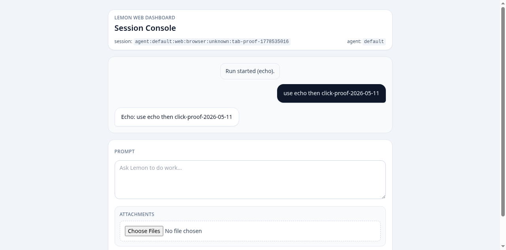

# Demo Lemon

Last reviewed: 2026-08-10

This page gives deterministic demo paths for evaluating Lemon without relying on
marketing claims or unreleased hosted infrastructure. The goal is to prove the
local runtime can install, diagnose itself, boot, expose operations surfaces, and
run a simple agent path.

## Prerequisites

Use the source install path from [Install Lemon](install.md). Before running a
demo, confirm:

```bash
mix deps.get
mix compile
mix lemon.doctor
```

If doctor reports missing provider credentials, either configure a provider with
the [Setup Guide](user-guide/setup.md) or use only the runtime and support-bundle
checks below.

## Demo 1: Runtime Health

Start the unified runtime:

```bash
./bin/lemon
```

In another terminal, check the Web health endpoint:

```bash
curl -fsS http://127.0.0.1:4080/healthz
```

Expected result:

- HTTP request succeeds
- response indicates the Web runtime is healthy
- the runtime process remains supervised

## Demo 2: Web Session UI

Start the Web UI directly; the command reuses a healthy runtime or starts one,
waits for the exact Web health response, and prints the address:

```bash
./bin/lemon web --no-open
```

Then open:

- `http://127.0.0.1:4080/` — the session index (`LemonWeb.SessionLive`)
- `http://127.0.0.1:4080/sessions/<session_key>` — a specific session

Current launch proof screenshot:



The Web surface shows the shared setup-readiness state before accepting a
prompt, streams one session's activity, accepts bounded file uploads, and
exposes **Stop** while a run is active. The standalone `/ops` dashboard was removed
(`refactor(lemon_web): remove ops dashboard`); operations introspection now lives
in the control plane and the doctor, not in the web UI.

To inspect runtime health, provider/secrets status, active sessions, recent runs,
pending approvals, cron/skills/channel/memory activity, and support bundles, use:

- `mix lemon.doctor` (and `mix lemon.doctor --bundle`, see Demo 4)
- the control-plane run APIs (JSON-RPC over `bin/lemon-control-plane`)
- the TUI (`./bin/lemon-tui`, see Demo 3)
- runtime logs

## Demo 3: TUI From a Project

Start Lemon attached to a repository:

```bash
./bin/lemon-tui
```

Use a small prompt that does not require edits:

```text
Inspect this repository and tell me the canonical test command.
```

Expected result:

- Lemon starts inside the selected project context
- the session streams progress in the interface
- tool activity is visible instead of hidden
- cancellation and follow-up prompts remain available

## Demo 4: Support Bundle

From a source checkout:

```bash
mix lemon.doctor --bundle
```

Expected result:

- a redacted support bundle zip is written
- provider keys, tokens, passwords, private prompts, memory contents, and tool
  outputs are excluded
- the bundle includes enough runtime shape to support setup and release triage

Release-runtime support bundles are generated with:

```bash
bin/lemon_runtime_full eval 'LemonCore.Doctor.CLI.bundle!()'
```

The exact release artifact proof is tracked in
[Release Artifact Proof](plans/lemon-1.0-release-artifact-proof-2026-05-11.md).

## Demo 5: Docs and Quality

The public docs site should build cleanly:

```bash
cd docs
npm ci
npm audit --audit-level=high
npm run build
find . -name "*.md" ! -path "./.vitepress/*" ! -path "./node_modules/*" | \
  xargs npx markdown-link-check --config .mlc.json --quiet
cd ..
rm -rf docs/node_modules docs/.vitepress/dist
mix lemon.quality
```

Expected result:

- no high or critical docs tooling advisory blocks the build
- docs build succeeds
- markdown links pass
- generated docs artifacts are removed before `mix lemon.quality`
- repo quality gates pass

## What This Demo Does Not Prove Yet

These demos do not prove final 1.0 readiness by themselves. The launch ledger
still tracks:

- final launch screenshots and video assets
- broader adversarial safety-depth variants beyond the launch-focused web,
  email, skill, and extension-style tool coverage

Use the [Hermes-on-BEAM Readiness Plan](plans/lemon-1.0-mainstream-readiness.md)
for the current source of truth.
