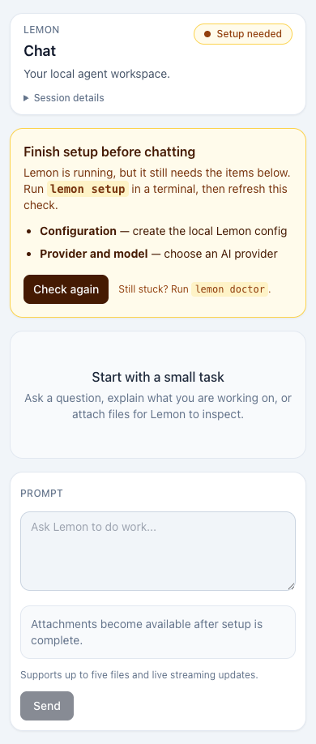

# Hermes vs Lemon Web and Setup Audit

Last reviewed: 2026-08-30

## Scope and evidence

This audit compares the first-run, configuration, local Web/desktop, lifecycle,
migration, recovery, and documentation experience. Transport breadth is out of
scope. Hermes was inspected from official documentation and the official source
tree at commit
[`4f225435`](https://github.com/NousResearch/hermes-agent/commit/4f22543509d1b91dc45bcb369447126c5eb14fb7).
Primary references were the official
[quickstart](https://hermes-agent.nousresearch.com/docs/getting-started/quickstart),
[CLI reference](https://github.com/nousresearch/hermes-agent/blob/main/website/docs/reference/cli-commands.md),
[updating guide](https://github.com/NousResearch/hermes-agent/blob/main/website/docs/getting-started/updating.md),
[Web dashboard guide](https://github.com/NousResearch/hermes-agent/blob/main/website/docs/user-guide/features/web-dashboard.md),
and [desktop guide](https://github.com/NousResearch/hermes-agent/blob/main/website/docs/user-guide/desktop.md).

The Lemon side was verified against the source launcher, packaged-launcher
overlay, setup state machine, doctor, installer, migration tasks, Web LiveView,
and existing parity matrices in this repository.

## New-user path comparison

| Journey | Hermes today | Lemon after this change | Remaining Lemon gap |
| --- | --- | --- | --- |
| Installation choice | Desktop installers, shell/PowerShell installers, Docker, Nix | Verified one-line prebuilt install plus source path | No native desktop installer, PowerShell-first path, Docker quickstart, or Nix quickstart |
| First command | `hermes setup` offers quick OAuth, full, or blank-slate modes | `lemon setup` is idempotent and verifies config, secrets, credential, provider, and model | Setup has no named “quick/full/later” choice and no browser setup wizard |
| First chat | Quickstart explicitly says to prove plain chat before optional layers | `lemon` opens the TUI; `lemon web` now starts, waits, prints, and opens the browser | No desktop GUI; source TUI and installed TUI still use different entry points |
| Browser readiness | Dashboard and desktop expose settings before chat | Browser now uses the exact shared setup readiness contract, explains pending items, refreshes live, and fails closed | Provider/model/secret editing still requires a terminal |
| Active run control | Chat UIs expose session/run controls | Browser streams activity and now exposes active-run **Stop** | Browser lacks session history, branching, model selection, retry, and richer run inspection |
| Offline/local behavior | Desktop and dashboard are bundled | Web CSS and Phoenix assets are now bundled; no runtime CDN | No installable desktop application or offline docs bundle |
| Diagnostics | `hermes doctor --fix`, `hermes status`, and `hermes dump` form a clear recovery toolkit | `lemon doctor`, `lemon status`, config/secrets checks, and support bundles cover diagnosis | No safe `doctor --fix`; `doctor --help` behavior and status output need a clearer user contract |
| Updates/removal | `hermes update` and `hermes uninstall` are documented first-class commands | Signed/atomic `lemon update` exists | No `lemon uninstall`; update/check/help IA is less discoverable |
| Backup/import | `hermes backup` and `hermes import` are packaged commands | Hermes migration is preview-first, conflict-aware, backed up, and secret-redacted | Migration is contributor-only Mix CLI; no packaged `lemon migrate hermes`, general backup/import, or exact session replay |
| Documentation | Searchable, responsive docs site with breadcrumbs, sidebar, copy buttons, decision table, failure matrix, and next steps | Accurate repository docs, catalog/staleness checks, setup/install guides, and this focused Web guide | No comparable searchable public docs shell, command reference, global task-oriented IA, or per-page copy/search affordances |
| Accessibility | Official docs and GUI expose semantic navigation and responsive layouts | Web now includes skip navigation, labeled live/status regions, keyboard focus, responsive cards, and hidden-by-default internals | Needs automated axe coverage, reduced-motion review, contrast proof, and full keyboard/screen-reader acceptance run |

## What this change implements

1. `LemonCore.Setup.Readiness` is now the single read-only contract for config,
   secrets, provider, credential, and model readiness. CLI and browser clients
   no longer need competing interpretations.
2. Lemon Web blocks prompts and file persistence until setup is usable, lists
   the exact pending steps, refreshes on config/secret events, and points to
   `lemon setup` and `lemon doctor`.
3. Active Web runs expose an explicit stop action and visible running/stopping
   state.
4. `lemon web [--no-open]` works in source and full packaged launchers, starts
   the daemon if needed, waits for the exact Web health response, and reports a
   direct recovery path on failure.
5. Lemon Web no longer loads Tailwind from a third-party CDN. A checked-in,
   release-digested stylesheet makes the first page work offline.
6. The page now prioritizes ordinary chat, hides session internals behind a
   disclosure, and adds skip navigation, live regions, labels, disabled-state
   semantics, and responsive controls.

Real 390x844 full-runtime proof with an isolated, intentionally incomplete
setup home:

## Highest-value remaining work

1. Build one GUI settings journey for provider sign-in, model selection,
   secrets status, and doctor results. Reuse setup commands as the backend
   instead of creating a second configuration model.
2. Promote Hermes migration into the packaged CLI with audit, preview, apply,
   and recovery commands. Add general `backup`, `import`, and `uninstall`
   lifecycle surfaces.
3. Turn the current Markdown catalog into a searchable, responsive public docs
   site with a five-minute path, task-oriented navigation, versioned CLI
   reference, and tested failure recipes.
4. Add Web session history/resume, per-session model/reasoning controls, retry,
   and structured run/tool inspection.
5. Add a native desktop wrapper only after the browser setup/settings journey
   is complete, so desktop and Web reuse one product surface.
6. Add automated accessibility checks and real Windows/Linux installation
   acceptance, including PowerShell, Docker, and Nix paths if Lemon chooses to
   support them.

The important product lesson from Hermes is sequencing: prove install,
provider, and one plain chat first; expose optional automation and channels
only after that path is healthy. Lemon now applies that rule in its browser,
but setup editing and documentation discovery still need the same treatment.
