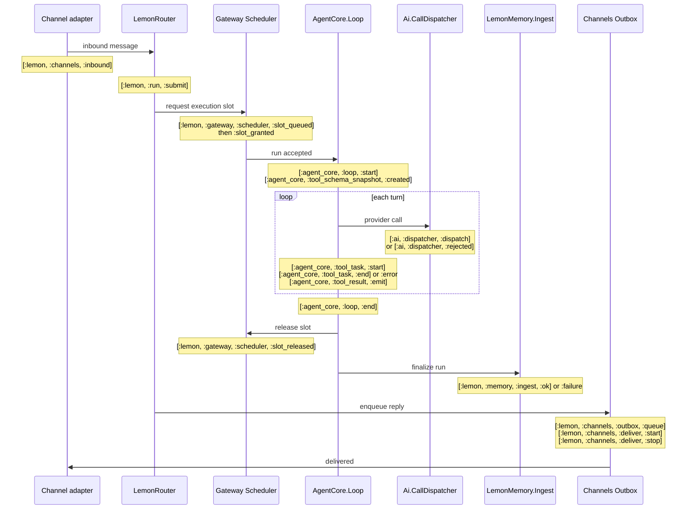

# Telemetry

Every event in this document was verified against its emit site on **2026-08-10**. Where
an event name exists in code but nothing calls it, it is listed under
[Known gaps](#known-gaps-and-inconsistencies) rather than in the catalog — a catalog entry
here means the event actually fires.

`:telemetry ~> 1.0` (declared in `apps/lemon_core/mix.exs`) is the only observability
dependency in the tree. There is no `telemetry_metrics`, `telemetry_poller`, or
`phoenix_live_dashboard` anywhere, so the consumer example below uses plain
`:telemetry.attach_many/4`.

Two layers coexist and are easy to confuse:

- **Telemetry** (this document) is fire-and-forget. Handlers run synchronously in the
  emitting process; nothing is stored.
- **Introspection** ([below](#introspection-the-persisted-layer)) is a separate, persisted,
  queryable envelope written through `LemonCore.Store`. It has its own event taxonomy and is
  *not* derived from the telemetry events here.

## Conventions

### Naming

Three prefix families coexist. This is descriptive, not a recommendation — see
[Known gaps](#known-gaps-and-inconsistencies).

| Prefix | Meaning | Emitted via |
|---|---|---|
| `[:lemon, ...]` | Cross-cutting platform concerns: runs, channels, approvals, memory, scheduler, reload, WASM | `LemonCore.Telemetry.emit/3` and its named helpers |
| `[:agent_core, ...]`, `[:coding_agent, ...]`, `[:ai, ...]` | App-local concerns, prefixed by OTP app | `LemonCore.Telemetry.emit/3` or `:telemetry.execute/3` directly |
| `[:lemon_skills, ...]`, `[:lemon_sim_ui, ...]` | App-local, full app name as prefix | app-local helper module |

`LemonCore.Telemetry.emit/3` is a direct pass-through to `:telemetry.execute/3`
([`telemetry.ex`](../apps/lemon_core/lib/lemon_core/telemetry.ex)); attaching does not
depend on which one an emitter used.

### Span shape

Events ending in `:start` / `:stop` / `:exception` follow the `:telemetry.span/3` convention
by hand — none of them actually call `:telemetry.span/3`. The practical consequence is that
`:stop` is **not** guaranteed to follow every `:start`: if the emitting process is killed
between them, no `:stop` or `:exception` arrives. Consumers that pair them need their own
timeout.

### Measurement units are not uniform

There is no single duration convention. When writing a consumer, check the table for the
event you are attaching to:

| Unit | Used by |
|---|---|
| `duration` in **native** units | `[:lemon, :channels, :deliver, :stop]`, `[:agent_core, :loop, :end]`, `[:ai, :dispatcher, :rejected]` |
| `duration_us` | `[:coding_agent, :extension, :tool, ...]`, `[:coding_agent, :wasm, :tool, ...]`, `[:lemon, :memory, :ingest, ...]` |
| `duration_ms` | `[:lemon, :reload, ...]`, `[:lemon, :wasm, :*, :stop]` |
| both `duration` and `duration_ms` | `[:lemon, :config, :reload, :stop]` (the `duration` value is `duration_ms * 1_000_000`, not a real native reading) |

`system_time` measurements are `System.system_time()` in native units and are timestamps,
not durations.

## Run lifecycle

The sequence below is the common path for a message arriving on a channel and producing a
reply. Not every step fires for every run: engine execution varies, and the tool block
repeats once per tool-calling turn.



**There is no end-to-end run span in telemetry.** `[:lemon, :run, :submit]` fires, but no
`[:lemon, :run, :stop]` is ever emitted (the helper exists and has no callers — see
[Known gaps](#known-gaps-and-inconsistencies)). To measure whole-run duration today, use the
introspection layer's `:run_started` / `:run_completed` records, which are persisted with
`ts_ms` and a shared `run_id`.

## Event catalog

### Run lifecycle — `[:lemon, :run, ...]`

| Event | Measurements | Metadata | Emitter |
|---|---|---|---|
| `[:lemon, :run, :submit]` | `count: 1` | `session_key`, `origin`, `engine` | `LemonCore.Telemetry.run_submit/3`, called from [`run_orchestrator.ex:204`](../apps/lemon_router/lib/lemon_router/run_orchestrator.ex) when a submission is accepted |

### Channels — `[:lemon, :channels, ...]`

| Event | Measurements | Metadata | Emitter |
|---|---|---|---|
| `[:lemon, :channels, :inbound]` | `count: 1` | `channel_id`, `account_id`, `peer_kind`, `agent_id` | [`channels/runtime.ex:113`](../apps/lemon_channels/lib/lemon_channels/runtime.ex) and [`router.ex:92`](../apps/lemon_router/lib/lemon_router/router.ex), on each normalized inbound message |
| `[:lemon, :channels, :outbox, :queue]` | `depth`, `max_queue_size`, `count: 1` | caller map plus `event` (`:enqueued`, and other queue transitions) | [`outbox.ex:742`](../apps/lemon_channels/lib/lemon_channels/outbox.ex) |
| `[:lemon, :channels, :outbox, :rejected]` | `count: 1`, `queue_depth`, `max_queue_size` | `reason: :queue_full`, `channel_id`, `account_id`, `chunk_count` | [`outbox.ex:97`](../apps/lemon_channels/lib/lemon_channels/outbox.ex), when the bounded queue refuses work |
| `[:lemon, :channels, :deliver, :start]` | `system_time` | `channel_id`, `account_id`, `chunk_index` | [`outbox.ex:574`](../apps/lemon_channels/lib/lemon_channels/outbox.ex) |
| `[:lemon, :channels, :deliver, :stop]` | `duration` (native) | delivery meta plus `ok` (boolean) | [`outbox.ex:608`](../apps/lemon_channels/lib/lemon_channels/outbox.ex); fires for both success and `{:error, _}` — check `ok` |
| `[:lemon, :channels, :deliver, :exception]` | `duration` (native) | delivery meta plus `kind: :exception`, `reason`, `stacktrace` | [`outbox.ex:591`](../apps/lemon_channels/lib/lemon_channels/outbox.ex), only when the plugin raises |

### Engine scheduling — `[:lemon, :gateway, :scheduler, ...]`

Last segment is built at runtime from an atom argument
([`scheduler.ex:477`](../apps/lemon_gateway/lib/lemon_gateway/scheduler.ex)). Values:
`:slot_granted`, `:slot_queued`, `:slot_released`.

| Event | Measurements | Metadata |
|---|---|---|
| `[:lemon, :gateway, :scheduler, :slot_granted]` | `in_flight`, `max`, `waitq`, `wait_ms`, `count: 1` | `%{}` (empty) |
| `[:lemon, :gateway, :scheduler, :slot_queued]` | `in_flight`, `max`, `waitq`, `count: 1` | `%{}` (empty) |
| `[:lemon, :gateway, :scheduler, :slot_released]` | `in_flight`, `max`, `waitq`, `count: 1` | `%{}` (empty) |

These are the clearest saturation signal in the system: `waitq > 0` means runs are waiting
for an engine slot. The empty metadata means they cannot be correlated to a run or session.

### Agent loop — `[:agent_core, ...]`

| Event | Measurements | Metadata | Emitter |
|---|---|---|---|
| `[:agent_core, :loop, :start]` | `system_time` | `prompt_count`, `message_count`, `tool_count`, `model` | [`loop.ex:305`](../apps/agent_core/lib/agent_core/loop.ex) (fresh loop) and `:352` (continue loop; `prompt_count` is always 0 there) |
| `[:agent_core, :loop, :end]` | `duration` (native, **may be `nil`**), `system_time` | `message_count`, `model`, `status` (`:completed` \| `:early_exit`) | [`loop.ex:807`](../apps/agent_core/lib/agent_core/loop.ex) |
| `[:agent_core, :loop, :state_transition]` | `system_time` | caller map plus `from`, `to` | [`loop.ex:754`](../apps/agent_core/lib/agent_core/loop.ex) |
| `[:agent_core, :tool_schema_snapshot, :created]` | `system_time` | `snapshot_id`, `fingerprint`, `tool_count`, `tool_names` | [`loop.ex:399`](../apps/agent_core/lib/agent_core/loop.ex) |
| `[:agent_core, :tool_task, :start]` | `system_time` | `tool_name`, `tool_call_id` | [`tool_calls.ex:551`](../apps/agent_core/lib/agent_core/loop/tool_calls.ex) |
| `[:agent_core, :tool_task, :end]` | `system_time` | `tool_name`, `tool_call_id`, `is_error` | [`tool_calls.ex:211`](../apps/agent_core/lib/agent_core/loop/tool_calls.ex) |
| `[:agent_core, :tool_task, :error]` | `system_time` | `tool_name`, `tool_call_id`, `reason` | six sites in [`tool_calls.ex`](../apps/agent_core/lib/agent_core/loop/tool_calls.ex) — `:137`/`:152` (`reason: :aborted`), `:309` (task crash), `:389` (`:timeout`), `:586` (`{:start_failed, reason}`), `:601` (prepare failure) |
| `[:agent_core, :tool_result, :emit]` | `system_time` | `tool_name`, `tool_call_id`, `is_error`, `trust` | [`tool_calls.ex:692`](../apps/agent_core/lib/agent_core/loop/tool_calls.ex). `trust` is normalized: only `:untrusted` stays untrusted, everything else becomes `:trusted` |
| `[:agent_core, :tool_call, :name_normalized]` | `system_time` | `original_name`, `matched_tool_name` | [`tool_calls.ex:747`](../apps/agent_core/lib/agent_core/loop/tool_calls.ex), when a model-supplied tool name needed fuzzy matching |
| `[:agent_core, :context, :size]` | `char_count`, `message_count` | `has_system_prompt` | [`context.ex:113`](../apps/agent_core/lib/agent_core/context.ex), on every `estimate_size/2` call |
| `[:agent_core, :context, :warning]` | `char_count`, `threshold` | `level` (`:warning` \| `:critical`) | [`context.ex:206`](../apps/agent_core/lib/agent_core/context.ex) (critical) and `:222` (warning) |
| `[:agent_core, :context, :truncated]` | `dropped_count`, `remaining_count` | `strategy` | [`context.ex:287`](../apps/agent_core/lib/agent_core/context.ex) |
| `[:agent_core, :subagent, :spawn]` | `system_time` | `pid`, `registry_key`, `has_registry_key` | [`subagent_supervisor.ex:99`](../apps/agent_core/lib/agent_core/subagent_supervisor.ex) |
| `[:agent_core, :subagent, :end]` | `system_time` | `pid`, `reason: :stopped` | [`subagent_supervisor.ex:150`](../apps/agent_core/lib/agent_core/subagent_supervisor.ex). Only fires on explicit stop — a crashed subagent emits nothing |

### Providers — `[:ai, ...]`

| Event | Measurements | Metadata | Emitter |
|---|---|---|---|
| `[:ai, :dispatcher, :dispatch]` | `system_time` | `provider` | [`call_dispatcher.ex:79`](../apps/ai/lib/ai/call_dispatcher.ex), before breaker and rate-limit checks |
| `[:ai, :dispatcher, :rejected]` | `duration`, `system_time` | `provider`, `reason`, `retry_after_ms` (circuit-open only) | [`call_dispatcher.ex:94`](../apps/ai/lib/ai/call_dispatcher.ex) (`:circuit_open`), `:127` (`:rate_limited`), `:140` (`:max_concurrency`) |
| `[:ai, :circuit_breaker, :opened]` | `system_time` | `provider`, `failure_count`, `failure_threshold`, `reason` | [`circuit_breaker.ex:291`](../apps/ai/lib/ai/circuit_breaker.ex) |
| `[:ai, :circuit_breaker, :closed]` | `system_time` | `provider` | [`circuit_breaker.ex:258`](../apps/ai/lib/ai/circuit_breaker.ex), recovery confirmed |
| `[:ai, :circuit_breaker, :half_opened]` | `system_time` | `provider`, `recovery_timeout` | [`circuit_breaker.ex:370`](../apps/ai/lib/ai/circuit_breaker.ex) |
| `[:ai, :circuit_breaker, :reopened]` | `system_time` | `provider`, `reason` | [`circuit_breaker.ex:317`](../apps/ai/lib/ai/circuit_breaker.ex), probe failed during half-open |
| `[:ai, :compacting_client, <event>]` | varies by call site | varies | [`compacting_client.ex:233`](../apps/ai/lib/ai/compacting_client.ex). Runtime suffix: `:request_started`, `:request_succeeded`, `:request_failed`, `:compaction_retry` |
| `[:ai, :context_compactor, <event>]` | `system_time` | varies | [`context_compactor.ex:370`](../apps/ai/lib/ai/context_compactor.ex). Runtime suffix: `:compaction_started`, `:compaction_succeeded`, `:compaction_failed` |
| `[:ai, :prompt_diagnostics, :llm_call]` | `system_time` | `data`, `engine: "ai"`, `session_key`, `agent_id`, `run_id` | [`prompt_diagnostics.ex:158`](../apps/ai/lib/ai/prompt_diagnostics.ex). Correlation fields come from `x-lemon-*` request headers and are `nil` when absent |

### Memory — `[:lemon, :memory, ...]`

| Event | Measurements | Metadata | Emitter |
|---|---|---|---|
| `[:lemon, :memory, :ingest, :ok]` | `duration_us` | `run_id`, `session_key`, `agent_id` | [`ingest.ex:114`](../apps/lemon_memory/lib/lemon_memory/ingest.ex) |
| `[:lemon, :memory, :ingest, :failure]` | `count: 1`, `duration_us` | `run_id`, `error` (message string) | [`ingest.ex:129`](../apps/lemon_memory/lib/lemon_memory/ingest.ex) |

### Approvals — `[:lemon, :approvals, ...]`

| Event | Measurements | Metadata | Emitter |
|---|---|---|---|
| `[:lemon, :approvals, :requested]` | `count: 1` | `approval_id`, `tool`, `run_id`, `session_id`, `session_key`, `agent_id` | [`exec_approvals.ex:101`](../apps/lemon_core/lib/lemon_core/exec_approvals.ex) |
| `[:lemon, :approvals, :resolved]` | `count: 1` | `approval_id`, `decision`, `tool`, `run_id` | [`exec_approvals.ex:161`](../apps/lemon_core/lib/lemon_core/exec_approvals.ex) (user decision) and `:373` (`decision: :timeout`) |

### Control plane fan-out — `[:lemon, :control_plane, ...]`

| Event | Measurements | Metadata | Emitter |
|---|---|---|---|
| `[:lemon, :control_plane, :event_bridge, :broadcast]` | `count: 1`, `recipients` | `event`, `recipients` | [`event_bridge.ex:290`](../apps/lemon_control_plane/lib/lemon_control_plane/event_bridge.ex) |
| `[:lemon, :control_plane, :event_bridge, :dropped]` | `count: 1`, `recipients` | `event`, `reason` (inspected, truncated to 80 chars) | [`event_bridge.ex:328`](../apps/lemon_control_plane/lib/lemon_control_plane/event_bridge.ex) |

### Configuration and hot reload — `[:lemon, :config | :reload, ...]`

| Event | Measurements | Metadata | Emitter |
|---|---|---|---|
| `[:lemon, :config, :reload, :start]` | `system_time` | reload context | [`config_reloader.ex:178`](../apps/lemon_core/lib/lemon_core/config_reloader.ex) |
| `[:lemon, :config, :reload, :stop]` | `duration`, `duration_ms` | context plus `changed_count`, `actions_count` | [`config_reloader.ex:212`](../apps/lemon_core/lib/lemon_core/config_reloader.ex) (no-change path, `changed_count: 0`) and `:273` |
| `[:lemon, :config, :reload, :exception]` | `duration`, `duration_ms` | context plus `kind`, `reason`, `stacktrace` | [`config_reloader.ex:301`](../apps/lemon_core/lib/lemon_core/config_reloader.ex) |
| `[:lemon, :reload, :start]` | `system_time` | reload context | [`reload.ex:463`](../apps/lemon_core/lib/lemon_core/reload.ex) |
| `[:lemon, :reload, :stop]` | `duration_ms` | context plus `status` | [`reload.ex:471`](../apps/lemon_core/lib/lemon_core/reload.ex) |
| `[:lemon, :reload, :exception]` | `duration_ms` | context plus `error`, `stacktrace` | [`reload.ex:482`](../apps/lemon_core/lib/lemon_core/reload.ex) (rescue) and `:493` (catch) |

### Extension and WASM tools — `[:coding_agent, ...]` and `[:lemon, :wasm, ...]`

| Event | Measurements | Metadata | Emitter |
|---|---|---|---|
| `[:coding_agent, :extension, :tool, :start]` | `count: 1` | tool identity | [`tool_registry.ex:392`](../apps/coding_agent/lib/coding_agent/tool_registry.ex) |
| `[:coding_agent, :extension, :tool, :stop]` | `count: 1`, `duration_us` | tool identity plus `status` | [`tool_registry.ex:399`](../apps/coding_agent/lib/coding_agent/tool_registry.ex) |
| `[:coding_agent, :extension, :tool, :exception]` | `count: 1`, `duration_us` | tool identity plus `kind`, `error_type` | [`tool_registry.ex:410`](../apps/coding_agent/lib/coding_agent/tool_registry.ex) (rescue) and `:423` (catch); both re-raise |
| `[:coding_agent, :wasm, :tool, :start]` | `count: 1` | tool identity | [`wasm/tool_factory.ex:58`](../apps/coding_agent/lib/coding_agent/wasm/tool_factory.ex) |
| `[:coding_agent, :wasm, :tool, :stop]` | `count: 1`, `duration_us` | tool identity plus `status` | [`wasm/tool_factory.ex:113`](../apps/coding_agent/lib/coding_agent/wasm/tool_factory.ex) |
| `[:coding_agent, :wasm, :tool, :exception]` | `count: 1`, `duration_us` | tool identity plus `kind`, `error_type` | [`wasm/tool_factory.ex:121`](../apps/coding_agent/lib/coding_agent/wasm/tool_factory.ex) |
| `[:coding_agent, :tool_call, :name_normalized]` | `%{}` (empty) | `original`, `normalized` | [`tool_registry.ex:148`](../apps/coding_agent/lib/coding_agent/tool_registry.ex) |
| `[:lemon, :wasm, :discover, :start]` | `count: 1` | `host: :wasm`, `session_hash`, `cwd_hash` | [`wasm/sidecar_session.ex:191`](../apps/coding_agent/lib/coding_agent/wasm/sidecar_session.ex) |
| `[:lemon, :wasm, :discover, :stop]` | `duration_ms`, `ok` | `host: :wasm`, `session_hash`, `cwd_hash` | [`wasm/sidecar_session.ex:376`](../apps/coding_agent/lib/coding_agent/wasm/sidecar_session.ex) |
| `[:lemon, :wasm, :invoke, :start]` | `count: 1` | `host: :wasm`, `session_hash`, `cwd_hash`, `tool_hash` | [`wasm/sidecar_session.ex:220`](../apps/coding_agent/lib/coding_agent/wasm/sidecar_session.ex) |
| `[:lemon, :wasm, :invoke, :stop]` | `duration_ms`, `ok` | `host: :wasm`, `session_hash`, `cwd_hash`, `tool_hash` | [`wasm/sidecar_session.ex:408`](../apps/coding_agent/lib/coding_agent/wasm/sidecar_session.ex) |

Session and cwd identifiers in the WASM events are hashed, not raw.

### Session recovery and rate limiting — `[:coding_agent, ...]`

All four families build the last segment at runtime.

| Event | Suffix values | Measurements | Metadata |
|---|---|---|---|
| `[:coding_agent, :rate_limit_pause, <event>]` | `:paused`, `:resumed` | `retry_after_ms`, `time_to_resume` | `session_id` and pause context ([`rate_limit_pause.ex:265`](../apps/coding_agent/lib/coding_agent/rate_limit_pause.ex)) |
| `[:coding_agent, :rate_limit_healer, <event>]` | `:probe_attempt`, `:probe_success`, `:probe_rate_limited`, `:probe_error`, `:healed`, `:failed`, `:stopped` | caller-supplied | `session_id`, `provider`, `model`, `healing_state`, `probe_count` ([`rate_limit_healer.ex:566`](../apps/coding_agent/lib/coding_agent/rate_limit_healer.ex)) |
| `[:coding_agent, :session_fork, <event>]` | `:fork_completed`, `:fork_failed`, `:original_terminated` | `%{}` (empty) | caller map plus `original_session_id`, `timestamp` ([`session_fork.ex:175`](../apps/coding_agent/lib/coding_agent/session_fork.ex)) |
| `[:coding_agent, :session, :overflow_recovery, <stage>]` | `:attempt`, `:success`, `:failure` | `count: 1` | recovery context including `duration_ms` ([`session/compaction_manager.ex:209`](../apps/coding_agent/lib/coding_agent/session/compaction_manager.ex)) |

### Skills — `[:lemon_skills, :skill, ...]`

All three carry `count: 1` and `system_time` measurements and are emitted through
[`lemon_skills/telemetry.ex:61`](../apps/lemon_skills/lib/lemon_skills/telemetry.ex), which
drops `nil` metadata values before emitting. Bodies of skills and file contents are never
included.

| Event | Fires when | Key metadata |
|---|---|---|
| `[:lemon_skills, :skill, :load]` | `read_skill` returns a skill or a not-found result | `result` (`ok` \| `not_found`), `key`, `name`, `source`, `path`, `view`, `section`, `file_path`, `tool_call_id`, `run_id`, `session_key`, `session_id`, `agent_id`, `cwd` |
| `[:lemon_skills, :skill, :write]` | `skill_manage` accepts or rejects a write | `result`, `action` (`create` \| `edit` \| `patch` \| `delete` \| `write_file` \| `remove_file`), `name`, `scope`, `path`, `audit_status`, `replacements`, `reason`, plus correlation fields |
| `[:lemon_skills, :skill, :prompt_render]` | prompt composition renders a skills block | `surface` (`available` \| `relevant`), `skill_count`, `skill_keys`, `active_count`, `not_ready_count`, `missing_count`, plus correlation fields |

`LemonSkills.Application` attaches an introspection bridge at boot that projects these three
into persisted `:skill_load_observed`, `:skill_write_observed`, and
`:skill_prompt_render_observed` records, and updates `LemonSkills.Usage` counters.

### Hosted sim rooms — `[:lemon_sim_ui, :hosted_werewolf, ...]`

Emitted through `LemonSimUi.HostedGame.emit/3`
([`hosted_game.ex:771`](../apps/lemon_sim_ui/lib/lemon_sim_ui/hosted_game.ex)), all with
`count: 1` and a `room_id`. Runtime suffix values: `:seat_claimed`, `:player_connected`,
`:player_disconnected`, `:command_accepted`, `:command_rejected`, `:turn_timeout`,
`:game_started`, `:game_stopped`, `:game_completed`, `:ai_error`, `:room_failed`,
`:persistence_error`. The `hosted_werewolf` segment is historical; the module now backs all
hosted room types.

## Attaching a consumer

This is the whole integration surface. Handlers run **synchronously in the emitting
process**, so they must be fast and must not raise — a raising handler is detached by
`:telemetry` and stops receiving events.

```elixir
defmodule MyApp.TelemetryLogger do
  @moduledoc "Logs the saturation and failure signals worth paging on."

  require Logger

  @events [
    [:lemon, :channels, :outbox, :rejected],
    [:lemon, :gateway, :scheduler, :slot_queued],
    [:ai, :dispatcher, :rejected],
    [:ai, :circuit_breaker, :opened],
    [:agent_core, :tool_task, :error],
    [:agent_core, :context, :warning],
    [:lemon, :memory, :ingest, :failure]
  ]

  def attach do
    :telemetry.attach_many(
      "my-app-telemetry-logger",
      @events,
      &__MODULE__.handle_event/4,
      %{}
    )
  end

  def handle_event([:lemon, :channels, :outbox, :rejected], m, meta, _config) do
    Logger.warning(
      "outbox rejected channel=#{meta.channel_id} reason=#{meta.reason} " <>
        "depth=#{m.queue_depth}/#{m.max_queue_size}"
    )
  end

  def handle_event([:lemon, :gateway, :scheduler, :slot_queued], m, _meta, _config) do
    Logger.warning("engine slots saturated in_flight=#{m.in_flight}/#{m.max} waitq=#{m.waitq}")
  end

  def handle_event([:ai, :dispatcher, :rejected], _m, meta, _config) do
    Logger.warning("provider rejected provider=#{meta.provider} reason=#{meta.reason}")
  end

  def handle_event([:ai, :circuit_breaker, :opened], _m, meta, _config) do
    Logger.error(
      "circuit opened provider=#{meta.provider} " <>
        "failures=#{meta.failure_count}/#{meta.failure_threshold}"
    )
  end

  def handle_event([:agent_core, :tool_task, :error], _m, meta, _config) do
    Logger.error("tool failed tool=#{meta.tool_name} reason=#{inspect(meta.reason)}")
  end

  def handle_event([:agent_core, :context, :warning], m, meta, _config) do
    Logger.warning("context #{meta.level}: #{m.char_count} chars (threshold #{m.threshold})")
  end

  def handle_event([:lemon, :memory, :ingest, :failure], m, meta, _config) do
    Logger.error("memory ingest failed run=#{meta.run_id} after #{m.duration_us}us: #{meta.error}")
  end
end
```

Call `MyApp.TelemetryLogger.attach()` once at application start, after `:telemetry` is
running.

### Verifying an attachment without a full runtime

`mix run --no-start` does not start the `:telemetry` application, so `attach_many/4` will
exit with `no process`. Start it explicitly and drive a real emit path:

```elixir
{:ok, _} = Application.ensure_all_started(:telemetry)

:telemetry.attach_many(
  "probe",
  [[:agent_core, :context, :size], [:agent_core, :context, :warning]],
  fn event, measurements, metadata, _ ->
    IO.inspect({event, measurements, metadata})
  end,
  %{}
)

messages = [%{role: :user, content: "hello world"}, %{role: :assistant, content: "hi"}]
AgentCore.Context.estimate_size(messages, "you are a test")
AgentCore.Context.check_size(messages, nil, warning_threshold: 1, critical_threshold: 2, log: false)
```

Running that under `mix run --no-start` produces:

```
{[:agent_core, :context, :size], %{char_count: 27, message_count: 2}, %{has_system_prompt: true}}
{[:agent_core, :context, :size], %{char_count: 13, message_count: 2}, %{has_system_prompt: false}}
{[:agent_core, :context, :warning], %{threshold: 2, char_count: 13}, %{level: :critical}}
```

`AgentCore.Context` is a good probe target because it emits from a pure function with no
supervision tree, no store, and no network.

### Aggregating into metrics

**`telemetry_metrics` is not a dependency of this repo**, and neither is
`telemetry_metrics_prometheus` or `phoenix_live_dashboard`. Nothing here aggregates,
samples, or exports — the runtime emits, and what happens next is the host application's
choice. This section is what wiring it up looks like *if you add those deps to your own
project*; it is not describing something that ships.

```elixir
# in your own app's mix.exs:
#   {:telemetry_metrics, "~> 1.0"},
#   {:telemetry_metrics_prometheus, "~> 1.1"}

import Telemetry.Metrics

def metrics do
  [
    # Saturation: the two signals that mean "shed load or add capacity".
    last_value("lemon.gateway.scheduler.waitq", tags: []),
    counter("lemon.channels.outbox.rejected.count", tags: [:channel_id, :reason]),

    # Provider health.
    counter("ai.dispatcher.rejected.duration", tags: [:provider, :reason]),
    counter("ai.circuit_breaker.opened.system_time", tags: [:provider]),

    # Tool reliability.
    counter("agent_core.tool_task.error.system_time", tags: [:tool_name, :reason]),

    # Latency. Note the three different units — see "Measurement units are not uniform".
    distribution("lemon.channels.deliver.stop.duration",
      unit: {:native, :millisecond},
      tags: [:channel_id, :ok]
    ),
    distribution("lemon.memory.ingest.ok.duration_us",
      unit: {:microsecond, :millisecond},
      tags: []
    ),
    distribution("coding_agent.extension.tool.stop.duration_us",
      unit: {:microsecond, :millisecond},
      tags: [:status]
    )
  ]
end
```

Three things bite when you do this, all of them consequences of items in
[Known gaps](#known-gaps-and-inconsistencies):

- **Pick the unit per event, not per dashboard.** `duration` is native, `duration_us` is
  microseconds, `duration_ms` is milliseconds, and `[:lemon, :config, :reload, :stop]`
  reports both `duration` and `duration_ms` where the former is synthesized from the latter.
  A single `unit: {:native, :millisecond}` applied across the board silently produces
  numbers that are wrong by six orders of magnitude on the `_us` events.
- **`counter/2` still needs a measurement key that exists.**
  `[:coding_agent, :tool_call, :name_normalized]` and `[:coding_agent, :session_fork, _]`
  emit empty measurement maps, so they cannot be counted without first adding a measurement
  at the emit site.
- **Runtime-suffixed events cannot be declared with a wildcard.** `Telemetry.Metrics` needs
  a concrete event name, so each value of the nine dynamic families has to be listed
  individually; the known values are in the catalog above.

For an interactive view instead of a scrape endpoint, `phoenix_live_dashboard` consumes the
same `metrics/0` list through its `:metrics` option. Neither path requires changing any
emit site.

## Known gaps and inconsistencies

These are recorded, not fixed. Renaming events is a breaking change for any attached
consumer and belongs in its own change.

**Events that exist as code but never fire.** `LemonCore.Telemetry` exports
`run_start/2`, `run_first_token/2`, `run_stop/3`, `run_exception/3`, and `cron_tick/1`
([`telemetry.ex`](../apps/lemon_core/lib/lemon_core/telemetry.ex)). All five have **zero
call sites** in the tree, so `[:lemon, :run, :start]`, `[:lemon, :run, :first_token]`,
`[:lemon, :run, :stop]`, `[:lemon, :run, :exception]`, and `[:lemon, :cron, :tick]` are
never emitted. `CodingAgent.RateLimitRecovery.emit_recovery_telemetry/3`
([`rate_limit_recovery.ex:217`](../apps/coding_agent/lib/coding_agent/rate_limit_recovery.ex))
is likewise public with no callers, so `[:coding_agent, :rate_limit_recovery, _]` never
fires. This is why there is no end-to-end run span.

**Events named only in documentation.** The `LemonCore.Telemetry` moduledoc lists
`[:lemon, :cron, :run, :start]` and `[:lemon, :cron, :run, :stop]`; neither has a helper or
an emitter anywhere.

**Two events share a leaf name with different metadata keys.**
`[:agent_core, :tool_call, :name_normalized]` uses `original_name` / `matched_tool_name`,
while `[:coding_agent, :tool_call, :name_normalized]` uses `original` / `normalized`. A
handler written for one will raise a `KeyError` on the other.

**Eight families build their final segment at runtime**, so they cannot be discovered by
searching for a literal event name, and `attach_many/4` requires knowing every value in
advance: `[:lemon, :gateway, :scheduler, _]`, `[:ai, :compacting_client, _]`,
`[:ai, :context_compactor, _]`, `[:coding_agent, :rate_limit_pause, _]`,
`[:coding_agent, :rate_limit_healer, _]`, `[:coding_agent, :rate_limit_recovery, _]`,
`[:coding_agent, :session_fork, _]`, `[:coding_agent, :session, :overflow_recovery, _]`, and
`[:lemon_sim_ui, :hosted_werewolf, _]`. The known values are listed in the catalog above.

**Measurement gaps.** `[:coding_agent, :tool_call, :name_normalized]` and
`[:coding_agent, :session_fork, _]` emit an empty measurement map, so they cannot drive a
counter without a synthetic measurement. `[:agent_core, :loop, :end]` reports
`duration: nil` when the process-dictionary start time is missing. The scheduler family
emits empty metadata, so slot pressure cannot be attributed to a run, session, or engine.

**Coverage gaps.** `[:agent_core, :subagent, :end]` fires only on explicit stop, so a
crashed subagent produces a `:spawn` with no matching `:end`. There is no telemetry on the
store, the Bus, or the router's session-coordinator queue transitions.

**Previously documented events that do not exist.** An earlier revision of this file
described ten events that were never in the code: `[:agent_core, :loop, :exception]`,
`[:agent_core, :loop, :task_start_failed]`, `[:agent_core, :event_stream, :queue_depth]`,
`[:agent_core, :event_stream, :dropped]`, `[:agent_core, :agent, :loop_error]`,
`[:coding_agent, :session, :event_stream, :broadcast]`, `[:coding_agent, :session, :error]`,
`[:ai, :dispatcher, :queue_depth]`, `[:ai, :dispatcher, :retry]`, and
`[:ai, :stream, :error]`. It also described an `AgentCore.TelemetryPoller` emitting periodic
`[:vm, _]` stats; no such module exists and `telemetry_poller` is not a dependency. They are
listed here so they are not reintroduced from memory. The same revision documented
`loop_type` / `reason` metadata on the agent loop events and `duration` measurements on the
tool-task events; the real shapes are in the catalog above.

## Introspection: the persisted layer

Introspection is a higher-level layer built beside `:telemetry`, not on top of it. It
captures a canonical envelope for agent lifecycle transitions and persists it through
`LemonCore.Store` for later query. Unlike telemetry, these records are **stored** and
**queryable**.

### Envelope

| Field | Type | Description |
|---|---|---|
| `event_id` | string | Stable unique identifier (prefixed `evt_`) |
| `event_type` | atom or string | Taxonomy name (below) |
| `ts_ms` | integer | Wall-clock milliseconds since the Unix epoch |
| `run_id` | string or nil | Run identifier |
| `session_key` | string or nil | Session identifier |
| `agent_id` | string or nil | Agent identifier |
| `parent_run_id` | string or nil | Lineage link when available |
| `engine` | string or nil | Engine name, e.g. `"claude"`, `"codex"`, `"lemon"` |
| `provenance` | `:direct` \| `:inferred` \| `:unavailable` | How context fields were resolved |
| `payload` | map | Event-specific metadata, redacted |

`:direct` means the emitter supplied the context fields; `:inferred` means they were derived
from surrounding state; `:unavailable` means they could not be determined.

### Redaction

`api_key`, `apikey`, `authorization`, `password`, `private_key`, `prompt`, `response`,
`secret`, `secrets`, `stderr`, `stdout`, and `token` are always removed. Tool argument
fields (`arguments`, `input`, `tool_arguments`) are redacted unless
`capture_tool_args: true` is passed. Result previews are kept and truncated to 256 bytes
unless `capture_result_preview: false` is passed. All other string values are truncated to
4096 bytes. See [`introspection.ex`](../apps/lemon_core/lib/lemon_core/introspection.ex).

### Taxonomy

Every atom below appears in a live `LemonCore.Introspection.record/3` call.

| Emitter | Event types |
|---|---|
| `LemonRouter.RunProcess` | `:run_started`, `:run_completed`, `:run_failed` |
| `LemonRouter.RunOrchestrator` | `:orchestration_started`, `:orchestration_resolved`, `:orchestration_failed` |
| Router answer finalization | `:answer_finalize_started`, `:answer_finalize_dispatch`, `:answer_finalize_completed`, `:answer_artifact_finalize_failed`, `:answer_media_jobs_record_failed` |
| `LemonGateway.ThreadWorker` | `:thread_started`, `:thread_message_dispatched`, `:thread_terminated` |
| `LemonGateway.Scheduler` | `:scheduled_job_triggered`, `:scheduled_job_completed` |
| `CodingAgent.Session` | `:session_started`, `:session_ended`, `:compaction_triggered` |
| `CodingAgent.Session.EventHandler` | `:tool_call_dispatched`, `:engine_event_ignored` |
| `AgentCore.Agent` | `:agent_loop_started`, `:agent_turn_observed` (inferred), `:agent_loop_ended`, `:agent_progress_snapshot` |
| `AgentCore.CliRunners.JsonlRunner` | `:jsonl_stream_started`, `:tool_use_observed` (inferred), `:assistant_turn_observed` (inferred), `:jsonl_stream_ended` |
| CLI runner engines (codex, claude, kimi, opencode, pi) | `:engine_subprocess_started`, `:engine_output_observed`, `:engine_subprocess_exited` — all inferred |
| Skills bridge / session-end audit | `:skill_load_observed`, `:skill_write_observed`, `:skill_prompt_render_observed`, `:missed_skill_observed`, `:missed_learning_observed` |

### Querying

```elixir
LemonCore.Introspection.list([])
LemonCore.Introspection.list(run_id: "run_abc123", limit: 50)
LemonCore.Introspection.list(session_key: "agent:default:main", limit: 20)
LemonCore.Introspection.list(event_type: :run_completed, limit: 30)

now_ms = System.system_time(:millisecond)
LemonCore.Introspection.list(since_ms: now_ms - 60 * 60 * 1000, limit: 200)
```

Results are newest-first. The same filters are available from the shell through
[`mix lemon.introspection`](../apps/lemon_core/lib/mix/tasks/lemon.introspection.ex), which
prints a table of timestamp, event type, run ID, session key, agent ID, engine, and
provenance:

```bash
mix lemon.introspection --limit 100
mix lemon.introspection --run-id run_abc123 --event-type run_completed
mix lemon.introspection --since 1h
mix lemon.introspection --since 2026-08-01T00:00:00Z
```

### Recording, disabling, retention

```elixir
LemonCore.Introspection.record(:run_started, %{origin: "telegram"},
  run_id: run_id,
  session_key: session_key
)
```

Set `config :lemon_core, :introspection, enabled: false` to drop events silently;
`LemonCore.Introspection.enabled?/0` reflects the setting. The store sweeps
`:introspection_log` periodically, pruning records older than 7 days by default.

## Related

- [beam_agents.md](beam_agents.md) — supervision trees and the process-level invariants these
  events observe
- [why-beam-for-agents.md](why-beam-for-agents.md) — why the runtime makes this kind of
  per-process observability cheap
