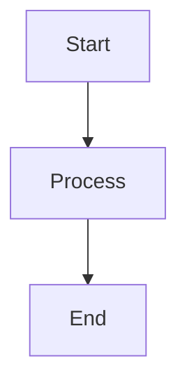

# Lemon Diagram Generator

Generates SVG diagrams from Excalidraw or Mermaid source files for the Lemon documentation.

## Prerequisites

- Node.js 18+

## Setup

```bash
cd tools/diagrams
npm install
```

## Usage

### Excalidraw Diagrams (Primary - Hand-drawn style)

The primary diagram source files are `.excalidraw` JSON files in `docs/diagrams/`.

**Export with hand-drawn style (requires Node 20):**

```bash
cd docs/diagrams

# Use Node 20 (excalidraw CLI has issues with Node 25+)
nvm use 20

# Export single diagram
npx excalidraw-brute-export-cli -i supervision-tree.excalidraw --format svg -o supervision-tree.svg --scale 1

# Export all diagrams
for f in *.excalidraw; do
  name="${f%.excalidraw}"
  npx excalidraw-brute-export-cli -i "$f" --format svg -o "${name}.svg" --scale 1
done

# Switch back to default Node
nvm use default
```

**Alternative: Manual export from excalidraw.com**
1. Open `docs/diagrams/*.excalidraw` in https://excalidraw.com
2. Export as SVG from the menu (Menu → Export → SVG)
3. Save to `docs/diagrams/*.svg`

### Mermaid Diagrams (Legacy)

```bash
# Generate all diagrams from Mermaid files
node generate.js

# Generate a specific diagram
node generate.js architecture

# List available diagrams
node generate.js --list
```

## Adding New Diagrams

1. Create a `.mmd` file in `tools/diagrams/mermaid/`:



2. Run the generator:

```bash
node generate.js
```

3. The SVG will be output to:
   - `tools/diagrams/output/svg/<name>.svg` (working copy)
   - `docs/diagrams/<name>.svg` (for README embedding)

## Embedding in README

Use standard markdown image syntax:

```markdown

```

## Current Diagrams

| Diagram | Description |
|---------|-------------|
| `architecture` | Overall system architecture |
| `data-flow` | Data flow paths through the system |
| `supervision-tree` | OTP supervision hierarchy |
| `orchestration` | Orchestration runtime components |
| `tool-execution` | Tool execution with approval gating |
| `event-bus` | Event-driven pub/sub architecture |

## Mermaid Syntax Reference

See [Mermaid documentation](https://mermaid.js.org/syntax/flowchart.html) for syntax reference.

Common patterns used:

```mermaid
flowchart TB           # Top to bottom
flowchart LR           # Left to right

subgraph Name["Label"]
    A --> B
end

A["Multi-line<br/>text"]
A{{"Decision"}}
A[["Subprocess"]]
```

## Configuration

The diagram style is configured in `generate.js`:

- Theme: default with lemon-yellow primary color
- Font size: 14px
- Transparent background
- Basis curve for connections
